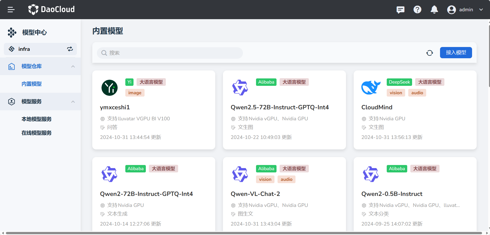

---
hide:
  - toc
---

# 什么是模型中心

**d.run 模型中心**是一款功能强大的模型管理和服务平台，旨在为用户提供便捷、高效的模型管理和使用体验。

## 产品的主要特点和优势

d.run 模型中心提供了以下六大核心功能，帮助企业实现模型管理和服务平台的建设：

### 1. **模型支持**

- **生成式 Transformer 模型支持**：全面支持主流大语言模型（如 Llama-2、ChatGLM、Qwen 等），帮助用户实现高效的文本生成与自然语言处理。
- **多模态语言模型支持**：支持图像与文本联合处理的多模态模型（如 BLIP-2、GLM-4V、LLaVA 系列），为用户提供跨领域的模型服务能力。

### 2. **模型部署**

- **多样化部署方式**：支持通过镜像或文件挂载的方式部署 HuggingFace Transformers 模型，灵活适应不同的业务场景。
- **Embedding 模型部署**：支持 BGE-Large-Zh-v1.5 等嵌入模型的部署，方便实现语义搜索与向量化匹配。
- **Rerank 模型部署**：提供对 BGE-Reranker-Large 等模型的支持，用于优化排序结果，提高检索质量。
- **多类型模型服务支持**：支持大语言模型和多模态模型的在线对话服务，满足丰富的业务需求。
- **GPU 部署支持**：支持在 Nvidia 和 Ascend 系列 GPU 上进行部署，确保模型的高效运行。

### 3. **服务监控与自动扩展**

- **服务监控**：提供 GPU 使用率、Token 处理延迟和服务健康状态的多项指标监控，确保服务稳定。
- **水平自动扩展（HPA）**：支持根据 GPU 负载和延迟自动扩展服务规模，保障高并发情况下的服务质量。

### 4. **在线服务集成与 API 管理**

- **API Key 管理与权限控制**：支持主流在线模型服务的 API Key 管理，并提供权限设置和使用限制。
- **多平台集成支持**：支持与豆包、阿里通义千问、Azure OpenAI、百度文心千帆、智谱 ChatGLM 等多家平台的对接，拓展模型应用场景。

### 5. **用户价值与优势**

- **高效管理与多样选择**：d.run 模型中心支持广泛的模型类型与部署方式，满足不同企业的业务需求。
- **智能扩展与稳定服务**：通过自动扩展与实时监控，保障模型服务的高可用性。
- **灵活集成与安全控制**：多平台支持与 API 权限管理让用户能够灵活、安全地使用模型资源。

d.run 模型中心凭借其全面的模型支持、强大的部署能力和灵活的管理工具，为企业提供了一站式的 AI 解决方案，加速模型应用的落地与创新。

## 切换工作空间

在导航栏左上角，可以切换工作空间。

[注册并体验 d.run](https://console.d.run/){ .md-button .md-button--primary }
