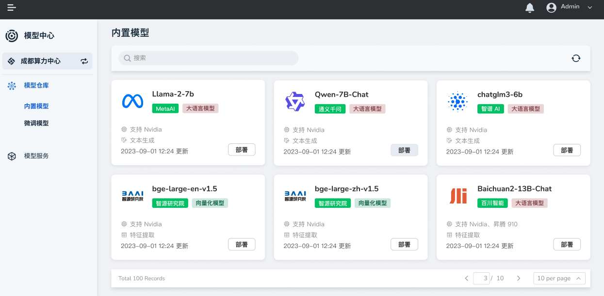

---
hide:
  - toc
---

# 什么是模型中心

d.run 模型中心是一款功能强大的模型管理和服务平台，旨在为用户提供便捷、高效的模型管理和使用体验。以下是产品的主要特点和优势：

- **多模型支持** ：模型中心支持 GLM、Llama、百川、文心一言等系列模型，以及 Transformer 架构的模型，满足用户在不同任务和场景下的需求。
- **直观图形界面** ：提供直观的图形化界面，让用户轻松地进行模型推理和管理，无需复杂的操作和编程知识。
- **微调支持** ：用户可以对模型进行微调，并通过可视化界面进行推理，以实现更精准和个性化的模型效果。
- **对话内容对比** ：提供对话内容对比功能，让用户能够直观地比较不同模型推理结果的对话内容，以便评估模型效果和调整策略。
- **全面的模型服务管理** ：提供全面的本地和在线模型服务管理，覆盖模型服务的整个生命周期，包括部署、监控和更新。
- **智能负载均衡** ：实现智能负载均衡，优化模型服务的使用效率，提高用户访问模型的速度和稳定性。
- **API Key 管理** ：提供在线模型服务的 API Key 管理功能，保证模型服务的安全性和可控性。

d.run 模型中心内置了[模型仓库](./model-hub/built-in.md)，可以一站式管理各类大模型，按需部署。
另外通过[模型服务](./model-service/local.md)，您可以从本地、在线提供大语言模型服务、向量化模型服务。

## 切换集群

在导航栏左上角，可以切换集群/算力中心。

[注册并体验 d.run](https://console.d.run/){ .md-button .md-button--primary }
