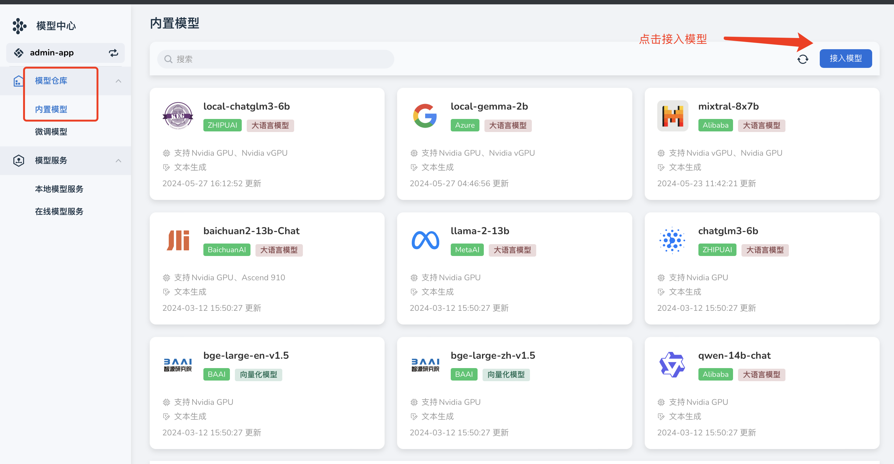
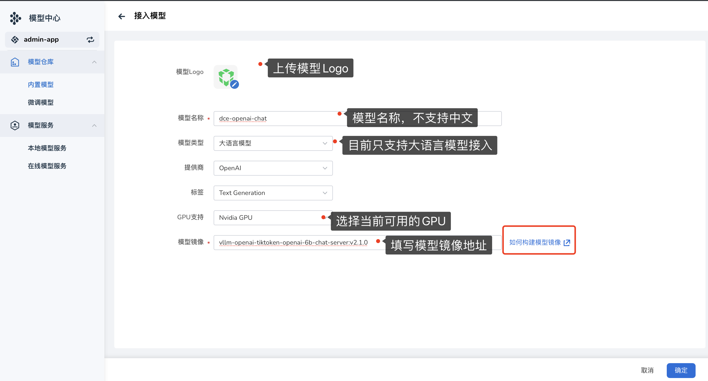

---
hide:
  - toc
---

# 接入模型功能

接入模型意味着用户能够接入自身部署的大语言模型镜像，一旦接入成功，便能借助该镜像来部署服务，从而使用该大语言模型所具备的能力（注：此功能仅对平台角色开发）。

## 接入模型

1. 在内置模型中点击右侧的 **接入模型** 。

    

2. 填写模型服务名称、模型镜像地址，选择模型类型、供应商、标签、GPU后，点击 **确定** （请注意镜像地址是否填写正确）。

    

    !!! info "支持国产 GPU"

        其中算力类型支持 Nvidia GPU 和 Ascend 等国产 GPU。

3. 接入成功，在列表中可以看到该模型的信息，接下来可以通过部署该模型提供服务。

部署操作可参考：[内置模型部署](../model-hub/built-in.md#_4)

## 删除

1. 接入的模型支持删除，将光标移动到模型卡片上，在弹出的选项中点击 **垃圾桶** 。

    

2. 输入模型名称，确认无误后删除。

    !!! note

        删除操作不可逆，请谨慎操作。
