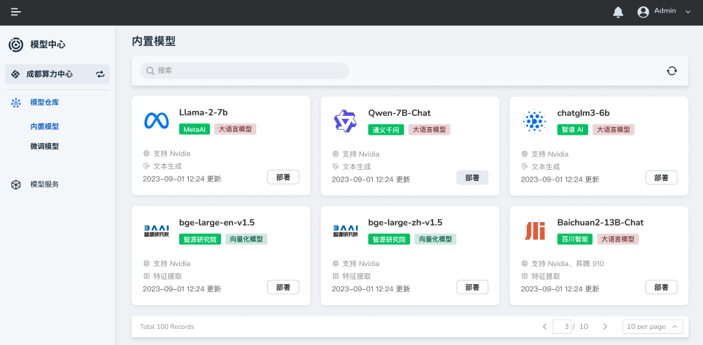

---
hide:
  - toc
---

# 内置模型

内置模型是 d.run 按照规范适配验证后上线到模型中心的，您可以直接部署。

如果想要部署某个模型，

1. 在模型卡片右下角，点击 **部署** 按钮。

    

2. 填写各项参数后点击 **确定** 。

    

    !!! info "支持国产 GPU"

        其中算力类型支持 Nvidia GPU 和 Ascend 等国产 GPU。

3. 屏幕提示创建成功，接下来可以通过部署的模型提供服务。

下一步：[模型服务](../model-service/local.md#_3)
