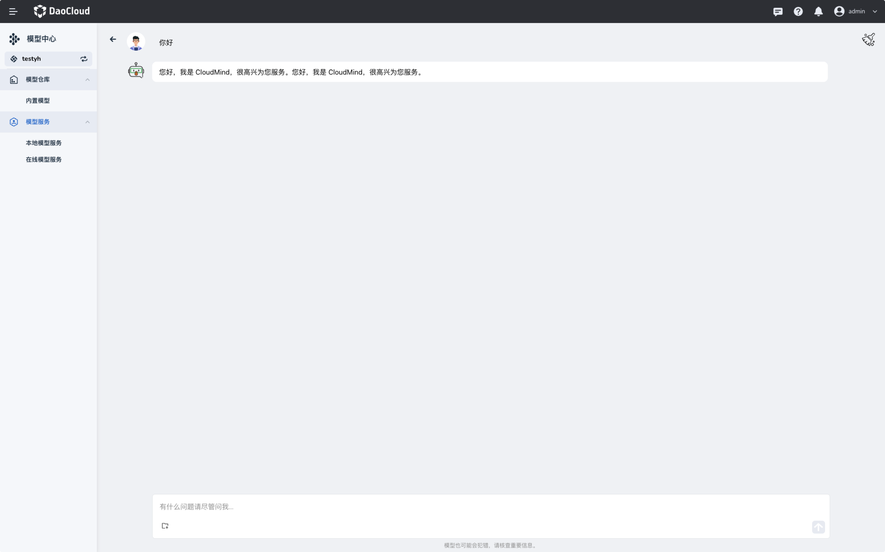

---
hide:
  - toc
---

# 内置模型

内置模型是 d.run 按照规范适配验证后上线到模型中心的，您可以直接部署。

如果想要部署某个模型，

1. 在模型卡片右下角，点击 **部署** 按钮。

    

2. 填写模型服务名称、部署配置、算力类型、资源配置后点击 **确定** 。

    

    !!! info "支持国产 GPU"

        其中算力类型支持 Nvidia GPU 和 Ascend 等国产 GPU。

3. 创建成功后，可以通过部署的模型提供服务。
   
   部署成功后，模型服务显示**健康**。

4. 点击模型服务的名称，可以调试模型的对话能力。
    
    

下一步：[模型服务](../model-service/local.md#_3)
