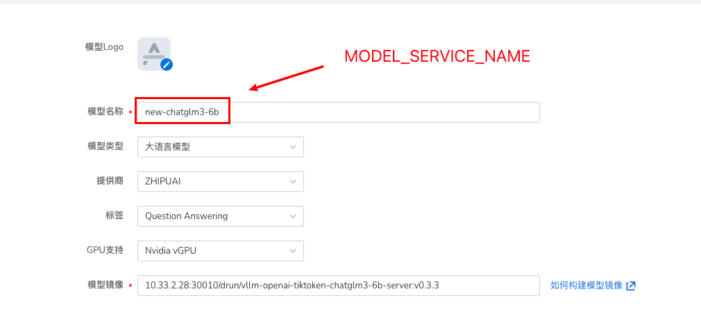

# 接入模型镜像

d.run 模型中心支持接入 [HuggingFace Transformers](https://huggingface.co/models) 上托管的各种生成式 Transformer 模型。

以下是目前支持的模型架构列表。

| 架构 | 模型 | HuggingFace 模型示例 | `LoRA <lora>` |
| --- | ----- | ------------------- | ------------- |
| `AquilaForCausalLM` | Aquila | `BAAI/Aquila-7B`, `BAAI/AquilaChat-7B` 等 | ✅︎ |
| `BaiChuanForCausalLM` | Baichuan | `baichuan-inc/Baichuan2-13B-Chat`, `baichuan-inc/Baichuan-7B` 等 | ✅︎ |
| `ChatGLMModel` | ChatGLM | `THUDM/chatglm2-6b`, `THUDM/chatglm3-6b` 等 | ✅︎ |
| `CohereForCausalLM` | Command-R | `CohereForAI/c4ai-command-r-v01` 等 | |
| `DbrxForCausalLM` | DBRX | `databricks/dbrx-base`, `databricks/dbrx-instruct` 等 | |
| `DeciLMForCausalLM` | DeciLM | `Deci/DeciLM-7B`, `Deci/DeciLM-7B-instruct` 等 | |
| `BloomForCausalLM` | BLOOM, BLOOMZ, BLOOMChat | `bigscience/bloom`, `bigscience/bloomz` 等 | |
| `FalconForCausalLM` | Falcon | `tiiuae/falcon-7b`, `tiiuae/falcon-40b`, `tiiuae/falcon-rw-7b` 等 | |
| `GemmaForCausalLM` | Gemma | `google/gemma-2b`, `google/gemma-7b` 等 | ✅︎ |
| `GPT2LMHeadModel` | GPT-2 | `gpt2`, `gpt2-xl` 等 | |
| `GPTBigCodeForCausalLM` | StarCoder, SantaCoder, WizardCoder | `bigcode/starcoder`, `bigcode/gpt_bigcode-santacoder`, `WizardLM/WizardCoder-15B-V1.0` 等 | |
| `GPTJForCausalLM` | GPT-J | `EleutherAI/gpt-j-6b`, `nomic-ai/gpt4all-j` 等 | |
| `GPTNeoXForCausalLM` | GPT-NeoX, Pythia, OpenAssistant, Dolly V2, StableLM | `EleutherAI/gpt-neox-20b`, `EleutherAI/pythia-12b`, `OpenAssistant/oasst-sft-4-pythia-12b-epoch-3.5`, `databricks/dolly-v2-12b`, `stabilityai/stablelm-tuned-alpha-7b` 等 | |
| `InternLMForCausalLM` | InternLM | `internlm/internlm-7b`, `internlm/internlm-chat-7b` 等 | ✅︎ |
| `InternLM2ForCausalLM` | InternLM2 | `internlm/internlm2-7b`, `internlm/internlm2-chat-7b` 等 | |
| `JAISLMHeadModel` | Jais | `core42/jais-13b`, `core42/jais-13b-chat`, `core42/jais-30b-v3`, `core42/jais-30b-chat-v3` 等 | |
| `LlamaForCausalLM` | LLaMA, Llama 2, Meta Llama 3, Vicuna, Alpaca, Yi | `meta-llama/Meta-Llama-3-8B-Instruct`, `meta-llama/Meta-Llama-3-70B-Instruct`, `meta-llama/Llama-2-13b-hf`, `meta-llama/Llama-2-70b-hf`, `openlm-research/open_llama_13b`, `lmsys/vicuna-13b-v1.3`, `01-ai/Yi-6B`, `01-ai/Yi-34B` 等 | ✅︎ |
| `MiniCPMForCausalLM` | MiniCPM | `openbmb/MiniCPM-2B-sft-bf16`, `openbmb/MiniCPM-2B-dpo-bf16` 等 | |
| `MistralForCausalLM` | Mistral, Mistral-Instruct | `mistralai/Mistral-7B-v0.1`, `mistralai/Mistral-7B-Instruct-v0.1` 等 | ✅︎ |
| `MixtralForCausalLM` | Mixtral-8x7B, Mixtral-8x7B-Instruct | `mistralai/Mixtral-8x7B-v0.1`, `mistralai/Mixtral-8x7B-Instruct-v0.1`, `mistral-community/Mixtral-8x22B-v0.1` 等 | ✅︎ |
| `MPTForCausalLM` | MPT, MPT-Instruct, MPT-Chat, MPT-StoryWriter | `mosaicml/mpt-7b`, `mosaicml/mpt-7b-storywriter`, `mosaicml/mpt-30b` 等 | |
| `OLMoForCausalLM` | OLMo | `allenai/OLMo-1B-hf`, `allenai/OLMo-7B-hf` 等 | |
| `OPTForCausalLM` | OPT, OPT-IML | `facebook/opt-66b`, `facebook/opt-iml-max-30b` 等 | |
| `OrionForCausalLM` | Orion | `OrionStarAI/Orion-14B-Base`, `OrionStarAI/Orion-14B-Chat` 等 | |
| `PhiForCausalLM` | Phi | `microsoft/phi-1_5`, `microsoft/phi-2` 等 | |
| `Phi3ForCausalLM` | Phi-3 | `microsoft/Phi-3-mini-4k-instruct`, `microsoft/Phi-3-mini-128k-instruct` 等 | |
| `QWenLMHeadModel` | Qwen | `Qwen/Qwen-7B`, `Qwen/Qwen-7B-Chat` 等 | |
| `Qwen2ForCausalLM` | Qwen2 | `Qwen/Qwen2-beta-7B`, `Qwen/Qwen2-beta-7B-Chat` 等 | ✅︎ |
| `Qwen2MoeForCausalLM` | Qwen2MoE | `Qwen/Qwen1.5-MoE-A2.7B`, `Qwen/Qwen1.5-MoE-A2.7B-Chat` 等 | |
| `StableLmForCausalLM` | StableLM | `stabilityai/stablelm-3b-4e1t/` , `stabilityai/stablelm-base-alpha-7b-v2` 等 | |

## 如何为模型构建镜像

以下是完整的指导流程，包含拉取模型、构建 Docker 镜像、配置私有仓库，以及将镜像推送到自定义仓库的步骤。

### 拉取 Hugging Face 上的模型

#### 获取模型的 Clone 地址

1. 前往 [Hugging Face](https://huggingface.co)
2. 找到目标模型，例如 "chatglm3-6b"
3. 复制模型的 Git URL 以用于克隆，例如：

    ```bash
    https://huggingface.co/THUDM/chatglm3-6b
    ```

#### Clone 模型

使用以下命令克隆模型（确保已安装 Git 和 Git LFS）：

```bash
git lfs install
git clone https://huggingface.co/THUDM/chatglm3-6b
```

如果克隆失败，请尝试以下步骤：

```bash
# 跳过 smudge - 我们会在后面的步骤中以更快的方式批量下载二进制文件
git lfs install --skip-smudge
# 在这里执行 git clone
git clone https://huggingface.co/THUDM/chatglm3-6b
# 进入克隆的目录（如果是其他模型，注意替换这个目录）
cd chatglm3-6b
# 在新的克隆中获取所有的二进制文件
git lfs pull
# 重新设置 smudge
git lfs install --force
```

### 构建 Docker 镜像

#### 创建 Dockerfile

创建一个名为 `Dockerfile` 的文件，并粘贴以下内容。确保根据实际需求设置 `MODEL_NAME`。

```dockerfile title="Dockerfile"
FROM vllm/vllm-openai:v0.3.3

ARG MODEL_NAME
ENV MODEL_NAME=${MODEL_NAME}

RUN pip install tiktoken

COPY ./${MODEL_NAME} /${MODEL_NAME}

CMD ["--model", "/${MODEL_NAME}", "--trust-remote-code", "--served-model-name", "${MODEL_SERVICE_NAME}"]
```

!!! note

    请手动替换 Dockerfile 最后一行中的 `MODEL_NAME` 和 `MODEL_SERVICE_NAME`。  
    MODEL_SERVICE_NAME 与模型仓库中填入的名称保持一致:
    
    
    
    示例：
    
    ```dockerfile
    CMD ["--model", "/chatglm3-6b", "--trust-remote-code", "--served-model-name", "new-chatglm3-6b"]
    ```

#### 构建 Docker 镜像

使用正确的 `MODEL_NAME` 和镜像标签构建 Docker 镜像。示例中使用 `vllm-openai-tiktoken-chatglm3-6b-server` 作为镜像名称。

```bash
docker build --build-arg MODEL_NAME=chatglm3-6b -t vllm-openai-tiktoken-chatglm3-6b-server .
```

### 推送镜像到自定义 Docker 仓库

#### 登录到 Docker 仓库

如果要推送到 Docker Hub 或其他私有仓库，请确保已登录到相应的 Docker 仓库。

```bash
docker login
```

对于其他仓库，例如 Google Container Registry 或 Amazon ECR，需要根据其文档指引进行登录和身份验证。

#### 配置镜像标签

在推送镜像之前，将镜像标签配置为目标仓库地址。以下示例使用自定义的私有仓库地址：

```bash
# 假设你的仓库地址是 myregistry.example.com
docker tag vllm-openai-tiktoken-chatglm3-6b-server myregistry.example.com/vllm-openai-tiktoken-chatglm3-6b-server
```

#### 推送镜像到仓库

将镜像推送到目标仓库：

```bash
docker push myregistry.example.com/vllm-openai-tiktoken-chatglm3-6b-server
```

#### 验证推送成功

确认推送成功后，可以在 Docker 仓库的仪表盘上查看已推送的镜像。
