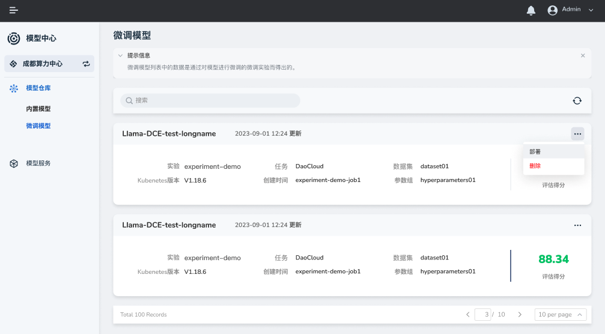
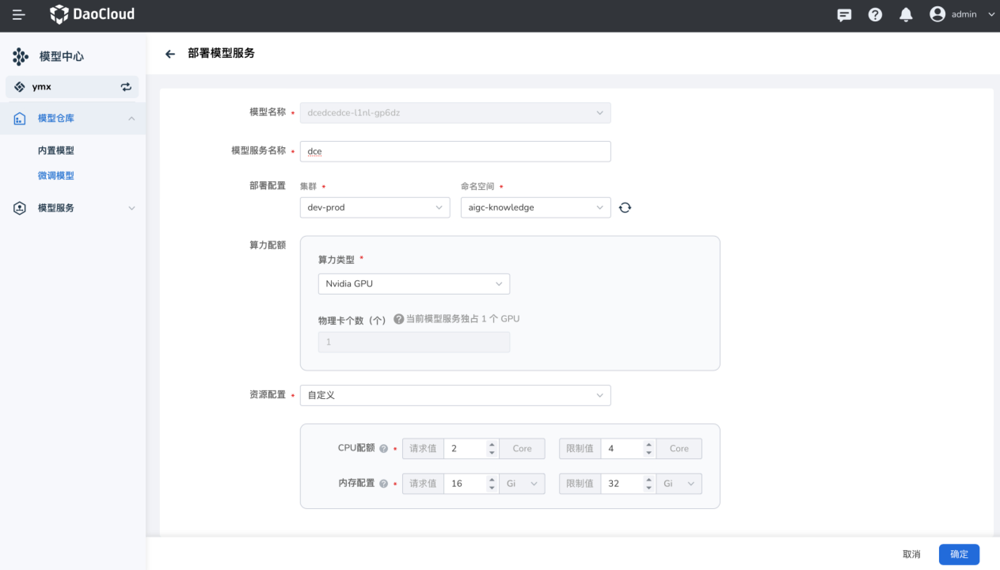

---
hide:
  - toc
---

# 微调模型

微调模型是指通过 [DataTunerX](https://github.com/DataTunerX/datatunerx) 等工具的微调得出的模型，部署该模型的服务后，可通过问答的方式检验微调的效果

## 部署

1. 点击右侧的 **...** ，在弹出的选项中选择 **部署** 

    

2. 填写模型服务名称、命名空间、算力配额、资源配置后点击 **确定** （注⚠️：资源给的太少服务会起不来）

    

    !!! info "支持国产 GPU"

        其中算力类型支持 Nvidia GPU 和 Ascend 等国产 GPU。

3. 创建成功，接下来可以通过部署的模型提供服务。

下一步：[模型服务](../model-service/local.md#_4)

## 删除

1. 点击右侧的 **...** ，在弹出的选项中选择 **删除** 。

    

2. 输入模型名称，确认无误后删除。

    !!! note

        删除操作不可逆，请谨慎操作。
