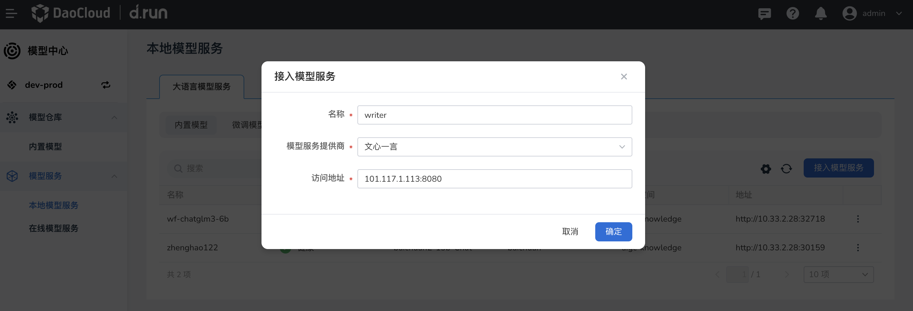
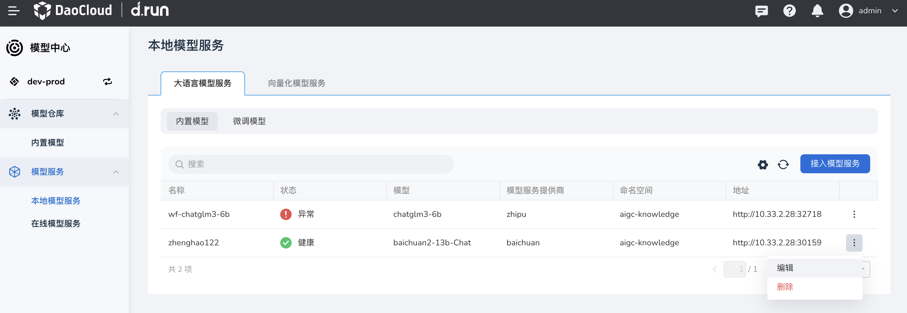

# 本地模型服务

顾名思义，这种模型部署在本地或内网，在一定的地理范围内提供服务。

## 大语言模型服务

可采用两种模型提供服务。

### 内置模型

这种模型可以直接接入，然后提供服务。

1. 点击右侧的 **接入模型服务** 按钮，

    

1. 填写名称，选择服务提供商，输入访问地址后，点击 **确定** 。

    

    点击 **确定** 后，屏幕上会有几种提示：

    - 接入中：测试链接中，请稍候…
    - 接入成功：链接成功
    - 接入失败：抱歉，模型服务当前不可用，请稍后重试，或联系系统管理员获取更多帮助

1. 屏幕提示创建，你可以点击右侧的 **⋮** ，执行 **编辑** 或 **删除** 等更多操作。

    

### 微调模型

对于向量化模型，直接勾选某条服务，就可以发起 **对话**。

## 向量化模型服务

这种服务不用区分内置模型或微调模型，接入服务的过程与[内置模型的接入步骤](#_3)相同。

如果要删除某个服务，点击列表右侧的 **⋮** ，在弹出菜单中选择 **删除** ，在弹窗中输入服务的名称，确认无误后点击 **删除** 。

!!! caution

    删除之前，请确认没有应用使用该模型服务。
    此操作不可逆，请谨慎操作。
