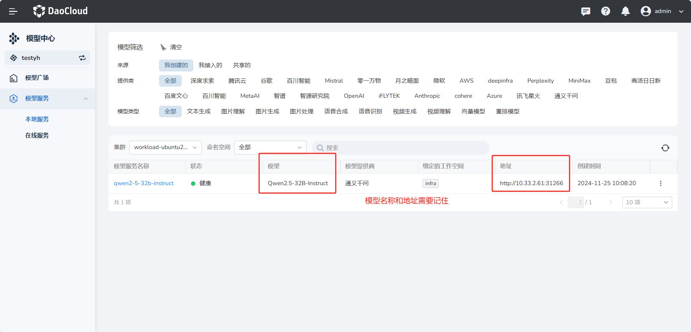
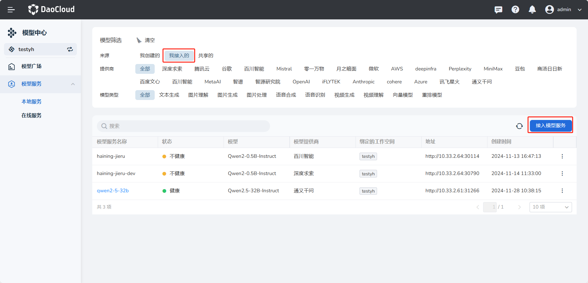

---
hide:
  - toc
---

# 本地服务

通过模型广场模型部署的模型服务可以在这里进行 **模型对话**、**编辑**、**分享**、**接入模型服务** 等操作。

## 模型服务对话

等待模型服务的状态 **健康** ，点击其名称直接进行 **对话调式**。
  
  
  

## 模型服务分享

1. 点击模型服务右边的 ┇ 符号，选择 **绑定/解绑工作空间** ，即可将模型服务分享分享到其他工作空间下。绑定后，其他工作空间下的用户就可以直接使用该模型服务。
    
    
    
    
2. 去到分享的工作空间下可查看分享的模型服务，并可以直接使用该模型服务进行 **对话调式** 和 **应用创建** 。

    

## 模型服务的接入

1. 获取需要接入的模型服务的模型名称，服务的地址等信息。

    

2. 进入 **我接入的** 页面，点击 **接入模型服务** 。

    

3. 正确填写表单信息，接入模型服务，模型名称和服务地址信息填写第一步获取的信息。

    

