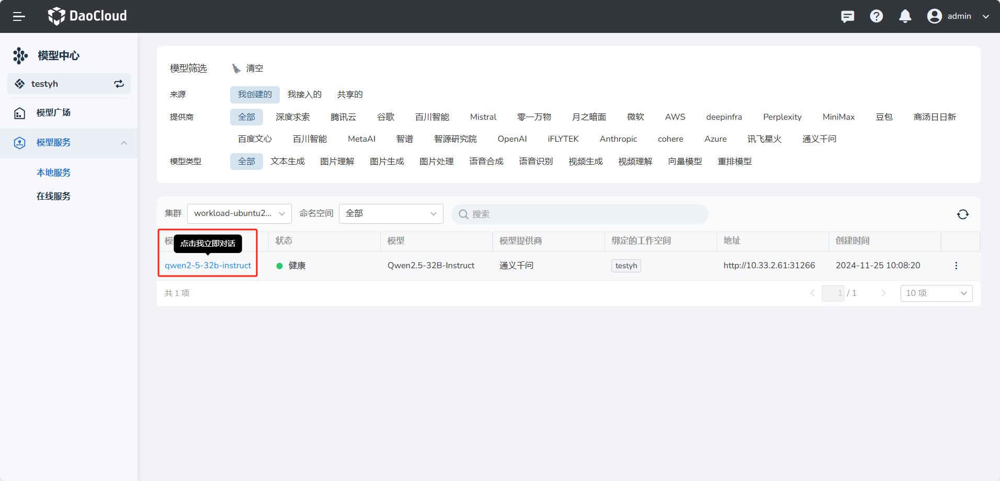
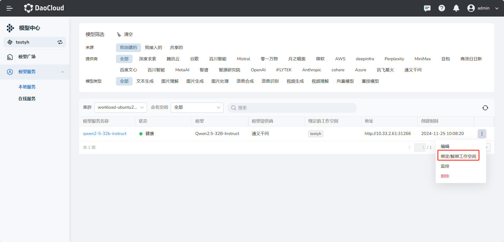
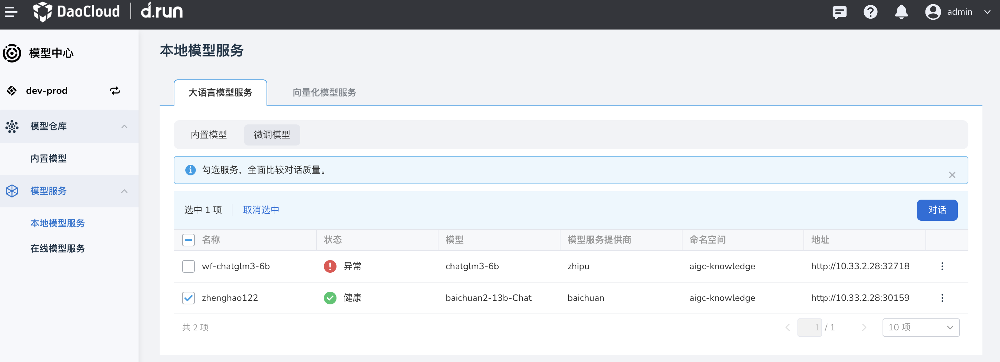
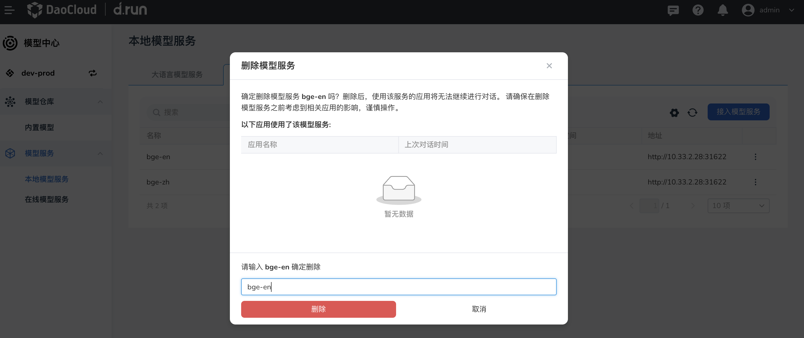

# 本地模型服务

顾名思义，此类模型部署在本地或内网，在限定地理范围内提供服务。
在本地可提供大语言和向量化两种模型服务。

## 大语言模型服务

大语言模型即 Large Language Model (LLM)，这是基于大量数据进行预训练的超大型深度学习模型。
可采用内置和微调两种模型提供服务。

### 内置模型

此类模型可直接接入，提供服务。

1. 点击中间 **我接入的** ，点击右侧的 **接入模型服务** 按钮。

    

1. 填写名称，模型名称，选择模型服务提供商，输入访问地址后，点击 **确定** 进行连接测试（注：大语言模型访问地址需要在url后加上 **/v1/chat/completions**）。

    

    点击 **确定** 后，屏幕上会有几种提示：

    - 接入中：测试连接中，请稍候
    - 接入成功：连接成功
    - 接入失败：抱歉，模型服务当前不可用，请稍后重试，或联系系统管理员获取更多帮助

2. 创建成功后，在列表中，您可点击右侧的 **⋮** ，执行 **编辑** 、 **绑定/解绑工作空间** 、 **删除** 操作。

    

### 微调模型

对于微调模型，勾选模型服务后，点击右侧 **对比对话** 即可与该模型 **对话**(注：最多选中三个微调模型进行对话)。

## 向量化模型服务

向量化模型：此类模型将数据表示成计算机可识别的实数向量（vector），根据粒度大小不同可将数据特征表示分为字、词、句子或篇章几个层次。
数据向量化的方法主要分为离散表示和分布式表示。也就是说，数据向量化是将原始数据转换为数值向量的过程，以便计算机可以理解和处理数据。

此类服务不用区分内置模型或微调模型，接入服务过程与[内置模型的接入步骤](#_3)相同（注：向量化模型直接填写正确的访问地址即可使用）

如果要删除某个服务，点击列表右侧的 **⋮** ，在弹出菜单中选择 **删除** ，在弹窗中输入服务的名称，确认无误后点击 **删除** 。

!!! caution

    删除之前，请确认没有应用使用该模型服务。
    此操作不可逆，请谨慎操作。

