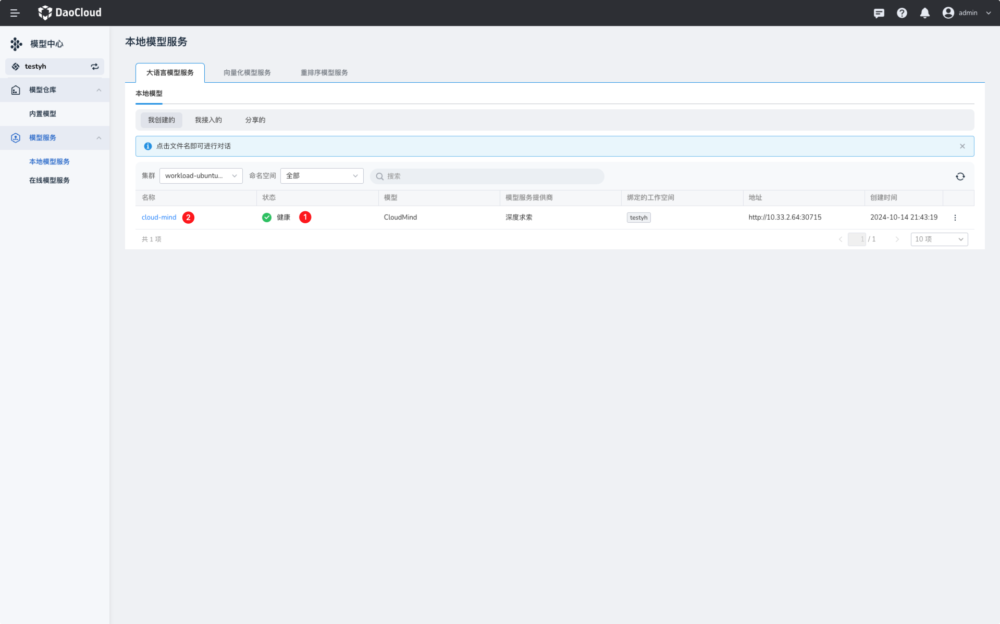

# 本地模型服务

顾名思义，此类模型部署在本地或内网，在限定地理范围内提供服务。
在本地可提供大语言和向量化两种模型服务。

<iframe width="560" height="315" src="https://harbor-test2.cn-sh2.ufileos.com/drun/deploy-model.mp4" title="部署模型教学" allow="accelerometer; autoplay; clipboard-write; encrypted-media; gyroscope; picture-in-picture; web-share" allowfullscreen></iframe>

## 大语言模型

大语言模型即 Large Language Model (LLM)，这是基于大量数据进行预训练的超大型深度学习模型。

### 部署大语言模型

1. 进入模型中心，选择需要部署的模型，点击右下角部署
   

2. 填写页面参数
   

3. 点击确定，等待模型部署完成
   
   部署成功后，模型服务显示**健康**。
4. 点击模型服务的名称，可以调试模型的对话能力。
   
