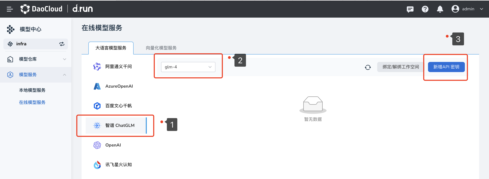
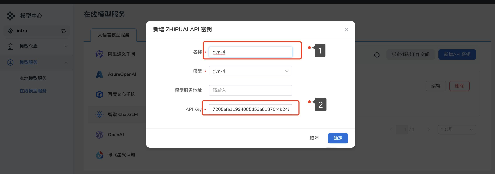
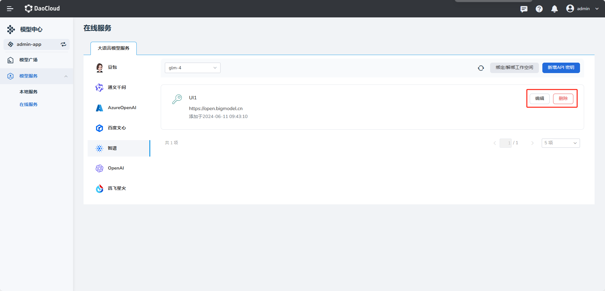

---
hide:
  - toc
---

# 在线模型服务

该模型可通过 API 密钥的形式，向公众提供在线服务。
获取到 API 密钥的用户，即可使用模型提供的服务。

## 大语言模型服务

D.run平台暂时支持接入的模型服务有：阿里通义千问、AzureOpenAI、百度文心千帆、智谱ChatGLM、OpenAl、讯飞星火认知六种公有云的服务。
如需新增 API 密钥（此处以智谱ChatGLM服务为例），步骤如下所示：

1. 选择 **智谱ChatGLM** 的模型服务，中部下拉框中切换至 **glm-4** 点击右侧的 **新增 API 密钥** 按钮

    

2. 填写密钥名称、APIkey后点击 **确定** 。(注⚠️：**模型服务地址** 非必填，填写错误会连接失败，不填写系统有默认的URL，**故不建议用户自行填写**)

    

3. 提示连接成功后，您可以执行 **编辑** 、 **删除** 等更多操作。

    

## 向量化模型服务（正在开发中，敬请期待）

......

