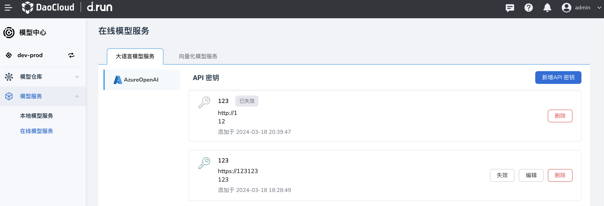
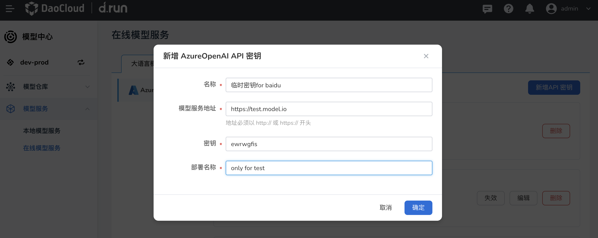
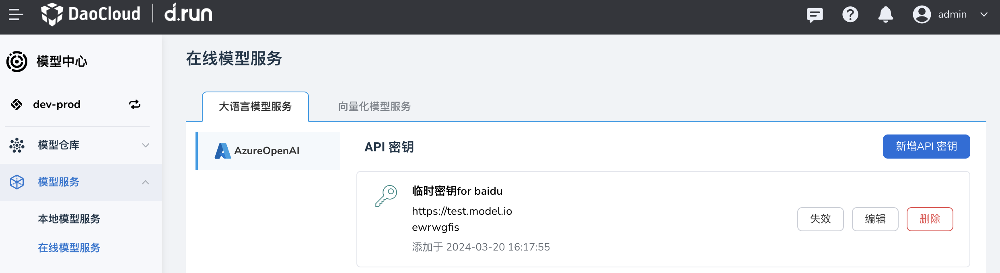
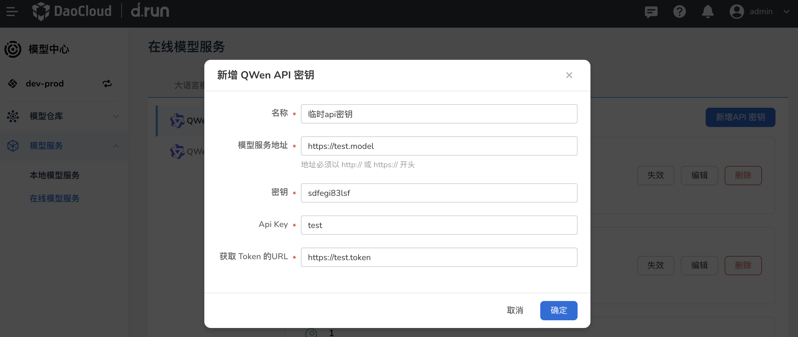

---
hide:
  - toc
---

# 在线模型服务

这种模型可以通过 API 密钥的形式，面向公众提供在线服务。
那些获取到 API 密钥的用户，即可使用这些模型提供的服务。

## 大语言模型服务

对于大语言模型服务，可使用 AzureOpenAI 等公有云的服务。
若要新增一个 API 密钥，

1. 点击右侧的 **新增 API 密钥** 按钮

    

1. 填写信息后点击 **确定** 。

    

1. 屏幕提示成功创建，您可以执行 **失效** 、**编辑** 、 **删除** 等更多操作。

    

## 向量化模型服务

对于向量化模型服务，也可以通过 API 密钥来访问。
新增 API 密钥的参数信息与[大语言模型](#_2)稍有不同。

