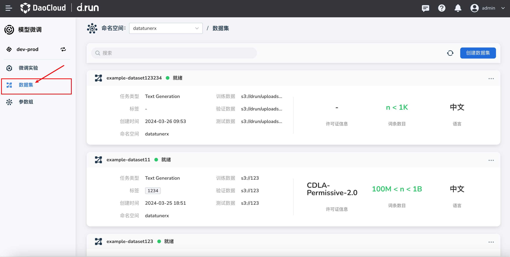
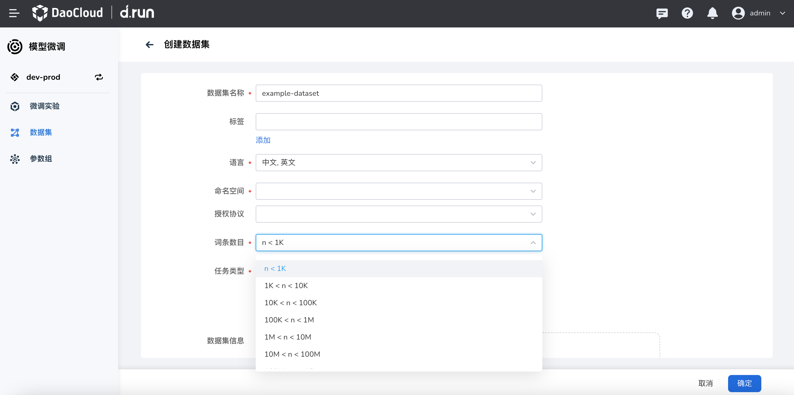
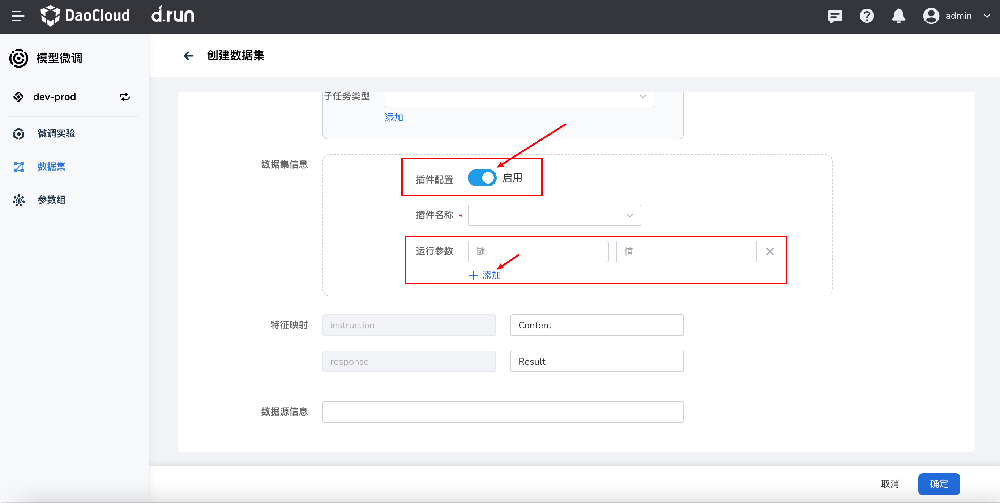
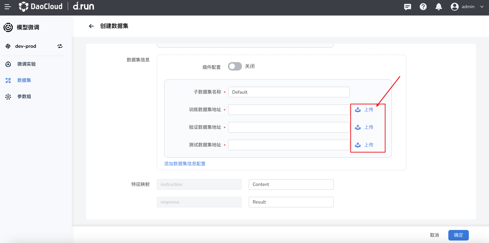

# 数据集

!!!note

     数据集是一个数据的集合，通常以表格形式出现。每一列代表一个特定变量。每一行都对应于某一成员的数据集的问题。它列出的价值观为每一个变量，如身高和体重的一个物体或价值的随机数。每个数值被称为数据资料。

- 点击模型微调中的数据集，即可进入到管理数据集页面。

 

## 创建数据集

1. 点击创建数据集按钮，即可进入到创建数据集页面。

2. 填写数据集名称（必填）：不可为空，可输入1-50个字符。

3. 填写数据集标签（选填）：可输入1-50个字符，作为数据集名称的备注。

4. 选择数据集语言类型（必填）：目前可选择为中文/英文，也可以全部选择。

5. 选择数据集的命名空间（必填）：命名空间是数据集的所属。

6. 选择授权协议：推荐选择为CC-BY-NC，也可以选择其他协议。

7. 选择词条数目（必填）：选择的区间范围是上传数据文件时，文件的大小。

 

8. 选择数据集任务类型（必填）：目前可选择为文本生成/QA对话/文本分类/概括。

  - 子任务类型（子任务可以添加多个）：可以点击添加，在语言建模，掩蔽语言建模和自然语言处理中选择子任务类型。

9. 填写数据集信息（分为插件配置和标准配置）：

     - 插件配置：点击打开插件配置，即可选择插件，如果插件需要填写参数，则在插件配置中填写参数。

     

     - 标准配置：需要填写子数据集名称，训练数据集地址，验证数据集地址，测试数据集地址。
       
       - 训练数据集地址：点击上传数据文件后，点击上传文件，即可上传数据文件。

       - 验证数据集地址：点击上传数据文件后，点击上传文件，即可上传数据文件。

       - 测试数据集地址：点击上传数据文件后，点击上传文件，即可上传数据文件。

     

10. 特征映射：在特征映射中填写数据文件中的列名。

11. 数据源信息：在数据源信息中填写数据源的名称，数据源的描述，数据源的链接。

12. 点击确定，即可创建数据集。