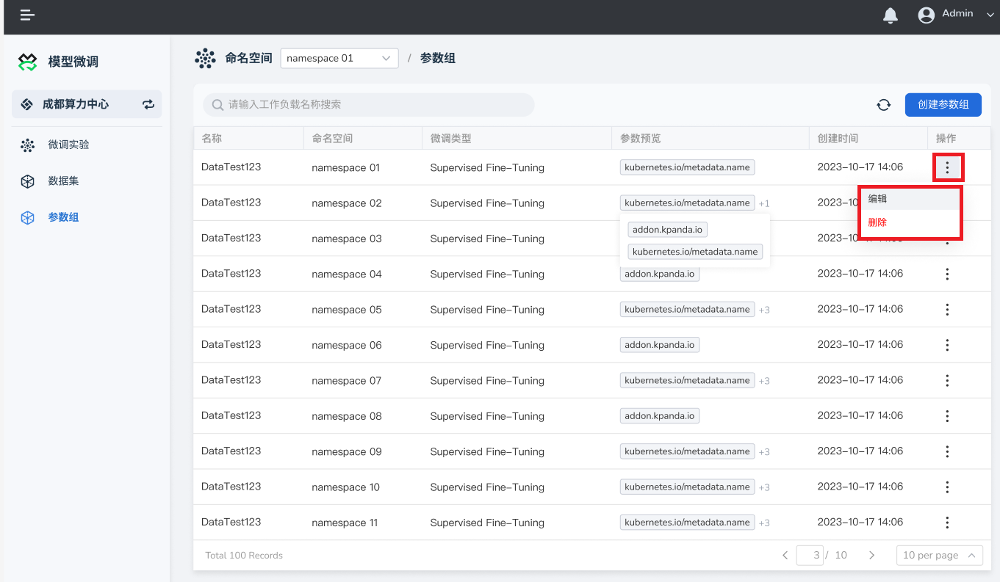

---
hide:
  - toc
---

# 微调实验

微调实验是使用 **数据组** 、 **大模型** 、 **参数组** 这三个配置灵活组合，利用底层的多个 GPU 卡，一次操作，并行完成多次微调，
然后基于所有微调模型进行总体的评估。最后在微调实验中，使用相同的评估标准，找出最佳的微调模型作为本次微调实验的推荐微调模型。

## 创建微调实验

1. 在 **模型微调** 中，点击右上角 **创建微调实验** 按钮。

    

2. 填写实验基本信息：

    - 实验名称：由小写字母、数字字符或“-”组成，并且必须以字母或数字字符开头及结尾。
    - 选择评估方式：实验中对模型使用的评分准则。
    - 选择命名空间

    

3. 填写微调任务配置：

    - 任务名称：由小写字母、数字字符或“-”组成，并且必须以字母或数字字符开头及结尾。
    - 选择算力类型并填写物理卡个数。

        !!! info

            当前模型服务仅支持Nvidia的GPU，模型会根据物理卡个数在GPU上进行分布式微调。

    - 资源配置：
        - CPU配额：通常需要使用多核CPU来加速训练和推理过程。具体的 CPU 配额需要根据任务的需求和可用的硬件资源来确定。
        - 内存配置：根据模型的大小和数据集的大小来确定内存需求，并根据需要调整内存配置。

        推荐CPU配额和内存配置请求值为 **16** Core，限制值为 **32** Core。

        !!! note

            两者的请求值皆不可超过限制值。

        

    - 选择实验中要使用的 **基础大模型** 、 **数据组** 以及 **参数组** 。

        若要设置多个微调任务，可点击左下角 **添加任务** 创建新任务。

        

4. 点击右下角 **确认** 按钮即可创建微调实验。

## 停止或删除微调实验

若想停止或删除某个微调实验，可点击右侧 **⋮** ，在弹出菜单中选择 **停止** 或 **删除** 。

!!! note

    停止及删除操作不可逆，请谨慎操作。
