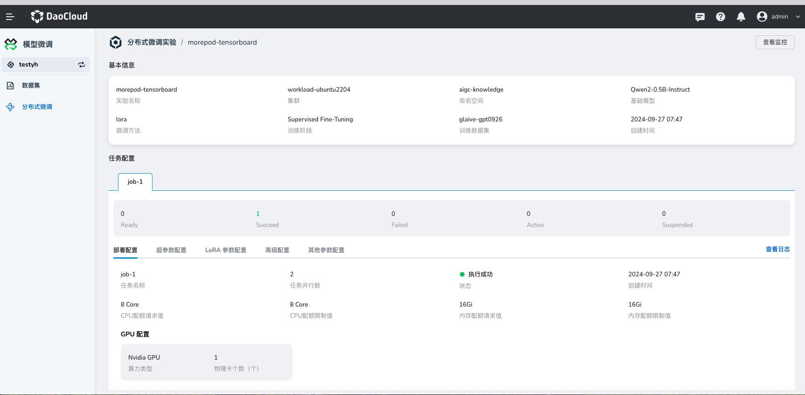
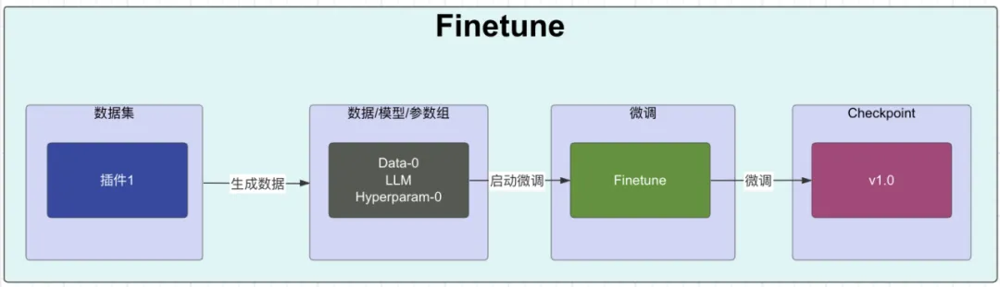
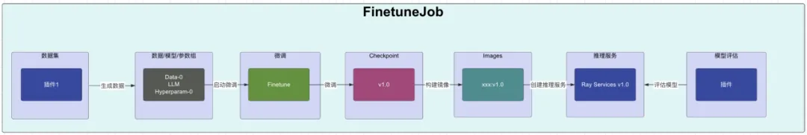
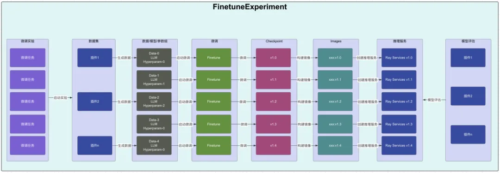

---
hide:
  - toc
---

# 什么是模型微调

DaoCloud DataTunerX（DTX）是一站式自动化平台，专注于大型语言模型微调。
涵盖了数据集、超参组、模型仓库、模型微调、模型评估和模型推理的全生命周期，实现了高度自动化。
通过高效利用底层分布式算力资源，DTX 能够进行矩阵式的模型微调实验，从而推动大型模型的敏捷和自动化迭代。

DTX 模型微调是一个云原生解决方案，旨在与分布式计算框架集成。
利用可扩展的 GPU 资源，该平台专注于高效微调 LLM 模型。
其核心优势在于促进批量微调任务，使用户能够在单个实验中同时进行多个任务。

## 几个术语

**云原生（Cloud Native）：** 基于 Kubernetes 的 CRD 和 Operator 设计和开发的，一套围绕大语言模型、数据处理、
大语言模型微调、评估、并行等能力的开源解决方案。让大模型的微调能力变成云原生应用的能力。

**数据集（Dataset）：** 与大语言模型微调中的数据集定义基本差不多，这里主要提到的是训练集（用于大语言模型微调的主要微调数据，也就是想让大语言模型能够学会的数据），
验证集（在微调过程中用于验证大语言模型微调效果的数据），测试集（用于在大语言模型这次微调结束之后，用于验证本地微调的效果的数据）。

**基础大语言模型（Base Large Language Model）：** 大语言模型（LLM）是指使用大量文本数据训练的深度学习模型，是一种用于自然语言处理的深度学习模型，
它通过大规模的预训练来学习自然语言的表示和语言模式。这些模型可以用于各种任务，如文本生成、文本分类、机器翻译等，以生成或处理自然语言文本。
基础大语言模型就是微调过程中，被微调的底座的大语言模型。

**参数组（Hyperparameter Group）：** 代表一组超参的集合。在大语言模型的微调过程中，可以根据需要设置很多不同的超参，
如 Scheduler、Optimizer、LearningRate、Epochs、BlockSize、BatchSize 等，这里的参数组就是各种超参的组合。

**评估（Scoring / Evaluation）：** 用于对大语言模型进行评定好与不好的一种方式。还有一种专业点的说法叫 metrics。
评估中支持很多种不同的 metric 类型，如 Bleu、Accuracy、Precision、Recall、Rouge、F1 等，不同类型的大模型任务需要使用不同的
metric 算法进行评估。评估的时候也需要特定格式的数据来进行评估。

**微调实验（FinetuneExperiment）：** 实验，顾名思义就是要做一次尝试。可以使用数据集、大语言模型、参数组进行不同的组合进行实验，
指定本次实验的评估方式，每个组合就是一个微调任务。最终根据这次实验的所有组合进行微调之后，给每个微调任务进行打分，评估出这次实验微调出来最好的模型。
在这个过程中是并行地使用所有可以使用的算力，我们知道大语言模型的微调是存在随机性，在这个背景下，卡越多，每次实验并行数越多，每次实验结束，
出现优秀模型的概率就越大。这是用算力资源换取时间的方式，来提升整体的微调效率。下次微调就可以基于上次评估出来最好的模型进行再次微调。

**微调任务（FinetuneJob）：** 一次微调任务就是使用指定的数据集、指定的大语言模型、指定的参数组、指定的评估方式，进行微调的运行，
运行结束就会产生一个微调版本的大语言模型，并且得到对这次微调出来的模型的评分。

**微调（Finetune）：** 使用指定的数据集、指定的大语言模型、指定的参数组进行真正的微调工作，包含了具体的微调工作的实现，
在微调过程中会有相关的微调的日志、监控数据、微调出来的权重文件等。

**数据插件（DataPlugin）：** 数据是大语言模型的基石。微调需要的数据是多种多样的，所以处理数据的能力也无法统一标准化，这种情况下，
满足数据处理的多样化能力就需要系统有插件化的能力，提供可以根据不同的数据进行不同处理的能力。

**评估插件（ScoringPlugin）：** 不同类型的模型评估方式可能是不同的，不同的场景评估方式也可能是不同的，
这个时候无法内置一种万能的评估能力，所以需要开放评估能力，以插件的方式实现这种能力。

**模型仓库（LLM / LLMCheckpoint）：** 不管是基础大模型，或者是微调出来的模型，在这里它都是一个模型，这里的模型仓库就是存放模型的地方，
可以是基础大模型（LLM），也可以是微调出来的模型（LLMCheckpoint），基于这些模型可以进行后续的推理服务的部署或者对比等。

## 能力介绍

### 数据集处理

- 根据训练的数据地址，验证的数据地址，测试的数据地址等信息定义数据集。目前支持对象存储 (S3) 和本地文件的方式。
- 修改数据集的信息
- 展示数据集的列表信息和详细信息
- 删除已经存在的数据集
- 支持使用数据集插件的方式创建数据集

### 参数组

- 提供了基于 lora 的机制所需要大模型的微调参数来创建参数组
- 修改参数组的信息
- 展示参数组的列表信息和详细信息
- 删除已经存在的参数组

### 微调实验

- 根据不同的数据集、基础大模型、参数组的组合并行的创建和运行微调实验
- 支持设置一个微调实验使用的评估方式，以相同的评估方式给这次实验的所有任务进行模型评估，得到本次实验的最佳微调模型
- 支持查看每一个微调实验中的每一个微调任务的详情、日志、监控信息
- 目前支持 lora 的方式进行大模型的微调能力
- 目前支持 llama2 的模型微调能力

### 模型评估

- 创建一个评估对象，内置支持设置相关的问题和期望的答案，基于此来评估微调出来的模型的评分
- 查看、修改、删除评估对象
- 支持使用评估插件的方式创建评估对象

### 大语言模型仓库

- 显示所有实验微调出来的模型
- 利用微调出来的模型进行部署推理服务
- 支持根据分类进行过滤

### 推理服务

- 显示从模型仓库创建出来的推理服务，包括列表的方式显示以及详情
- 选择多个推理服务，使用相同的问题，让所有选择的推理服务同时回答这个问题，对比不同模型的推理服务的回答效果
  支持在对比的过程中，展示计算性能数据，包括回复的 token 总数、每秒生成的 token 数、总的耗时是多少等性能数据

### 数据插件

- 创建一个数据集的插件
- 查看、修改、删除数据集的插件
- 支持开发自己的数据插件，同时在数据集创建的时候进行使用

### 评估插件

- 创建一个评估的插件
- 查看、修改、删除评估的插件
- 支持开发自己的评估插件，同时在微调实验创建的时候进行使用

### 控制台/命令行

- 数据集管理
- 参数组管理
- 微调实验管理
- 模型仓库管理
- 推理服务管理

## 核心思路

**Finetune:** 这里的微调专注于基于数据、大模型、参数组进行大模型微调的核心业务处理能力。
只关注微调本身，最后的输出就是 checkpoint。是一个很典型的微调的流程。微调过程中的状态也会记录在资源对象的状态中。

**FinetuneJob：** 这里的微调任务，不仅仅有上面的微调的能力，还会基于云原生的方式构建对应的镜像，以及启动对应微调出来的大模型的推理服务，
并基于推理服务来完成本次的微调模型的模型评估能力，最后还会保存评估结果。FinetuneJob 中会包含 Finetune 的能力。
FinetuneJob 在运行过程中的状态也会记录在资源对象的状态中，同时还会同步 Finetune 的状态到 FinetuneJob 中的状态中。

**FinetuneExperiment：** 因为大模型微调存在的不确定性，所以在资源充分的情况下，并行微调就变得很多必要。
这里的微调实验就是利用数据、大模型、参数组这三个配置灵活组合，利用底层的多个 GPU 的卡，一次操作，并行完成多次微调，
然后基于所有微调模型进行总体的评估，最后在这次实验中，使用相同的评估标准，找出最佳的微调模型作为本次微调实验的推荐的微调模型。
FinetuneExperiment 中其实就是包含了多个 FinetuneJob。也是用户侧使用的入口。FinetuneExperiment 在运行过程中的状态也会记录在资源对象的状态中，
同时还会同步 FinetuneJob 的状态到 FinetuneExperiment 中的状态中。

[注册并体验 d.run](https://console.d.run/){ .md-button .md-button--primary }
