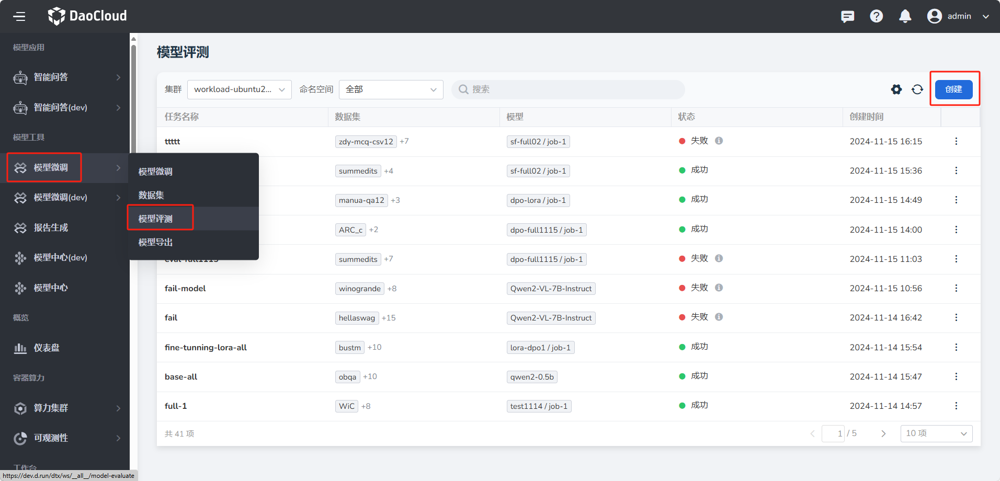
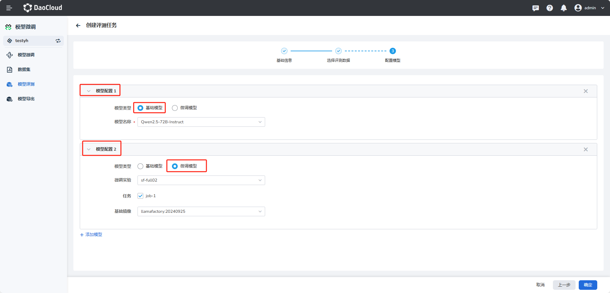
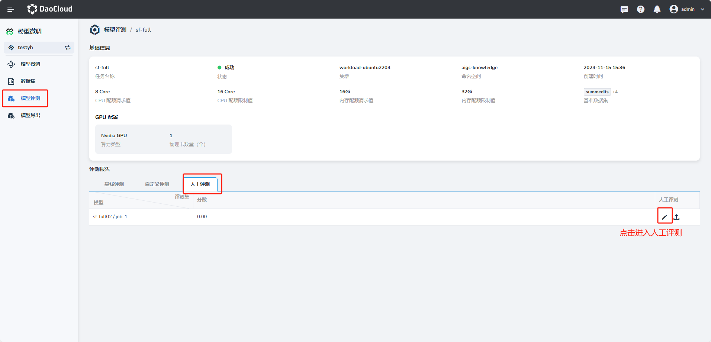
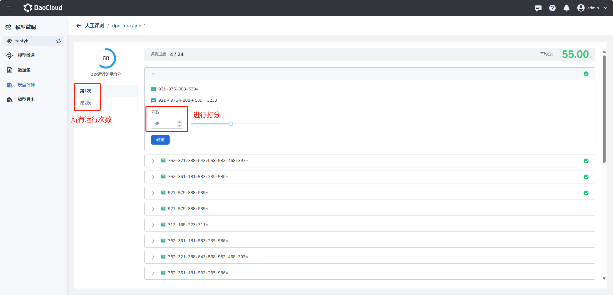

---
hide:
  - toc
---

# 模型评测

**模型评测** 基本功能操作使用说明如下。

## 创建模型评测任务

1. 进入 **模型微调** 菜单下的 **模型评测** 页面，点击 **创建** 按钮。

    

2. 填写基础信息。
    
    - **名称** ：输入符合规范的名称。
    - **部署位置** ：选择有 GPU 的可用的集群和命名空间。
    - **算力配额** ：配置使用的 GPU 卡数量。
    - **资源配置** ：设置 CPU、内存的使用配额。

    

3. **选择评测数据** ：支持 **基线评测**、**自定义评测**、**人工评测**。

    - **基线评测** ：默认开启，选择官方提供的数据集进行系统评测。
    - **自定义评测** ：选择开启，选择自定义的数据集进行系统评测。
    - **人工评测** ：选择开启，选择自定义数据集进行人工评测，可以设置运行次数。

    

4. **配置模型** ：支持使用 **基础模型** 和 **微调模型** 进行评测。

    - **模型配置** ：可以选择 **基础模型** 和 **微调模型**，且可以添加多个模型配置。

    

5. 点击右下角 **确定** 按钮创建模型评测。

## 模型评测详情查看

1. 点击模型评测任务的名称，进入模型评测详情页。

    

## 人工评测

1. 进入模型评测详情后，选择人工评测，点击右边的“笔”符号，进行人工评测打分。

    

2. 对所有运行次数的每一条数据进行打分。

    

