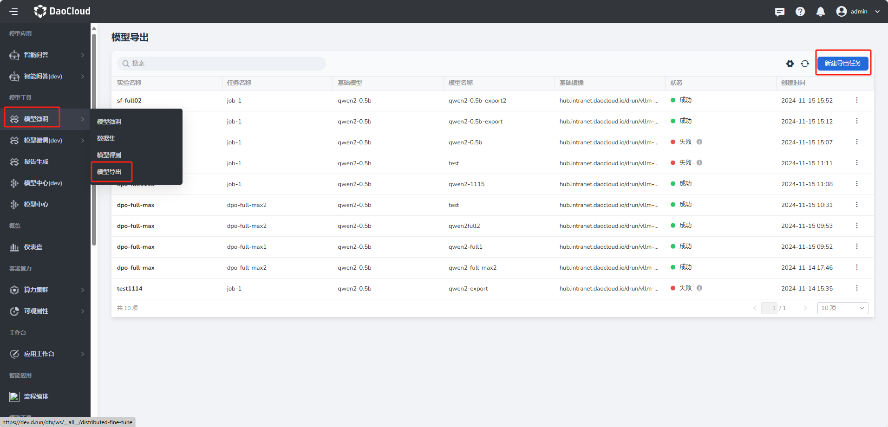
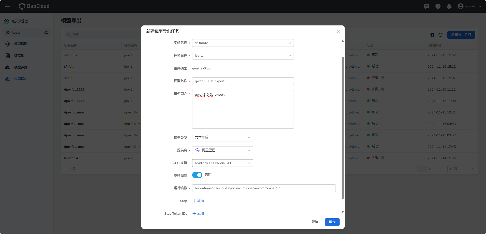
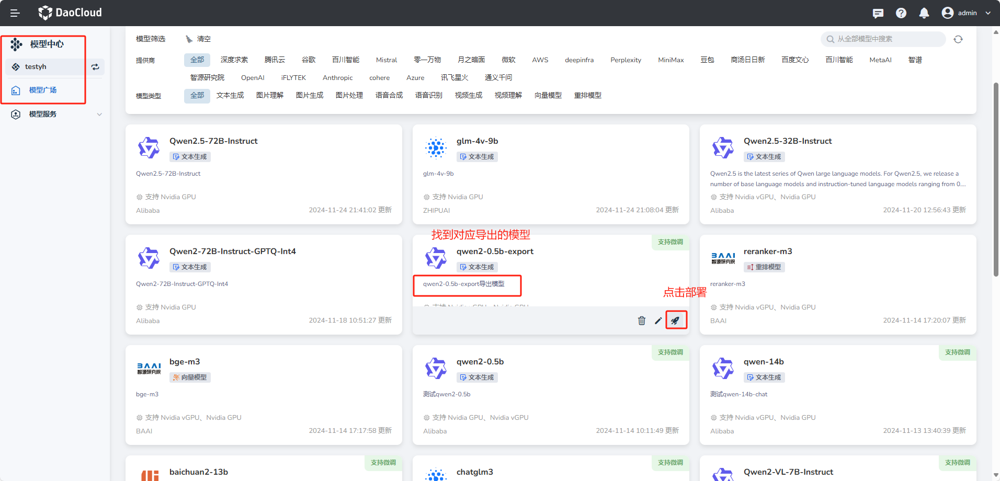

---
hide:
  - toc
---

# 模型导出

**模型导出** 基本功能操作使用说明如下。

## 创建模型导出任务

1. 进入 **模型微调** 菜单下的 **模型导出** 页面，点击 **创建** 按钮。

    

2. 填写基本信息

    - **实验名称** ：选择微调实验的名称。
    - **任务名称** ：选择微调实验下的成功的任务。
    - **模型名称** ：填写导出模型的名称。
    - **模型简介** ：简要说明模型。
    - **模型类型** ：选择该模型的类型。
    - **提供商** ：选择该模型的提供商。
    - **GPU支持** ：选择支持的 GPU 类型。
    - **支持微调** ：选择开启，开启表示导出的模型支持微调。
    - **运行镜像** ：选择运行模型的基础镜像。
    - **Stop** ：不填
    - **Stop Token IDs** ： 不填

    

## 模型导出详情查看

1. 点击模型导出任务的名称，进入模型导出详情页。

    

## 导出模型查看

1. 去到模型中心下的模型广场下，查看导出的模型，并部署和对话

    