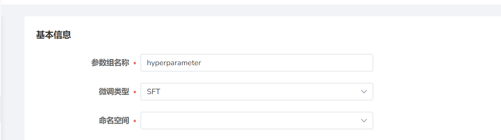
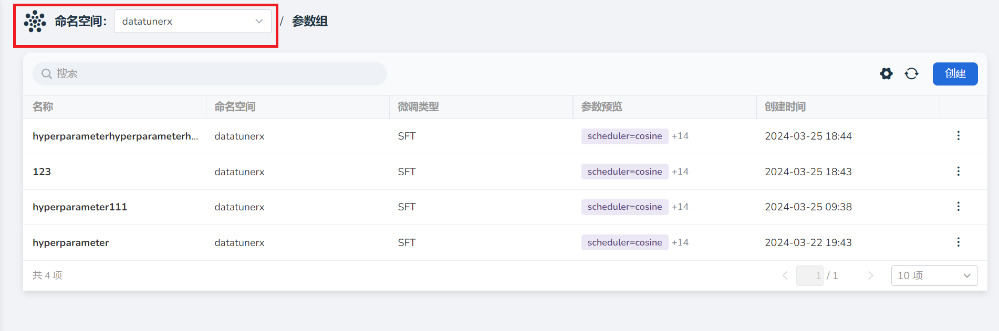
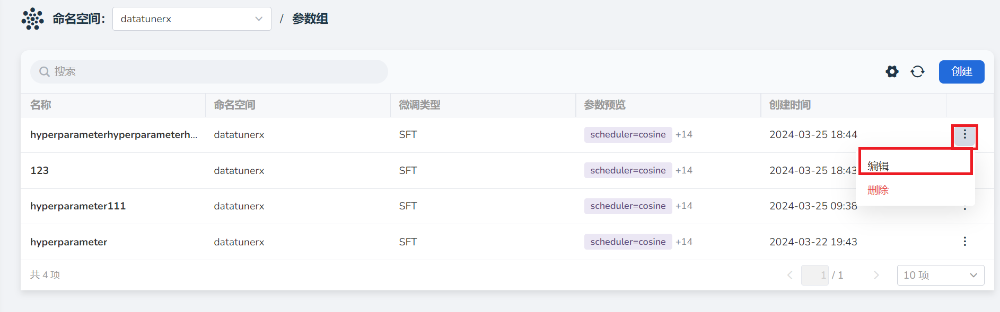

# 参数组

在微调模型之前，可以先设置一些参数组，不同的微调类型对应不同的的参数组。

参数组（Hyperparameter Group）代表一组超参的集合。在大语言模型的微调过程中，
可以根据需要设置很多不同的超参，如 Scheduler、Optimizer、LearningRate、Epochs、BlockSize、BatchSize 等，本文的参数组就是各种超参的组合。

## 创建参数组

1. 点击右上角 **创建** 按钮。

    

2. 填写参数组的基本信息：

    - 参数组名称
    - 选择微调类型：默认设置为 **SFT**
    - 选择参数组的命名空间

    

3. 填写参数配置：

    - Scheduler：训练中使用的调度器类型，指如何设置学习率的变化方式，默认设置为 **cosine** 。可选项包括：
        - **cosine** ：通过绘制余弦曲线，将 **LearningRate** 逐渐减少到 0。
        - **linear** ：初始 **LearningRate** 为设置值，以直线形式减少到 0。
        - **constant** ： **LearningRate** 始终保持不变。

    - Optimizer：训练中使用的优化器类型，默认设置为 **adamw_torch** 。包含以下选项：

        - **adamw_torch** ：是 Adam 优化器的一种变体，它使用了一种称为权重衰减的正则化方法，可以有效地防止过拟合。AdamW_torch 是 PyTorch 中的 AdamW 实现。
        - **adamw_hf** ：AdamW_hf 是 Hugging Face Transformers 库中的 AdamW 实现，与 AdamW_torch 相比，它使用了一种不同的权重衰减方法，可以更好地适应自然语言处理任务。
        - **sgd** ：是 **随机梯度下降（Stochastic Gradient Descent）** 的缩写，是一种基本的优化器。它每次迭代使用一个样本来更新模型参数，可以快速收敛，但容易陷入局部最优解。
        - **adafactor** ：Adafactor 是一种自适应学习率优化器，它使用了一种称为自适应二阶矩估计的方法来调整学习率。它可以自适应地调整学习率和权重衰减，适用于大规模训练任务。
        - **adagrad** ：Adagrad 是一种自适应学习率优化器，它根据每个参数的历史梯度大小来调整学习率。它适用于稀疏数据集和非平稳目标函数，但可能会导致学习率过小，导致收敛速度慢。

    总结来说， **adamw_torch** 和 **adamw_hf** 适用于大多数任务， **sgd** 适用于简单的模型和数据集， **adafactor** 和 **adagrad** 适用于大规模训练任务。

    | 参数          | 说明  | 默认值  |
    |--------------|------|---------|
    | FP16         | 选择是否使用 16 位浮点数进行训练，这可以减少内存占用和加速训练过程。| False |
    | LoRA_Alpha   | 数值越大，LoRA 输出对模型的影响越大。建议根据微调数据量调整数值。| 32 |
    | LoRA_R       | 数值越大，LoRA 的参数越多。建议根据模型表现调整数值。| 4 |
    | LoRA_Dropout | 训练过程中会以这一概率随机选择忽略神经元以防止过拟合。数值在 0 到 1 之间。| 0.1 |
    | Int4/8       | 可选择 **Int4** 或 **Int8** 形式储存数据。选择不同形式会影响储存效率和计算速率。| - |
    | LearningRate | 每次参数更新的步长，数值越小参数更新越快。| 0.001 |
    | Epochs       | 对同一组数据重复训练次数。 | 10 |
    | BlockSize    | 模型中块的大小。数值越大，模型表现可能会更好，但占用内存和计算量也会增加。| 512     |
    | BatchSize    | 同时学习的批次大小。数值越大，训练速度越快，但占用内存也会增加。| 32 |
    | WarmupRatio  | 训练过程中预热的比例，数值范围大多在 0 到 1 之间。| 0.1 |
    | WeightDecay  | 表示模型的正则化程度。数值越小，正则化越低，可能出现过拟合。| 0.0001  |
    | GradAccSteps | 权重更新前积累的梯度数目。在硬件条件不变的情况下，该数值越大，可使用的 **BatchSize** 越大。| 1 |
    | TrainerType  | 训练器类型。默认为 **Standard** ，指使用标准优化算法进行训练。| Standard|

    

4. 点击右下角 **确定** 即可创建参数组供微调实验中使用。

下一步：[微调实验](fine-tuning-lab.md)

## 编辑参数组

若希望将已创建的参数组做出调整：

1. 可在左上角选择一个想要修改参数组的 **命名空间** 。

    

2. 找到想要查看的参数组，点击右侧的 **⋮** 按钮，选择 **编辑**。

    

3. 修改参数组内的所有参数配置。

## 删除参数组

找到想要删除的参数组，点击右侧的 **⋮** 按钮，选择 **删除**。

!!! note

    删除操作不可逆，请谨慎操作。
