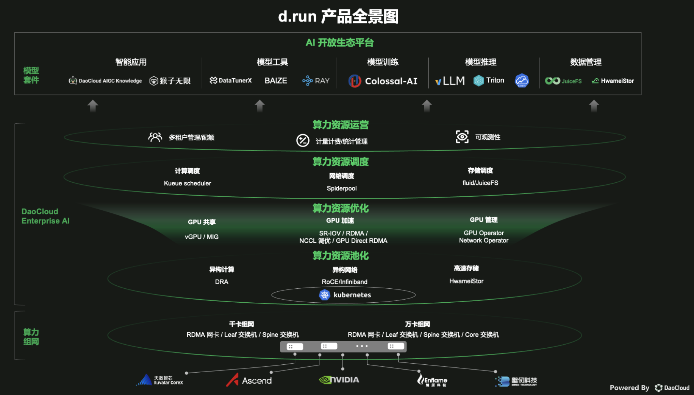

# d.run 生态项目

d.run 不是一个简单的产品，它是很多 AI 项目和组件聚合而成的生态体系，这些组件可以按需添加。

产品全景图中涉及的功能和组件如下：

| 一级功能       | 二级功能       | 组件            |
|------------ |------------ |--------------- |
| 智能应用       | 智能问答       | DaoCloud AIGC Knowledge |
|              | 流程编排        | 猴子无限         |
| 模型工具       | 算法中心       | Baize          |
|              | 模型微调        | DataTunerX     |
|              | 模型管理        | Ray            |
| 模型训练       | 降低训练门槛     | Colossal-AI    |
| 模型推理       | 虚拟大语言模型    | vLLM           |
|              | 推理          | Triton         |
| 算力资源调度    | 计算调度        | Kueue          |
|              | 网络调度        | Spiderpool     |
|              | 存储调度        | Fluid/JuiceFS  |
| 算力资源优化    | GPU 共享       | vGPU、MIG      |
|              | GPU 加速       | SR-IOV、RDMA、NCCL 调优，GPU Direct RDMA |
|              | GPU 管理       | GPU Operator 和 Network Operator |
| 算力资源池化    | 异构计算       | Dynamic Resource Allocation (DRA) |
|              | 异构网络       | RoCE, InfiniBand |
|              | 高速存储       | HwameiStor     |
