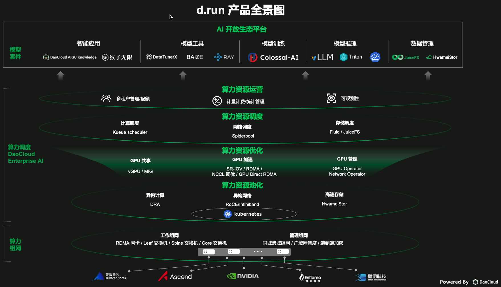

---
hide:
  - toc
---

# d.run 生态项目

d.run 不是一个简单的产品，它是很多 AI 新兴技术和项目聚合而成的生态体系，这些模块可以按需添加。

产品全景图中涉及的功能和组件如下：

| 一级功能 | 二级功能 | 组件 |
|-------- |------- |----- |
| 智能应用 | 智能问答 | [DaoCloud AIGC Knowledge](../dak/index.md) |
| | 流程编排 | [猴子无限](../monkey/index.md) |
| 模型工具 | 算法中心 | [Baize](../baize/index.md) |
| | 模型微调 | [DataTunerX](../dtx/index.md) |
| | 模型管理 | [Ray](./ray.md) |
| 模型训练 | 降低训练门槛 | [Colossal-AI](./colossal-ai.md) |
| 模型推理 | 虚拟大语言模型 | [vLLM](./vllm.md) |
| | 推理 | [Triton](./triton.md) |
| 算力资源调度 | 计算调度 | [Kueue](./kueue.md) |
| | 网络调度 | [Spiderpool](./spiderpool.md) |
| | 存储调度 | [Fluid](./fluid.md)、[JuiceFS](./juicefs.md) |
| 算力资源优化 | GPU 共享 | [vGPU](./vgpu.md)、[MIG](./mig.md) |
| | GPU 加速 | [SR-IOV](./sriov.md)、[RDMA](./rdma.md)、[NCCL 调优](./nccl.md)、[GPU Direct RDMA](./gpu-rdma.md) |
| | GPU 管理 | [GPU Operator](./gpu-operator.md) 和 [Network Operator](./net-operator.md) |
| 算力资源池化 | 异构计算 | [Dynamic Resource Allocation (DRA)](./dra.md) |
| | 异构网络 | [RoCE](./roce.md) 和 [InfiniBand](./infiniband.md) |
| | 高速存储 | [HwameiStor](./hwameistor.md) |
