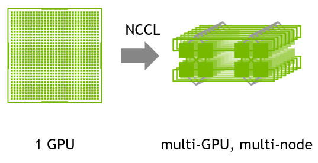

# NCCL 调优

NCCL（NVIDIA Collective Communications Library，Nvidia 集合通信库）可针对 NVIDIA GPU 和网络进行性能优化，这是一个多 GPU 和多节点的通信基元。
NCCL 提供了 all-gather、all-reduce、broadcast、reduce、reduce-scatter、point-to-point send 和 receive 等例程，这些例程均经过优化，
可通过节点内的 PCIe 和 NVLink 高速互联以及节点间的 NVIDIA Mellanox 网络实现高带宽和低延迟。

## 主要特性

- 对 AMD、ARM、PCI Gen4 和 IB HDR 上的高带宽路径进行自动拓扑检测
- 凭借利用 SHARPV2 的网络内 all reduce 操作，将峰值带宽提升 2 倍
- 通过图形搜索，找到更佳的高带宽、低延迟的环和树集合
- 支持多线程和多进程应用
- InfiniBand verbs、libfabric、RoCE 和 IP Socket 节点间通信
- 使用 Infiniband 动态路由重新路由流量，缓解端口拥塞

## 参考

- [Nvidia 官网 NCCL 说明](https://developer.nvidia.cn/nccl)
