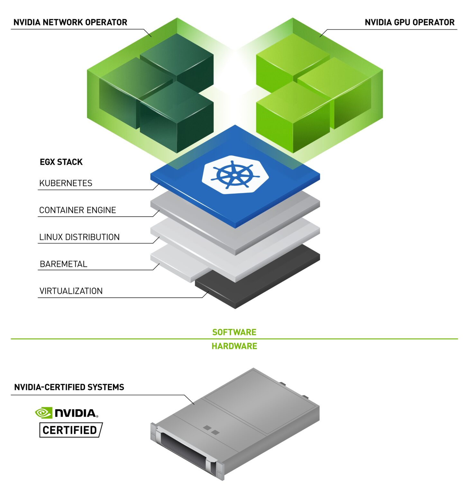

# Network Operator

NVIDIA Network Operator 简化了在 Kubernetes 集群中配置和管理 NVIDIA 网络资源的过程。
该 Operator 会自动安装所需的主机网络软件，将所有必需的组件汇集在一起，以提供高速网络连接。
这些组件包括 NVIDIA 网络驱动程序、Kubernetes 设备插件、CNI 插件、IP 地址管理 (IPAM) 插件等。
NVIDIA Network Operator 与 NVIDIA GPU Operator 协同工作，为大规模 GPU 计算集群提供高吞吐量、低延迟的网络连接。

NVIDIA Network Operator 利用 Kubernetes CRD 和 Operator SDK 来管理与网络相关的组件，
以便在 Kubernetes 集群中为工作负载实现高速网络、RDMA 和 GPUDirect。
Network Operator 与 GPU Operator 协同工作，以在兼容的系统上启用 GPU-Direct RDMA。

Network Operator 的目标是管理与网络相关的组件，同时在 Kubernetes 集群中启用 RDMA 和 GPUDirect RDMA 工作负载的执行。这包括：

- NVIDIA 网络驱动程序以启用高级功能
- Kubernetes 设备插件以提供高速网络所需的硬件资源
- Kubernetes 次级网络组件以支持网络密集型工作负载

## 参考

- [Nvidia 官网 Network Operator 文档](https://docs.nvidia.com/networking/display/cokan10/network+operator)
