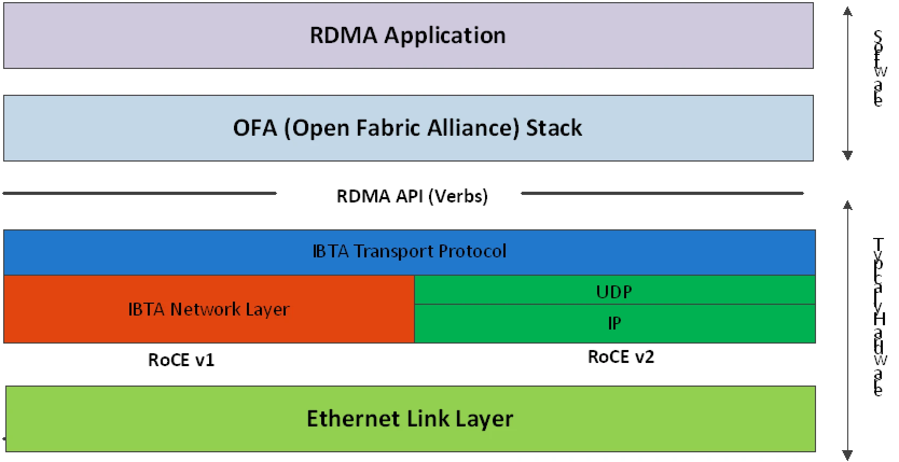

---
hide:
  - toc
---

# RoCE

收敛以太网上的 RDMA（RDMA over Converged Ethernet, RoCE）是一种在无损以太网网络上提供高效数据传输和超低延迟的机制。
随着数据中心在可靠以太网上的融合进展，搭载 RoCE 的 ConnectX® 以太网适配器卡系列利用经过验证且高效的 RDMA 传输，
提供在主流数据中心应用中以 10GigE 和 40GigE 链路速度部署 RDMA 技术的平台。
搭载硬件卸载支持的 ConnectX® 以太网适配器卡系列利用这种高效的 RDMA 传输（InfiniBand）服务，
通过以太网提供超低延迟，适用于金融、数据库、存储和内容分发网络等对性能和事务密集度要求极高的应用。

在以太网链路层上运行 RDMA 应用时，应注意以下几点：

1. 网络中不需要存在子网管理器（Subnet Manager, SM）。因此，RoCE 中需要与 SM 通信的操作将以不同方式管理。这不会影响 API，但会影响使用 API 时需要采取的操作，例如加入多播组。
2. 由于 LID 是 InfiniBand 协议栈的第 2 层属性，因此不会为端口设置 LID，在查询端口时将显示为零。
3. 在 RoCE 中，替代路径不会为 RC QP 设置。因此，不支持 APM（另一种高可用性机制，是 InfiniBand 协议的一部分）。
4. 由于没有 SM，无法查询路径。因此，在建立连接之前必须用相关值填充路径记录结构。因此，建议使用 RDMA-CM 来建立连接，因为它负责填充路径记录结构。
5. VLAN 标记的以太网帧携带一个 3 位优先级字段。该字段的值从 IB SL 字段中取得，即取 SL 字段的三个最低有效位。
6. RoCE 流量不会显示在关联的以太网设备的计数器中，因为它由硬件卸载，并且不经过以太网网络驱动程序。RoCE 流量在与 InfiniBand 流量相同的位置进行计数：/sys/class/infiniband/<设备>/ports/<端口号>/counters/

RoCEv1 和 RoCEv2 的协议栈如下：

## 参考

- [Nvidia RoCE 文档](https://docs.nvidia.com/networking/display/mlnxenv497100lts/rdma+over+converged+ethernet+(roce))
