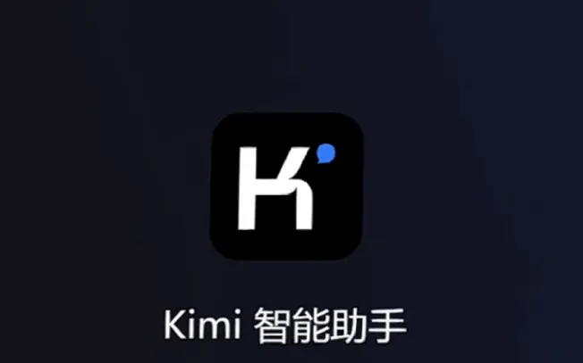

# After Kimi Became Popular, Other Major Models in China Feel the Pressure

> Reprinted from [AI New Intelligence](https://mp.weixin.qq.com/s/NzynvwHkikXAyKsyljRJGg)

Influenced by Kimi, the user traffic for Baidu's Wenxin Yiyan and Alibaba's Tongyi Qianwen has significantly declined, with decreases of 33.42% and 45.05% respectively.

## A Shift in Dynamics

Since its launch, Kimi has been consistently outperforming various AI models from major domestic companies.

According to brokerage monitoring data, as of March 25, Kimi's DAU (Daily Active User) on both web and app platforms has reached historic highs, hitting 790,000 and 540,000 respectively. When including mini-program users, the total DAU across all platforms significantly exceeds 2.25 million, potentially surpassing Baidu's Wenxin Yiyan, which reported 2.33 million.

Just two weeks prior, on March 10, Kimi's total DAU had only just crossed 1.2 million. However, back in February, Kimi's user traffic had already reached 3.05 million, more than doubling compared to January.

Meanwhile, the two major players, Baidu's Wenxin Yiyan and Alibaba's Tongyi Qianwen, have experienced substantial declines in user traffic, with decreases of 33.42% and 45.05% respectively.

As Kimi continues to break records, its every move is being closely watched and emulated by major companies.

Kimi is a conversational AI product launched by the company Moonlight Dark Side. On March 18, Moonlight Dark Side announced that Kimi now supports lossless context input of up to 2 million characters. Just six months earlier, when it was released in October of last year, Kimi could only support lossless context input of 200,000 characters.

Therefore, the "long text capability" of LLMs has gained the attention of major companies, even being considered an important performance metric in the competition among LLMs.

On March 22, Tongyi Qianwen upgraded its features, offering free access to a long document processing function of up to 10 million characters for all users; 360's Zhinao officially began internal testing for a long text processing function of 5 million characters, which will soon be integrated into the 360AI browser.

Wenxin Yiyan also announced an upgrade scheduled for April, which will include long text capabilities, expected to range between 2 million and 5 million characters.

However, many industry insiders are skeptical about the major companies' attempts to "follow suit." They believe that Kimi's leading position in the long text domain will not be easily surpassed.

Perhaps for this reason, in February of this year, during Moonlight Dark Side's latest round of financing, Alibaba, as the lead investor, converted 70-80% of its investment into computing services.

## The Soul of Kimi

Internet giants attract top talent from various fields, but few have a "star employee" like Kimi.

Yang Zhilin, the founder of Moonlight Dark Side, is the soul of the Kimi team. He has a background from Tsinghua University and Carnegie Mellon University, and is an expert in the long text field.

In the past five years of self-researched language processing (NLP), Yang Zhilin has garnered considerable influence. In terms of citation rankings among Chinese scholars, his academic papers rank in the top 10, and he is first among those under 40.

During his doctoral studies, Yang Zhilin published two significant works, Transformer-XL and XLNet, as the first author, which have been cited nearly 20,000 times on Google Scholar and achieved the best results on several NLP tasks at the time.

Transformer-XL became the first attention-based language model to fully surpass RNNs, while XLNet received best paper nominations at 20 top conferences.

Yang Zhilin and his team created Kimi's outstanding lossless compression technology. This technology reduces the storage needs of parameters, inference computing resource, and bandwidth usage for data transmission, enabling efficient lossless processing of millions of long tokens.

In contrast, to quickly catch up with the long text trend, other major companies have had to settle for using retrieval-augmented generation (RAG) technology.

Kimi's lossless long context window approach provides answers after reading the entire text word by word. RAG technology retrieves key information from the entire text to generate answers, but it may lose some critical information in the process.

Thus, compared to the former, there remains a significant gap in both output depth and accuracy in the models from major companies.

Currently, Kimi has not disclosed the technical details of its lossless compression technology. Aside from academic papers, there is little open-source content available for reference in the academic community. It is very difficult for major companies to "learn" and engineer this technology.

Beyond technology, Kimi's strategic approach is also worth contemplating.

To quickly "keep up with the situation," major companies have pursued flashy multimodal features, leading to a "jack of all trades, master of none" situation that falls into mediocrity.

In contrast, Kimi has chosen a "one-hit kill" strategy—focusing on dominating the long text domain first to cultivate user mindset and accumulate user retention.

Since its launch, Kimi has not only expanded its context window from the initial 200,000 characters to 2 million characters, but has also continuously iterated on instruction understanding, information retrieval capabilities, and model response speed.

Insiders from Moonlight Dark Side have mentioned that, based on infrastructure layer optimizations, Kimi's generation speed has tripled compared to last October.

In December 2023, and in January and February of this year, Kimi's user retention rates were 18.48%, 22.25%, and 23.36% respectively. This high retention creates positive feedback.

Users spontaneously "feed" Kimi a lot of specialized data during usage. By continually learning and processing various types of data, Kimi becomes better at understanding and adapting to different contexts, questions, and needs, thus improving its performance and accuracy.

In terms of processing speed for specialized data, Kimi is even ahead of OpenAI.

This is because OpenAI currently has restrictions on C-end users uploading files. In contrast, Kimi users are effectively cultivating a highly learning personal assistant for free, maintaining continuous interaction.

## Expanding into Overseas Markets

As Musk recently stated, the way to upgrade technological routes is not to simply compare with competitors, as that is too simplistic. It should involve constantly challenging physical limits.

Surpassing Baidu and other major companies may not be Kimi's ultimate goal. The next step for expansion, according to Moonlight Dark Side, is focused on overseas markets.

Currently, Moonlight Dark Side is recruiting effect advertisers both domestically and internationally. Besides designing ads for domestic platforms, this position also requires the design of the company's products for major overseas platforms such as Google, Meta, and TikTok.

At the same time, Moonlight Dark Side is also addressing its operational shortcomings.

With only over 100 members in its technical team, Moonlight Dark Side is among the smallest in head domestic model companies. Positions currently being recruited include Android engineers, testers, marketing, human resources, and more.

For example, for product growth positions, candidates are required to have experience working in major companies and excel in driving product growth through social media and user viral strategies, including experience growing from 0 to 10 million users, focusing on increasing active user numbers and long-term retention rates.

"When you can't beat them, join them." Despite having its own Tongyi Qianwen, Alibaba has also provided support for Kimi.

Currently, Kimi has borrowed Alibaba's Nvidia (NVDA.O) A800 and A100 GPU processors for expansion, and future support for Kimi's computing resource will mainly come from Alibaba.

In February of this year, during Moonlight Dark Side's latest round of investment exceeding $1 billion, Alibaba, as the lead investor, converted 70-80% of its investment into computing resource servers.

With Alibaba's support, Kimi no longer needs to worry about downtime due to insufficient computing resource. An insider has also indicated that the expansion will not be done all at once. Rapid expansion can lead to idle and wasted computing resource, so a certain strategy is needed. For example, Kimi will also predict user usage patterns.

Since the release of ChatGPT in November 2022, there have been over 200 AI models in China, and the number continues to increase. The emergence of Kimi has awakened a sense of crisis among industry giants.

However, Kimi is not the endpoint of this technological race.
