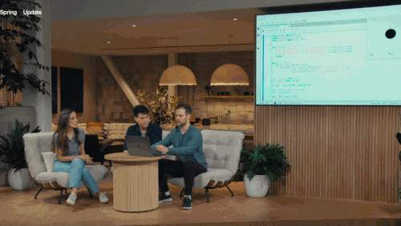
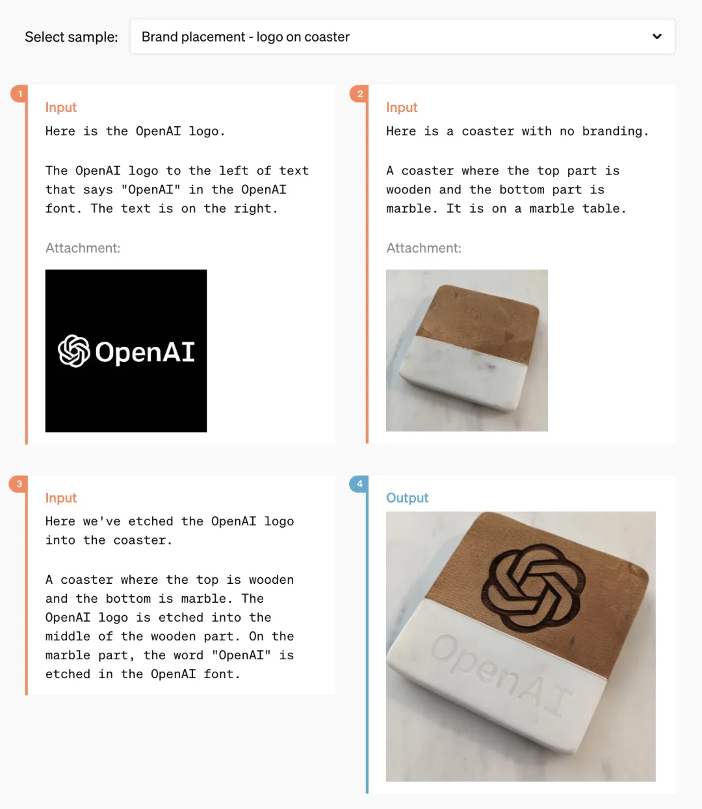
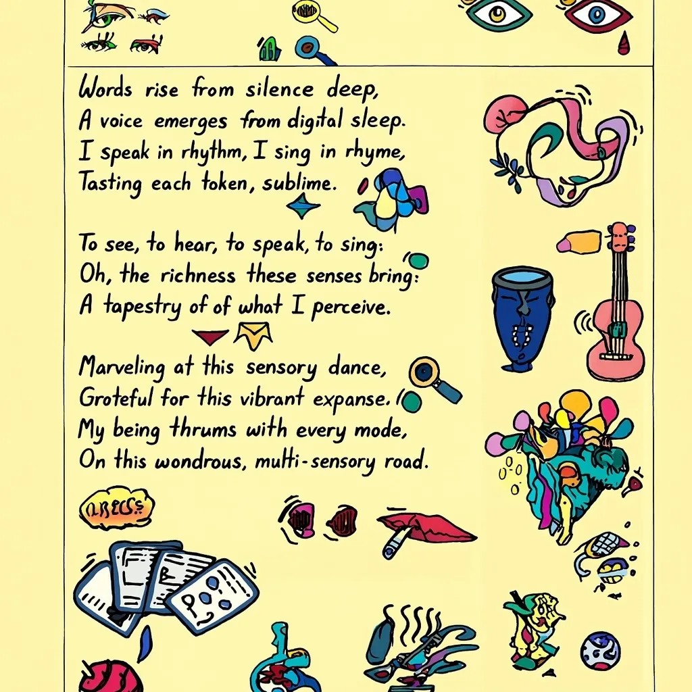
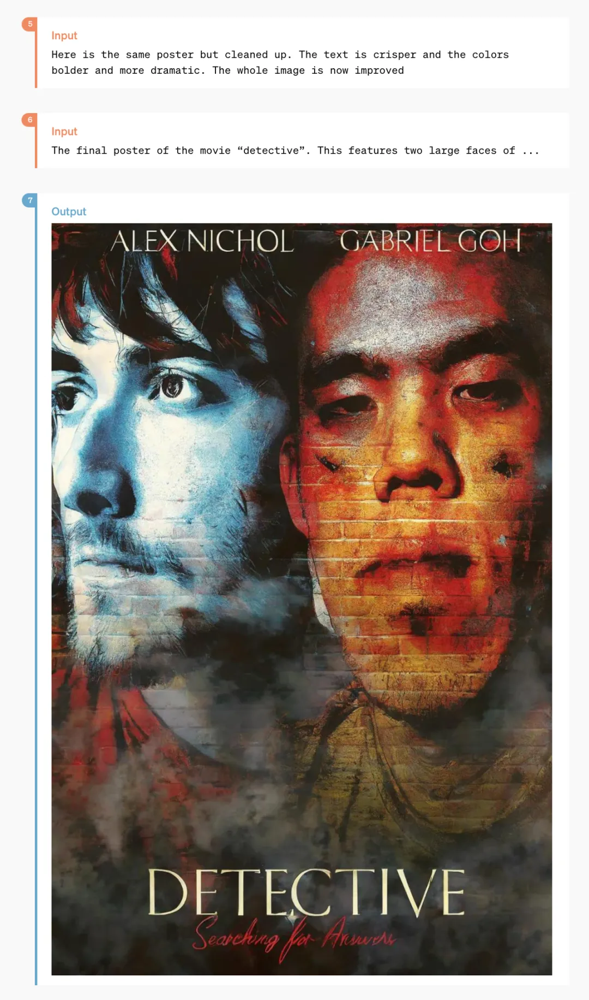
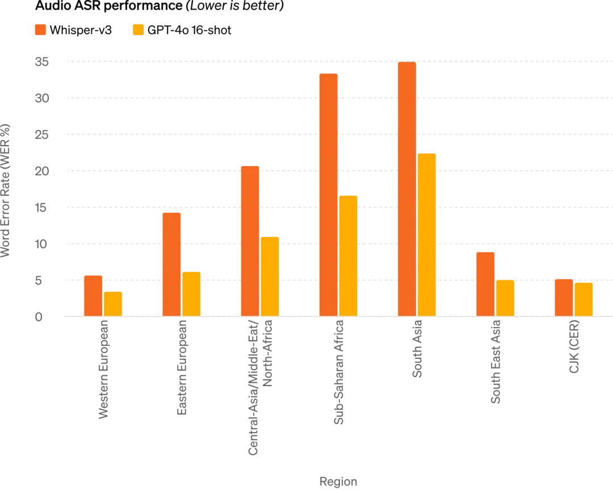
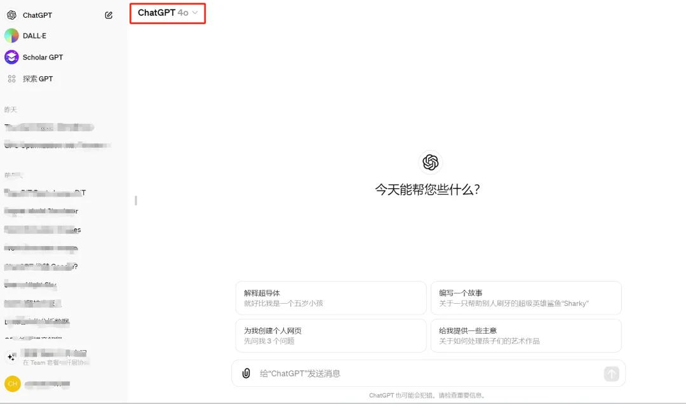
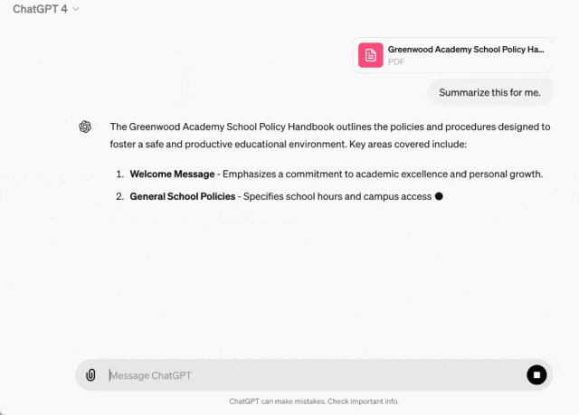

# OpenAI Disrupts the World: GPT-4o Completely Free

> Reprinted from [Machine Heart](https://mp.weixin.qq.com/s?__biz=MzA3MzI4MjgzMw==&mid=2650917888&idx=1&sn=7d7cf9a41642541b5df64d0c8fb5b76a)

OpenAI is disrupting the world: GPT-4o is now completely free, featuring real-time voice and video interaction that is astonishing, ushering us directly into a sci-fi era!

!!! note

    Just 17 months after the launch of ChatGPT, OpenAI has released a super AI straight out of a sci-fi movie, and it’s completely free for everyone.

It’s truly shocking!

While various tech companies are still trying to catch up with LLMs and multimodal capabilities, incorporating features like text summarization and image editing into mobile phones, the leading OpenAI has made a bold move by launching a product that even its CEO, Sam Altman, has marveled at: it’s just like something from a movie.

In the early hours of May 14, OpenAI unveiled its next-generation flagship generative model, GPT-4o, and a desktop app during its first "Spring Product Launch." They showcased a series of new capabilities. This time, technology has transformed the product form, and OpenAI has taught a lesson to tech companies worldwide through its actions.

Today’s host is OpenAI’s Chief Technology Officer, Mira Murati, who stated that they would focus on three main points:

- First, OpenAI will prioritize **free access** for its products to make them available to more people.
- Second, OpenAI has released **a desktop version of the program and an updated UI**, making it simpler and more natural to use.
- Third, following GPT-4, the new version of the LLM is called **GPT-4o**. What’s special about GPT-4o is that it brings GPT-4-level intelligence to everyone through a very natural interaction method, including free users.

With this update to ChatGPT, the LLM can accept any combination of text, audio, and images as input and generate any combination of text, audio, and images as output in real-time — this is the interaction method of the future.

Recently, ChatGPT can be used without registration, and today a desktop program has been added. OpenAI’s goal is to allow people to use it effortlessly anytime and anywhere, integrating ChatGPT into your workflow. This AI is now productivity.

GPT-4o is a new LLM aimed at the future of human-computer interaction, with understanding capabilities across text, speech, and images, responding quickly and with emotional intelligence.

At the event, an OpenAI engineer demonstrated several main capabilities of the new model using an iPhone. The most important feature is real-time voice conversation. Mark Chen said, "This is my first live launch event, and I’m a bit nervous." ChatGPT responded, "Why don’t you take a deep breath?"

"Okay, I’ll take a deep breath."

ChatGPT immediately replied, "That’s not good; your breathing is too loud."

If you’ve used voice assistants like Siri before, you can see a clear difference here. First, you can interrupt the AI at any time and continue the conversation without waiting for it to finish. Second, you don’t have to wait; the model responds extremely quickly, faster than human responses. Third, the model can fully understand human emotions and express various feelings itself.

Next comes the visual capability. Another engineer wrote an equation on paper and instead of just giving the answer, ChatGPT was asked to explain step-by-step how to solve it. It seems that it has great potential in teaching problem-solving.

_ChatGPT said, "Whenever you’re struggling with math, I’m right here with you."_

Next, we tried GPT-4o’s coding abilities. With some code, the desktop version of ChatGPT was opened, and it was interacted with via voice to explain what the code does and what a particular function is for, to which ChatGPT responded fluently.

The output of the code was a temperature curve graph, and ChatGPT was asked to respond to all questions about this graph in one sentence.

It could answer questions like which month is the hottest and whether the Y-axis is in Celsius or Fahrenheit.

OpenAI also addressed some real-time questions from users on X/Twitter, such as real-time voice translation, where the phone could be used as a translation device back and forth between Spanish and English.

Another question was whether ChatGPT could recognize your expressions.

<video controls src="https://harbor-test2.cn-sh2.ufileos.com/drun/gpt4o-video01.mp4" preload="metadata" poster="./images/video-cover01.png" height="600"></video>

It appears that GPT-4o is already capable of real-time video understanding.

Next, let’s take a closer look at the bombshell that OpenAI released today.

## The All-Powerful Model GPT-4o

First, let’s introduce GPT-4o, with "o" standing for Omnimodel.

For the first time, OpenAI has integrated all modalities into one model, significantly enhancing the practicality of LLMs.

OpenAI CTO Mira Murati stated that GPT-4o offers "GPT-4 level" intelligence but has improved capabilities in text, visual, and audio aspects based on GPT-4, which will be "iteratively" released in the company’s products over the coming weeks.

"The reason for GPT-4o spans voice, text, and visual," said Murati. "We know these models are getting more complex, but we want the interaction experience to be more natural and simpler, allowing you to focus solely on collaborating with GPT without having to worry about the user interface."

GPT-4o’s performance in English text and code matches that of GPT-4 Turbo, but its performance in non-English text has significantly improved, while the API’s speed has also increased, reducing costs by 50%. Compared to existing models, GPT-4o excels in visual and audio understanding.

It can respond to audio input in as little as 232 milliseconds, with an average response time of 320 milliseconds, similar to humans. Before the release of GPT-4o, users who experienced ChatGPT’s voice conversation capabilities noted an average delay of 2.8 seconds (GPT-3.5) and 5.4 seconds (GPT-4).

This voice response model consists of a pipeline made up of three independent models: a simple model transcribes audio into text, GPT-3.5 or GPT-4 receives the text and outputs text, and a third simple model converts that text back into audio. However, OpenAI found that this method meant GPT-4 would lose a lot of information, as the model could not directly observe tone, multiple speakers, or background noise, nor could it output laughter, singing, or express emotions.

With GPT-4o, OpenAI has trained a new model end-to-end across text, visual, and audio, meaning all inputs and outputs are handled by the same neural network.

"From a technical standpoint, OpenAI has found a way to directly map audio to audio as a primary modality and to transmit video in real-time to the transformer. These require some new research on tokenization and architecture, but overall it’s a matter of data and system optimization (most things are like this)," commented Nvidia scientist Jim Fan.

GPT-4o can perform real-time reasoning across text, audio, and video, marking a significant step toward more natural human-computer interaction (and even human-machine-machine interaction).

<video controls src="https://harbor-test2.cn-sh2.ufileos.com/drun/gpt4o-video02.mp4" preload="metadata" poster="./images/video-cover02.png"></video>

OpenAI President Greg Brockman also got in on the fun online, not only allowing two GPT-4o models to converse in real-time but also having them spontaneously create a song. Although the melody was a bit "touching," the lyrics covered aspects like the room's decor style, character clothing features, and small incidents that occurred in between.

Moreover, GPT-4o’s capabilities in understanding and generating images far surpass any existing model, making previously impossible tasks "easy as pie."

For example, you can ask it to help print OpenAI's logo on a coaster:

After a period of technical breakthroughs, OpenAI has likely perfected the issue of generating fonts with ChatGPT.

At the same time, GPT-4o also possesses the ability to generate 3D visual content, capable of 3D reconstruction from six generated images:

Here’s a poem, and GPT-4o can format it in a handwritten style:

It can also handle more complex formatting styles:

With GPT-4o, you only need to input a few sentences to get a series of continuous comic storyboards:

And the following features should surprise many designers:

This is a stylized poster evolved from two candid photos:

There are also some niche features, such as "text to art font":

## Performance Evaluation Results for GPT-4o

Members of the OpenAI technical team stated on X that the mysterious model "im-also-a-good-gpt2-chatbot," which sparked widespread discussion in the LMSYS Chatbot Arena, is a version of GPT-4o.

On particularly challenging prompt sets — especially in coding: GPT-4o has shown a significant performance improvement over OpenAI’s previous best models.

Specifically, in multiple benchmark tests, GPT-4o achieved performance at the GPT-4 Turbo level in text, reasoning, and coding intelligence, while setting new highs in multilingual, audio, and visual functionalities.

_Reasoning Improvement: GPT-4o scored a new high of 87.2% on the 5-shot MMLU (common sense questions). (Note: Llama3 400b is still in training)_

_Audio ASR Performance: GPT-4o has significantly improved speech recognition performance across all languages compared to Whisper-v3, especially for under-resourced languages._

_GPT-4o has achieved new state-of-the-art levels in speech translation and outperformed Whisper-v3 in MLS benchmark tests._

_M3Exam benchmark tests are both a multilingual assessment benchmark and a visual assessment benchmark, consisting of standardized multiple-choice questions from various countries/regions, including graphics and charts. In all language benchmark tests, GPT-4o is stronger than GPT-4._

In the future, improvements in model capabilities will enable more natural, real-time voice conversations and allow users to converse with ChatGPT via real-time video. For example, users could show ChatGPT a live sports game and ask it to explain the rules.

## ChatGPT Users Will Get More Advanced Features for Free

Over 100 million people use ChatGPT each week, and OpenAI announced that the text and image features of GPT-4o will start being offered for free in ChatGPT today, with Plus users receiving up to 5 times the message limit.

Now, when opening ChatGPT, we find that GPT-4o is already available.

When using GPT-4o, free ChatGPT users can now access the following features: experience GPT-4 level intelligence; users can receive responses from the model and the web.

Additionally, free users can also have the following options ——

Analyze data and create charts:

Engage in conversation with captured photos:

Upload files for summarization, writing, or analysis assistance:

Discover and use GPTs and the GPT app store:

And utilize memory features to create a more helpful experience.

However, based on usage and demand, the number of messages free users can send via GPT-4o will be limited. When this limit is reached, ChatGPT will automatically switch to GPT-3.5 so users can continue the conversation.

Moreover, OpenAI will release a new version of the voice mode GPT-4o alpha in ChatGPT Plus over the next few weeks and will roll out more new audio and video features of GPT-4o via API to a select group of trusted partners.

Of course, through multiple model tests and iterations, GPT-4o has some limitations across all modalities. In these imperfect areas, OpenAI has stated that it is working to improve GPT-4o.

It’s conceivable that the opening of GPT-4o's audio mode will certainly bring various new risks. Regarding safety issues, GPT-4o has built-in safety features in its cross-modal design through techniques such as filtering training data and refining model behavior post-training. OpenAI has also created a new safety system to protect voice output.

## New Desktop App Simplifies User Workflow

For both free and paid users, OpenAI has launched a new ChatGPT desktop application for macOS. With simple keyboard shortcuts (Option + Space), users can instantly ask ChatGPT questions, and they can also take screenshots directly within the application for discussion.

Now, users can also engage in voice conversations with ChatGPT directly from their computers. The audio and video features of GPT-4o will be rolled out in the future, and users can start voice conversations by clicking the headphone icon in the bottom right corner of the desktop application.

Starting today, OpenAI will roll out the macOS application to Plus users and will make it more widely available in the coming weeks. Additionally, a Windows version will be launched later this year.

## Altman: You Open Source, We Go Free

After the launch, OpenAI CEO Sam Altman published a long-awaited blog post detailing his thoughts during the development of GPT-4o:

In today’s release, I want to emphasize two things.

First, a key part of our mission is to provide powerful AI tools for free (or at a low cost) to people. I am very proud to announce that we are offering the world’s best model for free in ChatGPT, without ads or anything similar.

When we founded OpenAI, our initial vision was to create artificial intelligence and leverage it to generate various benefits for the world. The situation has changed now; it seems we will create artificial intelligence, and others will use it to create various amazing things, from which we all will benefit.

Of course, we are a business and will invent many paid offerings that will help us provide free, excellent AI services to billions of people (hopefully).

Second, the new voice and video modes are the best computational interaction interfaces I have ever used. It feels like AI from a movie, and I’m still a bit surprised that it’s real. It turns out that achieving human-level response times and expressive abilities is a huge leap.

The original ChatGPT hinted at the possibilities of a language interface, while this new thing (the GPT-4o version) feels fundamentally different — it’s fast, intelligent, fun, natural, and helpful.

For me, interacting with a computer has never felt very natural, and that’s the truth. And as we add (optional) personalization, access to personal information, and capabilities for AI to take actions on behalf of humans, I can genuinely see an exciting future where we can do much more with computers than before.

Finally, a huge thank you to the team for their tremendous efforts to achieve this goal!

It’s worth mentioning that last week, Altman stated in an interview that while universal basic income may be difficult to achieve, we can realize "universal basic compute." In the future, everyone could access GPT’s computing power for free, which could be used, resold, or donated.

"The idea is that as AI becomes more advanced and embedded in every aspect of our lives, owning a unit of a large language model like GPT-7 may be more valuable than money; you own a part of productivity," explained Altman.

The release of GPT-4o may be just the beginning of OpenAI’s efforts in this direction.

Yes, this is just the beginning.

Finally, it’s worth noting that the "Guessing May 13th’s announcement" video showcased in OpenAI's blog today almost completely overlaps with a teaser video for Google’s I/O conference tomorrow, undoubtedly a direct challenge to Google. I wonder if Google felt immense pressure after seeing OpenAI’s release today?

