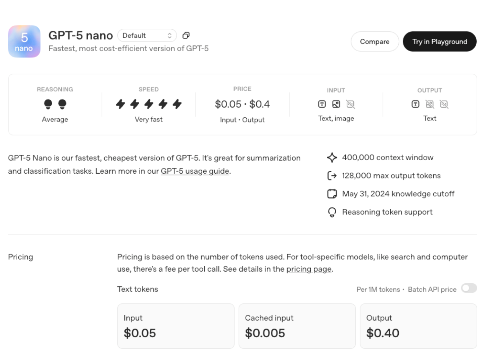

# GPT-5 Official Release: The Largest Product Upgrade in OpenAI’s History — Full Analysis of All Four Versions

On August 7, 2025, OpenAI officially released the GPT-5 series models, marking the most significant product upgrade in the company’s history. The release includes GPT-5, GPT-5Mini, GPT-5Nano, and GPT-5Pro, each deeply optimized for different application scenarios. This milestone signifies a new era of AI development.

## Unified Intelligence System: A Revolutionary Technological Breakthrough

OpenAI positions GPT-5 as a "Unified Intelligence System," successfully integrating capabilities that were previously scattered across different models: GPT-4o’s multimodal processing, the o-series’ deep reasoning, advanced mathematical computation, and agent task execution. This architectural innovation eliminates the need for manual switching between models — a real-time router automatically selects the most suitable processing method based on task complexity.

GPT-5 delivers significant breakthroughs in core metrics:

- **Mathematical Reasoning:** Achieves 94.6% accuracy in the AIME2025 benchmark without external tools.
- **Coding Skills:** Scores 74.9% on the SWE-bench Verified test; reaches 88% on the Aider Polyglot multi-language programming benchmark.
- **Multimodal Understanding:** Scores 84.2% on the MMMU benchmark.
- **Professional Knowledge:** Achieves 88.4% on the GPQA general problem answering benchmark.

## Detailed Breakdown of the Four Versions

### GPT-5 (Flagship): The Most Powerful Reasoning and Multimodal Capabilities

As the flagship product of the series, GPT-5 is designed for complex tasks and offers the following key features:

- **Breakthrough Reasoning:** Built-in Chain-of-Thought technology to decompose and solve complex problems step-by-step. In internal testing, GPT-5 outperformed all previous models in complex tasks across 40+ professional fields.
- **Comprehensive Multimodal Support:** Supports text, image, speech, and video processing, inheriting Sora’s video generation technology. Users can upload various formats, and GPT-5 can respond accordingly or execute compound tasks — e.g., analyzing medical images or translating video content in real time.
- **Agent-Like Task Execution:** Can automatically browse the web, generate complete software applications, and manage schedules. In the launch demo, GPT-5 created a full French learning web app with flashcards, quizzes, and progress tracking in seconds based on a simple description.
- **Significantly Lower Hallucination Rate:** With "Safe Completion" technology, GPT-5’s factual error rate is about 45% lower than GPT-4o, and up to 80% lower than the o3 model in reasoning mode.

### GPT-5Mini: High Value, Lightweight Option

Optimized for cost-sensitive applications, GPT-5Mini retains core capabilities while significantly reducing resource requirements:

- Supports medium-complexity Chain-of-Thought reasoning.
- Handles text, image, and speech processing; limited video capabilities.
- Runs on lower-spec devices — ideal for SMEs and individual developers.
- Core reasoning performance close to o4-mini.

Main use cases include educational content generation, customer service automation, and simple multimodal tasks.

### GPT-5Nano: Ultra-Efficient Edge Computing Model

GPT-5Nano is optimized for speed and low resource usage, making it the most lightweight version:

- Extremely low latency, designed for real-time applications.
- Operates on devices with as little as 16GB RAM, including MacBooks and low-end servers.
- Simplified reasoning, focused on quick interactions and simple tasks.
- Comparable performance to o3-mini in general benchmarks.

Best suited for mobile apps, embedded systems, real-time translation, and voice assistants where speed is critical.

### GPT-5Pro: Enhanced Version for Professional Users

GPT-5Pro targets high-end users and enterprises:

- **Enhanced Reasoning Mode:** Includes "GPT-5Thinking" for extended deep reasoning on complex problems with extremely high accuracy.
- **Unlimited Access:** Pro users get unrestricted access to GPT-5 and exclusive GPT-5Pro capabilities.
- **Professional-Grade Multimodal:** Excels in video processing and complex image analysis, scoring 46.2% on the HealthBench Hard medical benchmark.
- **Deep Tool Integration:** Seamless access to search, Canvas, code execution, and other professional tools for a complete workflow.

## Pricing Strategy: The Largest Free Access Rollout Ever

OpenAI adopts an unprecedentedly open strategy, granting GPT-5 access to all user groups:

- **Free Users:** Access to GPT-5 and GPT-5Mini with usage limits; excess usage switches to Mini automatically.
- **Plus Users ($20/month):** Higher usage limits, ideal for individuals and small teams.
- **Pro Users ($200/month):** Unlimited access to GPT-5 and GPT-5Pro, plus GPT-5Thinking mode.
- **Enterprise & Education:** Access to GPT-5Pro within a week of release.
- **API Pricing:** $1.25 per million input tokens; $10 per million output tokens for professional developers.

## Comprehensive User Experience Upgrades

The GPT-5 series introduces multiple UX innovations:

- **Smart Model Selection:** Automatically picks the best model version based on task complexity and user intent — no manual switching needed.
- **Personalized Interaction:** Four preset personas (Cynic, Robot, Listener, Nerd) plus custom chat color options.
- **Enhanced Memory:** Larger context window to recall longer conversations for more coherent interactions.
- **User-Friendly Design:** Reduced over-politeness and fewer unnecessary emojis compared to GPT-4o for a more natural feel.

## Architectural Innovations

The GPT-5 series likely adopts a Mixture-of-Experts (MoE) architecture, improving efficiency by reducing the number of active parameters. Training data is primarily English text, focused on STEM, programming, and general knowledge. The knowledge cutoff is June 2024. Training was completed on NVIDIA H100 GPUs, consuming about 2.1 million GPU hours.

## Competitive Edge and Market Impact

In today’s highly competitive AI landscape, GPT-5’s release carries major strategic significance. Against strong rivals like Anthropic Claude 3.5 Sonnet, xAI Grok 4, and Google Gemini 2.5 Pro, OpenAI strengthens its market position with free access and drastically reduced hallucination rates.

Reportedly, 5 million paying users already use ChatGPT’s commercial products, including organizations like BNY Mellon, California State University, Figma, Intercom, and Morgan Stanley. GPT-5’s release is expected to further accelerate enterprise AI adoption and drive digital transformation across industries.

## Industry Outlook and Challenges

The GPT-5 series marks a new milestone in AI development but also faces challenges:

- **Privacy & Security:** Multimodal capabilities involve sensitive data like medical imaging and private conversations, making data protection a priority.
- **Technological Impact:** Increased automation may disrupt traditional jobs, requiring societal adaptation.
- **Performance Verification:** While OpenAI claims GPT-5 has “PhD-level intelligence,” its real-world reasoning performance still needs time to be fully validated.

## Conclusion

The GPT-5 series represents another major breakthrough for OpenAI. With four differentiated versions, it effectively covers the entire spectrum from individual users to enterprise clients. This is not just a technical upgrade, but a complete overhaul of AI product strategy.

With GPT-5 now the default ChatGPT model — replacing GPT-4o, o3, and others — users simply open ChatGPT, input a question, and the system automatically handles it, applying reasoning when needed. This seamless experience signals AI’s rapid evolution from a tool to an assistant, and from assistance to true collaboration.

## References

- [OpenAI GPT-5 Official Page](https://openai.com/index/introducing-gpt-5/)
