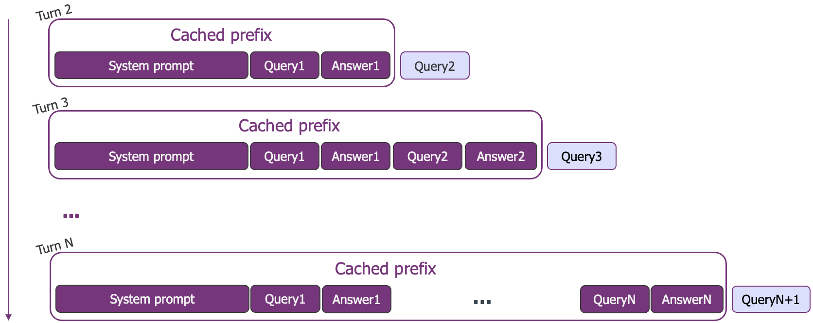
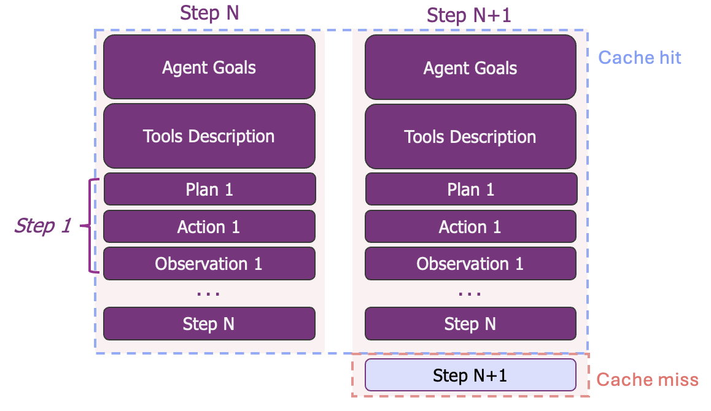
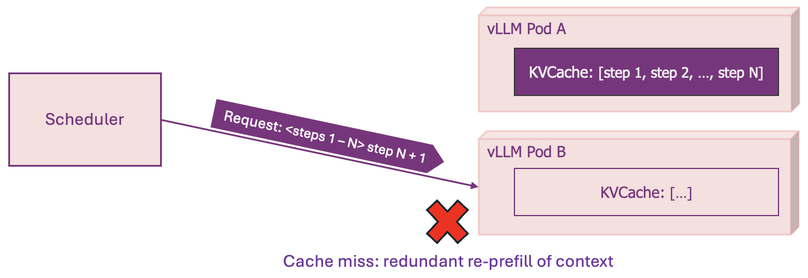
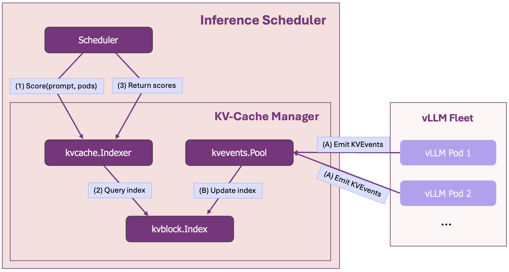
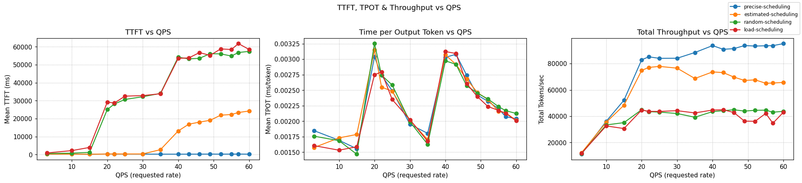
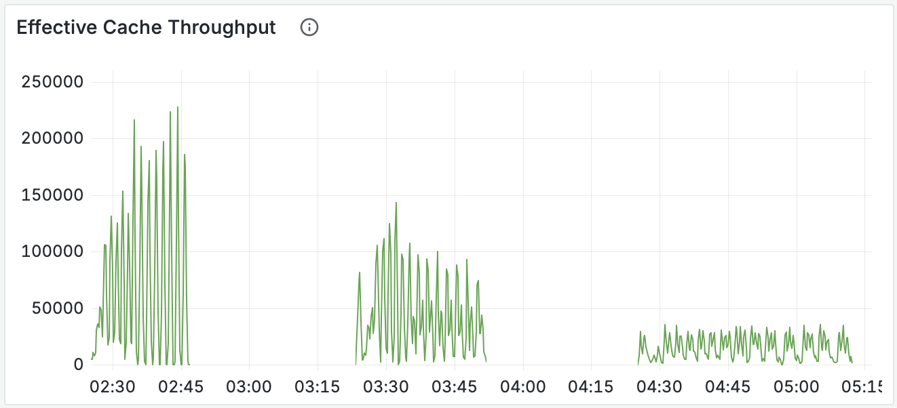
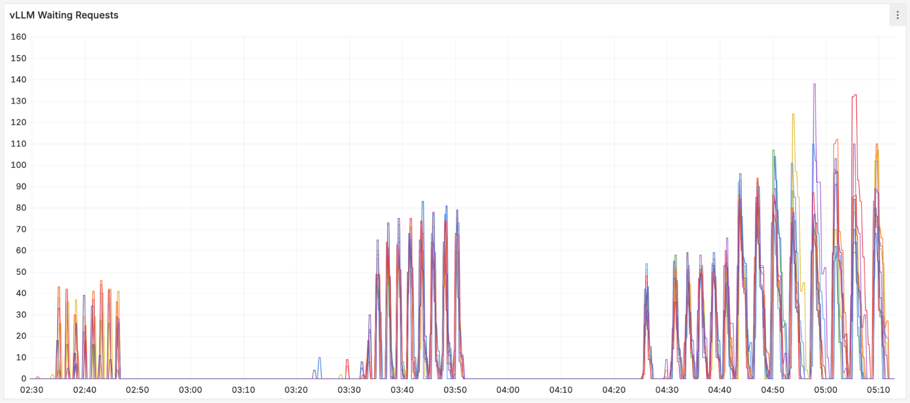
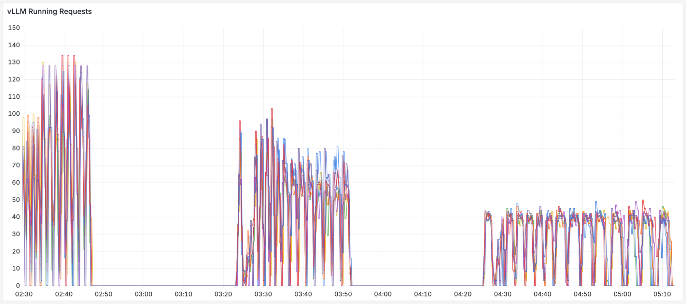

# KV-Cache Wins You Can See: From Prefix Caching in vLLM to Distributed Scheduling with llm-d

> Original from [https://llm-d.ai/blog/](https://llm-d.ai/blog/kvcache-wins-you-can-see)

**How does llm-d enable smarter, prefix-aware, load- and SLO-aware routing for better latency and throughput?**

The llm-d project provides a series of “well-lit paths” - tested, benchmarked solutions for deploying large language models in production. Our first path, [**Intelligent Inference Scheduling**](https://llm-d.ai/blog/intelligent-inference-scheduling-with-llm-d), established a baseline for AI-aware routing by balancing both cluster load and prefix-cache affinities. The default configuration for that path uses an *approximate* method for the latter, predicting cache locality based on request traffic.

This blog illuminates a more advanced and powerful path: [**precise prefix-cache aware scheduling**](https://llm-d.ai/docs/guide/Installation/precise-prefix-cache-aware).

We take a deep dive into the next generation of this feature, which moves beyond prediction and gives the scheduler direct introspection into distributed vLLM caches. This precision is key to maximizing cache hit rates and achieving a new level of performance and maximizing cost-efficiency in your distributed deployments.

!!! tip "Blog key takeaways"

    - **KV-cache hit rates directly impact your bottom line:** With **10x cost differences** between cached and uncached tokens, cache efficiency isn't just a performance optimization — it's a fundamental cost and performance driver  
    - **This isn't theoretical:** Real production workloads like conversational AI and agentic workflows naturally create the prefix-heavy patterns where this approach excels  
    - **vLLM's prefix caching breaks in distributed deployments:** Standard load balancers scatter related requests across pods, destroying cache locality and forcing expensive re-computation  
    - **Precise prefix-cache aware scheduling delivers order-of-magnitude gains:** Our benchmarks show **57x faster response** times and **double the throughput** on identical hardware

<!-- truncate -->

## The Most Important Metric in Production AI

In production LLM inference, we track dozens of metrics - latency, throughput, GPU utilization, and cost, to name a few. But one metric significantly stands out. As engineers building production-grade AI agents have noted: 

!!! quote "Manus, [Context Engineering for AI Agents](https://manus.im/blog/Context-Engineering-for-AI-Agents-Lessons-from-Building-Manus)"

    The *KV-cache hit rate is the single most important metric for a production-stage AI agent. It directly affects both latency and cost*.
 
This isn't just an academic claim; it has a direct and dramatic impact on the bottom line. Consider the pricing model for a state-of-the-art model like Anthropic's Claude Sonnet. The [cost](https://www.anthropic.com/pricing#api) for processing tokens that are already in the cache is **10 times lower** than for uncached tokens ($0.30 vs. $3.00 per million). The same pattern can be seen in OpenAI’s [API pricing](http://openai.com/api/pricing/) page. A high cache hit rate doesn't just make your application faster; it makes it **fundamentally cheaper to operate**. This is the power of the KV-cache. 

In a single-instance environment, engines like vLLM leverage Automatic Prefix Caching to cut redundant work, reusing prior computations to drive faster, more efficient performance. However, the moment you scale to a distributed, multi-replica environment, these finely tuned optimizations can fall apart.

This blog explores that challenge: how the wins of vLLM's prefix caching are lost in naive distributed systems, and how llm-d's precise prefix-cache aware scheduling restores and enhances them. To fully grasp this, we first need to understand what makes vLLM so performant in a single instance. Let's dive in.

## Inside vLLM: Mastering the Cache in a Single Instance

!!! note "For the Experts"

    Already know how vLLM uses the KV-cache and prefix caching to optimize inference? Feel free to skip right into the [**challenges of scale-out**](#the-challenge-of-scale-out).
 
At the heart of every transformer model is the **self-attention mechanism** - how the model understands context by computing attention scores between every pair of tokens. This all-pairs comparison scales quadratically with input length, making the initial **prefill** computation the most expensive part of generation.

The result is **Key (K)** and **Value (V)** tensors stored in the **KV-cache** - the model's short-term memory. For subsequent token generation during **decode**, the model simply pulls these existing values from memory rather than recomputing them.

vLLM takes this further with **Automatic Prefix Caching:** it intelligently identifies when requests share the same token sequence prefix. Instead of recomputing, it reuses the exact same memory pages from the cache through hash-based block matching. This principle of reusing computed work drives vLLM's performance:

* **Time to First Token (TTFT)** plummets because the expensive prefill step is mostly skipped
* Overall **throughput** increases because the GPU is freed up to serve more requests

In a simple test sending a request with a ~10,000 token prompt to a Qwen/Qwen3-32B instance a second time, time-to-first-token drops from **4.3 seconds** to just **0.6 seconds**.

## Prefix Reuse in Practical Use Cases

The power of vLLM's caching isn't theoretical; it directly maps to the structure of the most common and valuable LLM workloads. By understanding this pattern, we can see exactly what's at stake when serving in production.

#### Conversational AI

In any multi-turn dialogue, from a customer service bot to a long-form assistant, the entire chat history and system prompt form a massive **prefix**. Each new user message is a tiny **suffix**. Effective caching means only the latest turn is prefilled, keeping the conversation fluid and responsive, preventing latency from increasing as the dialogue gets longer.

<small>*__FIGURE 1__: A diagram showing the conversational history as a growing prefix that gets cached, with only the new user query requiring prefill.*</small>

#### Agentic Workflows

AI agents represent the most extreme case of prefix dominance. These systems operate in reasoning loops where the prefix contains the agent's goals, tool definitions, and a long history of actions and observations. Production data shows this can lead to input-to-output ratios exceeding **100:1** *(from the Manus [blog](https://manus.im/blog/Context-Engineering-for-AI-Agents-Lessons-from-Building-Manus))*, making the prefix overwhelmingly large. Reusing context at every step makes agents computationally viable.

<small>*__FIGURE 2__: A visual of an agent loop, showing the massive, static context (tools, step-history) as the cached prefix and the new observation/action as the small suffix.*</small>

Reusing this massive context on each turn is essential for complex agents to be computationally viable and cost-effective.

!!! tip "What about RAG?"

    While Retrieval-Augmented Generation also relies on large prefixes (system prompts + documents), reusing the KVs is more challenging. The exact documents and their order often change between queries, breaking simple prefix patterns. This requires a more sophisticated approach, which we will discuss briefly at the end of this post.

## The Challenge of Scale-Out

What happens when we move from single-instance environment to distributed production clusters? The once-unified KV-cache becomes **disaggregated**. Each vLLM pod manages its own cache in complete isolation. Standard load balancers naively spread traffic evenly using cache-blind metrics, scattering related requests across different pods and destroying cache locality.

Let's revisit our agentic workflow example to see the direct impact of being blind to this unmanaged, disaggregated cache:

<small>*__FIGURE 3__: A heartbreaking KV-cache miss scenario.*</small>

This single routing decision triggers a cascade of failures:

* **Cache Miss:** The warm cache benefit on Pod A is completely lost  
* **Duplicated Work:** The most expensive computation is needlessly performed twice  
* **Increased Latency:** Users experience significantly higher Time to First Token (TTFT)
* **Wasted GPU Resources:** Expensive hardware is tied up re-doing work instead of serving new requests, lowering overall system throughput

In a production environment with thousands of concurrent requests, this isn't a rare event; it's the default behavior. The result is a system that is **significantly** **slower** and **more expensive** than it should be. This is the core challenge that [llm-d's precise prefix-cache aware scheduling](https://github.com/llm-d/llm-d/blob/main/guides/precise-prefix-cache-aware/README.md) is designed to solve.

## llm-d: Precise Prefix-Cache Aware Scheduling

We've just seen how scaling out a vLLM cluster naturally disaggregates the KV-cache, creating a distributed pool of memory that leads to costly cache misses. The solution, then, is to bridge the disaggregation. To restore the benefits of prefix caching, the scheduler needs a new sense: vision into the real-time state of the distributed cache.

This is precisely what llm-d provides (pun intended). It creates a **global view** of the cluster's KV-cache, allowing it to treat the disaggregated memory as a single, manageable pool and route requests with precision.

### How It Works: A Global Cache View via KVEvents

The global cache view is built upon a continuous stream of [**`KVEvents`**](https://docs.vllm.ai/en/latest/api/vllm/config/kv_events.html) from each vLLM pod, which are processed efficiently by the open-source [**`llm-d-kv-cache-manager`**](https://github.com/llm-d/llm-d-kv-cache-manager) library.

The `KVEvents` provide a live feed of all physical cache changes across the cluster, firing every time a cache block is created or evicted. This stream is then ingested and organized by the llm-d-kv-cache-manager library's components:

1. **`kvevents.Pool`:** This component consumes the high-throughput stream of events. As it digests them, it continuously updates a low-level **KV-Block Index**, which maintains a simple, real-time map of block-hashes to the pod and memory-medium (GPU/CPU) it resides on.
2. **`kvcache.Index`:** This is the higher-level index used by the scheduler. It uses the underlying KV-Block Index to map logical sequences of tokens (i.e., prefixes) to the pods that hold them. This provides the direct answer to the question, "what percentage of this request's prefix is on the accessible Pods?"

This two-layered architecture provides a continuously updated, scalable view of the cluster's cache state, which is the key to enabling intelligent, cache-aware routing.

<small>*__FIGURE 4__: Simplified architecture diagram. (1) - (3) show the read path, while (A) - (B) show the write pipeline.*</small>

**What about the overhead?** The memory overhead for this global index is negligible - see **Appendix A.3** for the scaling analysis showing a **1,000,000:1** data-to-metadata ratio.

!!! info "High availability support"

    This design naturally supports active-active or active-passive deployments, with either full view duplication or sharding through configurations.

### The Precise Prefix-Cache Scorer

With an accurate, real-time global view of the cache, the scheduler can now perform intelligent routing. The component responsible for this is the **Precise Prefix-Cache Scorer**. It sits within the scheduler and utilizes the `kvcache.Index` to perform a simple but critical task for every incoming request:

1. It queries the `kvcache.Index` to determine what percentage of that prefix is already available on each active vLLM pod.
2. It outputs a "cache affinity score" for each pod, directly representing the computational work that can be saved.

This scorer provides a strong **stickiness** signal, scheduling requests to maximize the probability of a cache hit. However, relying solely on stickiness can create new problems, like sending a stream of requests to an already overloaded pod while others sit idle.

Therefore, the final routing decision isn't based on this score alone. As detailed in our previous post on the [**Intelligent Inference Scheduling**](https://llm-d.ai/blog/intelligent-inference-scheduling-with-llm-d) well-lit path, the KV-cache affinity score is combined with distributive, load-aware scores, creating a balanced decision.

## Performance Results

To validate this approach, we benchmarked four scheduling strategies on a cluster of **8 vLLM pods (16 H100 GPUs total)** using a realistic B2B workload simulating **150 enterprise customers** each with **6,000-token contexts**, with **5 concurrent users per customer** submitting **1,200-token queries** under sustained load from **3-60 QPS**. 

The total KV-cache demand this workload generates is **73% of cluster’s capacity**, which is **six times** larger than any single pod could handle, forcing the system to distribute prefixes across the cluster - exactly where intelligent scheduling becomes essential.

!!! info "Benchmark details"

    See **[Appendix A.1](#a1-benchmark-setup-details)** and **[Appendix A.2](#a2-workload-details---real-world-b2b-saas-scenario)** for complete benchmark methodology and workload details.

The four strategies compared:

* `random-scheduling`: A naive scheduler, acting as the control group.
* `load-scheduling`: A scheduler aware of only of load scorers: vLLM queueing + kv-cache-utilization  
* `approximate-scheduling`: The default configuration in the intelligent inference scheduling path, extending load-aware scheduling with the [approximate prefix-cache scorer](https://gateway-api-inference-extension.sigs.k8s.io/guides/epp-configuration/prefix-aware/).
    * This plugin builds an approximate-locality index based on routing history.
* `precise-scheduling`: The advanced well-lit path described in this post.

This benchmark, therefore, tests the scheduler's ability to efficiently manage the disaggregated KV-cache. In a production environment, if the total cache demand were to exceed the cluster's capacity, an autoscaling system would be responsible for spinning up more replicas to maintain SLOs. Here, we focus on **maximizing the performance of the existing hardware**.

### The Results: A Leap in Performance

The summary table below shows the difference across the key performance indicators.

| Experiment             | Output toks/s | TTFT p90 (s) | TTFT mean (s) | vLLM Wait Queue (mean) |
|:-----------------------| :---- | :---- | :---- | :---- |
| **precise-scheduling** | **8730.0** | **0.542** | **0.298** | **0.1** |
| approximate-scheduling | 6944.4 | 31.083 | 13.316 | 8.1 |
| load-scheduling        | 4428.7 | 94.865 | 46.987 | 28.9 |
| random-scheduling      | 4428.7 | 92.551 | 45.281 | 27.3 |

#### Time to First Token (TTFT)

The most dramatic impact was on user-facing latency. `precise-scheduling` delivered a P90 TTFT of just **0.542 seconds**. In contrast, the approximate scheduler took over **31 seconds**, and the cache-blind schedulers took over **90 seconds**.

* `precise-scheduling` is 57x faster than `approximate-scheduling`.
* `precise-scheduling` is over 170x faster than `random-scheduling`.

This is the difference between an interactive experience and a system that is functionally unusable at scale.

#### Total System Throughput

This efficiency in latency directly translates to higher system capacity. `precise-scheduling` achieved a total throughput of **8,730 output tokens/second**. This represents:

* A **25% increase** over the **`approximate-scheduling`** baseline.
* Over **double the throughput** of the cache-blind configurations.

This allows you to handle significantly more traffic on the exact same hardware, simply by eliminating the waste of cache misses.

<small>*__FIGURE 5__: A tri-panel of TTFT, TPoT and Throughput measured through progressively rising QPS rates.*</small>

The charts above clearly illustrate these wins. The blue line (`precise-scheduling`) maintains the lowest Mean TTFT and achieves the highest Total Throughput as the request rate increases.

#### The "Why": From Saved Work to System Throughput

The dramatic performance gains seen in the benchmarks are a direct result of **system efficiency**, a difference that is immediately visible in the **real-time Grafana metrics**.

The following graphs were captured throughout the benchmark runs. Schedulers are shown in order: `precise-scheduling` *(left)*, `approximate-scheduling` *(center)*, and `random-scheduling` *(right)*.

##### 1. Effective Cache Throughput: Quantifying Saved Work

First, we measure the **Effective Cache Throughput** - the number of prompt **tokens** per second served directly from the cache. This metric quantifies the computational work the GPUs ***avoided***. A high value means the system is consistently saving massive amounts of expensive prefill computation.

<small>*__FIGURE 6__: The total computational work **saved** by the KV-cache across the cluster, over the course of the benchmarks.*</small>

The chart clearly shows that `precise-scheduling` sustains a massive and stable throughput of saved work by hitting the prefixes effectively. In the middle, we see `approximate-scheduling` with good but lower efficiency, and on the right, `random-scheduling` saving almost no work.

##### 2. System State: The Consequence of Efficiency

This saved work translates directly into system health. By avoiding prefill bottlenecks, the GPUs can focus on productive decoding. We can see this by comparing the number of "**Waiting**" requests (**queued**) and "**Running**" requests (**in decode**).

<small>*__FIGURE 7__: The number of **waiting requests** in vLLM over the course of the benchmark.*</small>

<small>*__FIGURE 8__: The number of **running requests** **(decoding)** in vLLM over the course of the benchmark.*</small>

The **`precise-scheduling`** plots on the left show a stable system. By effectively utilizing the disaggregated KV-cache, it maintains minimal waiting queues and maximizes the number of actively running requests. In contrast, the other schedulers are clearly overwhelmed; their growing waiting queues choke the system and prevent work from being done efficiently.

This instability is caused by **"cache thrashing."** Cache-blind schedulers constantly **duplicate and evict** the same prefixes across different pods, wasting GPU cycles on **redundant prefill**. `precise-scheduling` avoids this entirely. It is precisely aware of prefix locations and consistently routes requests for cache-hits - as long as the load allows - resulting in less work, virtually no queues, and a healthy system.

!!! info "Session-Based Scheduling"

    Session-based scheduling provides affinity for individual users but misses cross-user scenarios. In our benchmark with **150 enterprise customers** each having **6,000-token system prompts**, session-scheduling would create 750 separate sessions but miss cross-user cache reuse within customer groups, leaving the majority of computational work uncaptured. Precise prefix-cache aware scheduling guarantees **maximal reuse** across the system.

### Adoption

The dramatic performance improvements demonstrated in these benchmarks are what drive real-world adoption.

**Alibaba Cloud**, for instance, is integrating this precise routing strategy into its **Alibaba Cloud Container Service for Kubernetes (ACK) Gateway with Inference Extension (GIE).**  To further enhance their production deployments for models like **Qwen** and **DeepSeek**, they are developing a disaggregated tokenization service to support complimentary features, with the goal of contributing this work back to the llm-d community. The end to end capabilities are already being validated in customer simulation environments.

This same potential has led **DaoCloud** to enhance its **d.run** **Model-as-a-Service (MaaS)** platform for accelerating inference of **DeepSeek** and other advanced models, adopting distributed inference with P/D disaggregation and advanced  KV-cache architectures via **Kubernetes**, **vLLM**, and **llm-d**. Kay Yan emphasizes: "intelligent KV-cache management enables more adaptive and cost-effective inference architectures".

## What's Next: Extending the Cache-Aware Paradigm

Precise prefix-aware scheduling is a massive step forward, but it's just one part of a broader, cache-centric vision for inference. The llm-d project is rapidly evolving, with several exciting directions on the horizon:

* **Enhanced CPU Offloading:** For KV-cache pools at larger scales, we are deepening the native vLLM integration for CPU offloading. This will allow for massive cache pools that intelligently tier between GPU VRAM and cheaper CPU RAM, with the scheduler making latency-aware decisions.
* **KV-Cache-Fusion for RAG:** As noted earlier, RAG workloads present a unique challenge because retrieved documents can appear in different orders, breaking simple prefix patterns. The next frontier is position-independent KV-fusion, a technique enabling flexible and powerful cache reuse across varied RAG queries. This will come hand-in-hand with **large-scale storage offloading**.

## Conclusion

The journey of llm-d reflects a broader shift in how we think about LLM inference - not as a set of stateless function calls, but as a dynamic, stateful orchestration problem. The benchmark data is clear: **prefix-cache aware scheduling is not just an optimization; it is essential for production performance and cost efficiency.**

By moving from AI-blind routing to a precise, KV-cache aware strategy, **we unlock order-of-magnitude improvements in latency and throughput on the same hardware**. The well-lit path of precise prefix-cache awareness offers a tested, benchmarked solution to make your distributed deployments dramatically more efficient.

!!! tip "Choosing the Right Strategy"

    The optimal scheduler depends on the complexity of the workload. Below is a hierarchy of supported strategies, where each level addresses the limitations of the one before it.

1. **Random/Round-Robin Scheduling:** this simple approach works well for symmetric workloads where all requests have similar computational costs and minimal cache reuse.

2. **Load-Aware Scheduling:** the necessary next step for asymmetric workloads. By routing requests based on Pod serving capacity, it prevents overload and improves resource utilization.

3. **Approximate Prefix-Cache Scheduling:** this strategy introduces cache-awareness for workloads with context reuse patterns.
  
    * **Limitation:** The estimations can become unreliable at high scale or with dynamic workloads, leading to suboptimal routing - as seen in our benchmarks.

4. **Precise Prefix-Cache Aware Scheduling:** in production environments with tight SLOs - this is the most effective strategy for dynamic, high-scale workloads where maximizing the cache-hit ratio is a primary performance driver.

## Get Involved with llm-d

The llm-d project thrives on community contributions, and there are many ways to get involved:

* Explore the llm-d Community Quickstart Guide → [Start here](https://llm-d.ai/docs/community) to learn more about getting involved in the llm-d project.
* Join our Slack → [Get your invite](https://llm-d.slack.com/) and connect with maintainers and contributors  
* Explore the code → Browse our [GitHub organization](https://github.com/llm-d) and find issues that interest you  
* Attend meetings → All meetings are open! Add our [public calendar](https://llm-d.ai/docs/community#public-meeting-calendar) and join discussions`

## Appendix

### A.1: Benchmark Setup Details

* **Model:** `Qwen/Qwen-32B`.
* **Hardware:** A cluster of **8** vLLM pods, each running on **2 NVIDIA H100 GPUs** (16 total).

    * Each instance holds a 307,328-tokens KV-cache.

* **Schedulers Compared:**  

    * `random-scheduling`: A naive scheduler, acting as the control group.
    * `load-scheduling`: A scheduler aware of only of load scorers: vLLM queueing + kv-cache-utilization  
    * `approximate-scheduling`: The baseline intelligent scheduler extending load-scheduling with the approximate prefix-cache scorer.
    * `precise-scheduling`: The advanced well-lit path described in this post.

### A.2: Workload Details - Real-World B2B SaaS Scenario

The benchmark was designed to simulate a high-value, multi-tenant B2B application under a heavy, sustained load. Imagine a platform providing a specialized AI assistant to a large number of enterprise customers.

* There are **150 distinct enterprise customers** (groups) using the platform simultaneously.
* Each customer has a unique and substantial context of **6,000 tokens**. This can be thought of as their company's internal knowledge base or a detailed set of instructions, forming the valuable **shared prefix**.
* For each customer, **5 employees** are concurrently interacting with the assistant, submitting their own unique questions of **1,200 tokens** each.
* The system is stressed by a continuous Poisson distribution of requests, ramping up from 3 QPS to a demanding **60 QPS** to simulate peak business hours.

For this workload, in an ideal state, caching the shared prefixes for all active customers requires **~73%** of the cluster's total KV-cache capacity. This is nearly **six times larger** than any single pod's individual capacity (~12.5%). This makes it impossible for one replica to handle the load and forces the scheduler to intelligently distribute the prefixes across the entire cluster.

This benchmark, therefore, tests the scheduler's ability to efficiently manage the disaggregated KV-cache. In a real-world scenario, if the total cache demand were to exceed the cluster's capacity, an autoscaling system would be responsible for spinning up more replicas to maintain SLOs. Here, we focus on **maximizing the performance of the existing hardware** - a task where cache-blind configurations create massive queues and high latency.

The tools and specifics of the experiment are captured in this [llm-d-kv-cache-manager benchmarking report](https://github.com/llm-d/llm-d-kv-cache-manager/blob/main/benchmarking/73-capacity/README.md).

### A.3: Indexing Scale Analysis

The overhead for this global bookkeeping is that of storing KV-block hashes, and not the massive KV tensors themselves. Let's consider this vLLM example: [Running DeepSeek-R1 with FP8 on 8xH200](https://docs.vllm.ai/projects/recipes/en/latest/DeepSeek/DeepSeek-V3.html#installing-vllm).

A full KV-cache for the **DeepSeek R1** model running with FP8 on **8x** **NVIDIA H200 GPUs** with a total of **45.7 GB * 8 = 365 GB VRAM** dedicated to the KV-cache pool would be composed of thousands of individual memory blocks. Each block, representing **128 tokens**, consumes about **8.6 MB** of VRAM. However, the metadata needed to track each of these blocks in the global index is just a single 64-bit hash, which is **8 bytes**. The additional overhead of maintaining a data structure is trivial if efficient. 

This means that managing the entire **365 GB** cache pool requires only about **339 KB** of memory for the scheduler's index - a data-to-metadata ratio of over **1,000,000-to-1**. The index's memory footprint is several orders of magnitude smaller than the GPU VRAM it tracks, making this a highly efficient, low-overhead solution.
