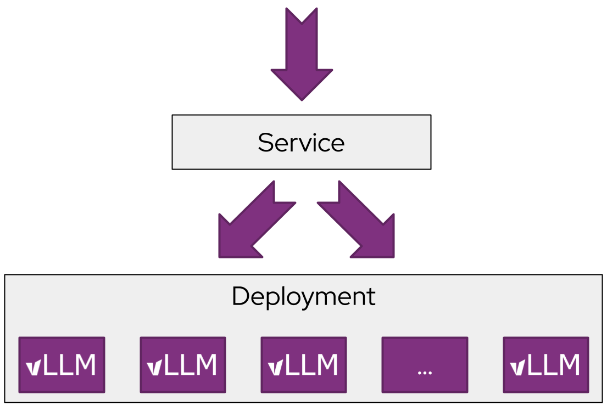
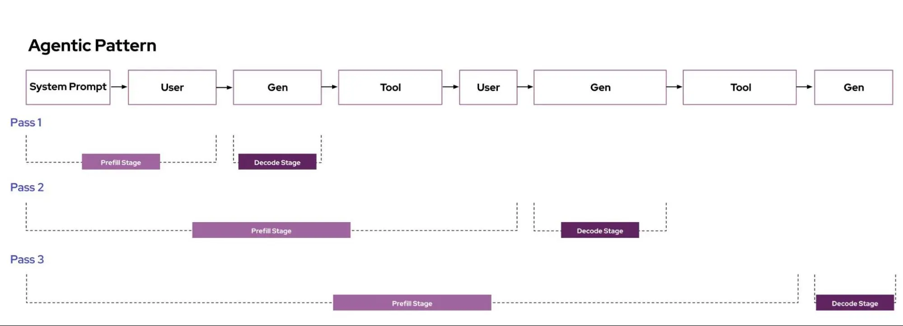
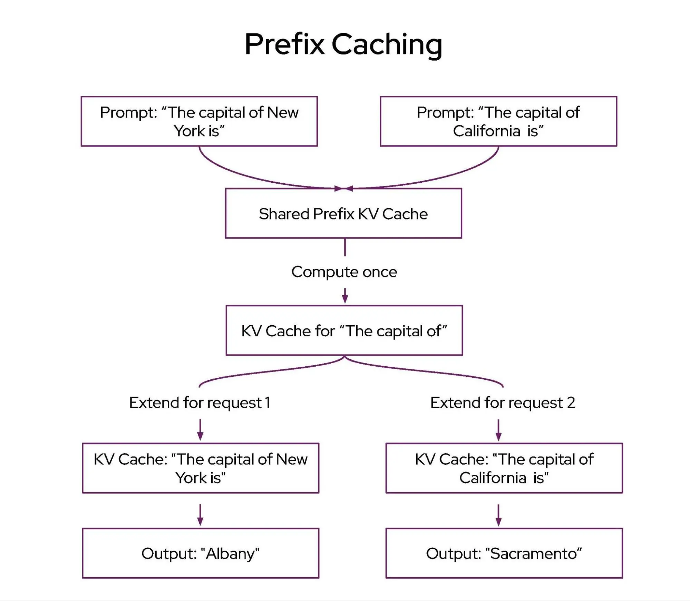
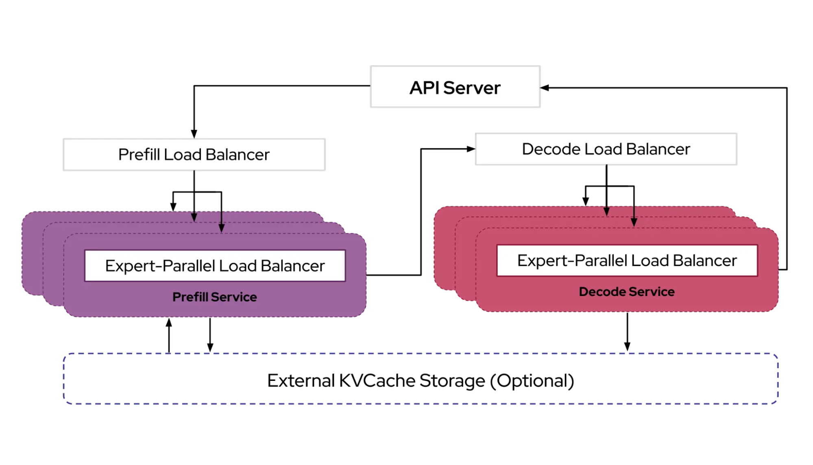
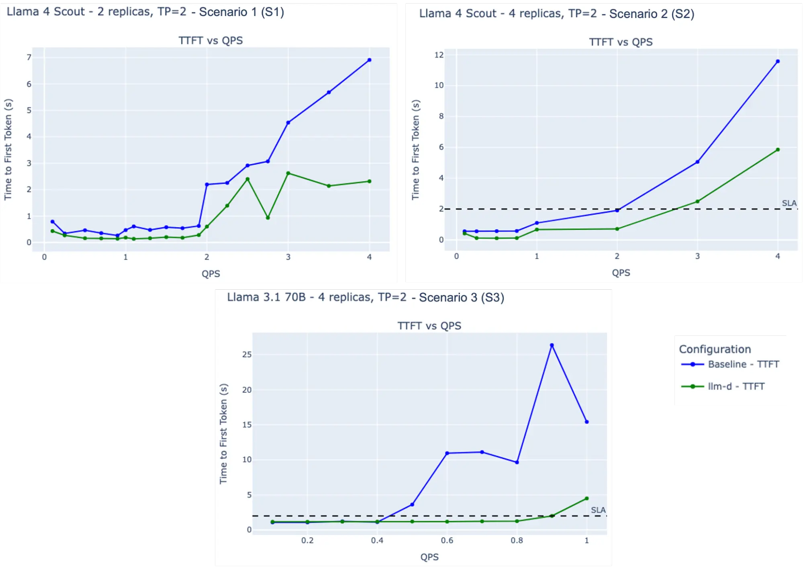

# Announcing the llm-d community!

> Source: [llm-d.ai](https://llm-d.ai/blog/llm-d-announce)

llm-d is a Kubernetes-native high-performance distributed LLM inference framework,
a well-lit path for anyone to serve at scale, with the fastest time-to-value and competitive performance per dollar for most models across most hardware accelerators.

With llm-d, users can operationalize gen AI deployments with a modular, high-performance, end-to-end serving solution that leverages the latest distributed inference optimizations like KV-cache aware routing and disaggregated serving, co-designed and integrated with the Kubernetes operational tooling in [Inference Gateway (IGW)](https://github.com/kubernetes-sigs/gateway-api-inference-extension?tab=readme-ov-file).

<!-- truncate -->

## LLM Inference Goes Distributed

### Why Standard Scale Out Falls Short

Kubernetes typically scales out application workloads with uniform replicas and round-robin load balancing.

This simple pattern is very effective for most request patterns, which have the following characteristics:

* Requests are short-lived and generally uniform in resource utilization  
* Requests have generally uniform latency service level objectives (SLOs)  
* Each replica can process each request equally well  
* Specializing variants and coordinating replicas to process a single request is not useful

### LLM Serving Is Unique

The LLM inference workload, however, is unique with slow, non-uniform, expensive requests. This means that typical scale-out and load-balancing patterns fall short of optimal performance.

Let’s take a look at each one step-by-step:

1. Requests are expensive with significant variance in resource utilization.

    * Each LLM inference request has a different “shape” to it, as measured by the number of input tokens and output tokens. There is significant variance in these parameters across requests and workloads.
     
        * RAG has long inputs - prompt and retrieved docs - and short generated outputs  
        * Reasoning has a short or medium inputs and long generated outputs

        

    * These differences in request times can lead to significant imbalances across instances, which are compounded as loaded instances get overwhelmed. Overloads lead to longer ITL (Inter-Token Latency), which leads to more load, which leads to more ITL.

2. Routing to specific replicas with cached prior computation can achieve orders of magnitude better latency.

    * Many common LLM workloads have “multi-turn” request patterns, where the same prompt is sent iteratively to the same instance.  
     
        * Agentic (tool calls are iterative request flow)  
        * Code completion task (requests reuse current codebase as context)

        

    * LLM inference servers like vLLM implement a method called “automatic prefix caching”, which enables “skipping” a significant amount of prefill computation when there is a cache hit. If requests are routed to vLLM replicas that have the data in the cache, we skip computation. Increasing the likelihood of prefix cache hits with a larger cache size can dramatically improve tail latencies.

        

1. Specializing and coordinating replicas to process a single request can lead to more throughput per GPU.

    * Inference is split into two phases – prefill and decode.  Prefill generates the first output token and runs in parallel over all the prompt tokens - this phase is compute bound.  Decode generates tokens one at a time by doing a full pass over the model, making this phase memory bandwidth-bound.

    * Standard LLM deployments perform the prefill and decode phases of inference within a single replica.Given that prefill and decode phases of inference have different resource requirements, co-locating these phases on the same replica leads to inefficient resource use, especially for long sequences.

    * **Disaggregation** (e.g. [Distserve](https://arxiv.org/abs/2401.09670)) separates prefill and decode phases onto different variants, enabling independent optimization and scaling of each phase.  
        * Google [leverages disaggregated serving on TPUs](https://cloud.google.com/blog/products/compute/whats-new-with-ai-hypercomputer) to provide better first-token latency and simplify operational scaling.

        * DeepSeek released a [discussion of the design of their inference system](https://github.com/deepseek-ai/open-infra-index/blob/main/202502OpenSourceWeek/day_6_one_more_thing_deepseekV3R1_inference_system_overview.md), which leverages aggressive disaggregation to achieve remarkable performance at scale.

    

1. Production deployments often have a range of quality of service (QoS) requirements.*

    * Use cases for a single LLM endpoint can have a wide variety of quality of service requirements. Consider the following examples:  
        * Latency is the most important factor: Code completion requests and search responses need to minimize latency to provide an “in the loop” experience. O(ms) latency tolerance.  
        * Latency is important: Chat agent sessions and email drafting with interactive use cases. O(seconds) latency tolerance.   
        * Latency tolerant: Video call and email summarization and “deep research” agents with daily or hourly usage patterns. O(minutes) latency tolerance.  
        * Latency agnostic: Overnight batch processing workloads, meeting minute generation, and autonomous agents. O(hours) latency tolerance.

    * Given the compute intensity (and, therefore, high costs) of LLMs, tight latency SLOs are substantially more expensive to achieve. This spectrum of latency requirements presents an opportunity to further optimize infrastructure efficiency – the more latency tolerant a workload is, the more we can optimize infrastructure efficiency amongst other workloads.

## Why llm-d?

To exploit these characteristics and achieve optimal performance for LLM workloads, the inference serving landscape is rapidly transitioning towards distributed cluster-scale architectures. For instance, in its “Open Source Week”, the DeepSeek team published the design of its [inference system](https://github.com/deepseek-ai/open-infra-index/blob/main/202502OpenSourceWeek/day_6_one_more_thing_deepseekV3R1_inference_system_overview.md), which aggressively leverages disaggregation and KV caching to achieve remarkable performance per $ of compute.

However, for most GenAI innovators, ML platform teams, and IT operations groups, these benefits remain out of reach. Building and operating a complex, monolithic system is time-consuming and challenging, especially in the context of the rapid pace of innovation and enterprise deployments with tens or hundreds of models for divergent use cases. This complexity risks time to market, higher operational costs and sprawl, and difficulty adopting and experimenting.

### Our Objective

The objective of llm-d is to create a well-lit path for anyone to adopt the leading distributed inference optimizations *within their existing deployment framework* - Kubernetes.

To achieve this goal, we have the following design principles for the project:

* **Operationalizability:** modular and resilient architecture with native integration into Kubernetes via Inference Gateway API  
* **Flexibility:** cross-platform (active work to support NVIDIA, Google TPU, AMD, and Intel), with extensible implementations of key composable layers of the stack  
* **Performance**: leverage distributed optimizations like disaggregation and prefix-aware routing to achieve the highest tok/$ while meeting SLOs

### Architecture

To achieve this objective, we designed llm-d with a modular and layered architecture on top of industry-standard open-source technologies: vLLM, Kubernetes, and Inference Gateway.

* [vLLM](https://docs.vllm.ai/en/latest/) is the leading open-source LLM inference engine, supporting a wide range of models (including Llama and DeepSeek) and hardware accelerators (including NVIDIA GPU, Google TPU, AMD ) with high performance. 

* [Kubernetes](https://kubernetes.io/docs/home/) (K8s). K8s is an open source container orchestration engine for automating deployment, scaling, and management of containerized applications. It is the industry standard for deploying and updating LLM inference engines across various hardware accelerators.

* [Inference Gateway](https://gateway-api-inference-extension.sigs.k8s.io/) (IGW). IGW is an official Kubernetes project that extends the [Gateway API](https://gateway-api.sigs.k8s.io/) (the next generation of Kubernetes Ingress and Load Balancing API) with inference-specific routing. IGW includes many important features like model routing, serving priority, and extensible scheduling logic for “smart” load balancing. IGW integrates with many different gateway implementations, such as Envoy, making it widely portable across Kubernetes clusters.

And our key new contributions:

* **vLLM Optimized Inference Scheduler** - IGW defines a pattern for customizable “smart” load-balancing via the [Endpoint Picker Protocol (EPP)](https://github.com/kubernetes-sigs/gateway-api-inference-extension/tree/main/docs/proposals/004-endpoint-picker-protocol). Leveraging enhanced operational telemetry exposed by vLLM, the inference scheduler implements the filtering and scoring algorithms necessary to make “smart” scheduling decisions around disaggregated serving, prefix-cache-awareness, and load-awareness, validated to be used out-of-the-box by llm-d users. Advanced teams can also tweak or implement their own scorers and filterers to further customize for their use cases, while still benefiting from upcoming operational features in the inference gateway, like flow control and latency-aware balancing.  
  
    For more details, see our Northstar: [[PUBLIC] llm-d Scheduler Northstar](https://docs.google.com/document/d/1kE1LY8OVjiOgKVD9-9Po96HODbTIbgHp4qgvw06BCOc/edit?tab=t.0)

* **Disaggregated Serving with [vLLM](https://github.com/vllm-project/vllm)** - llm-d leverages vLLM’s recently enabled support for disaggregated serving via a pluggable KV Connector API to run prefill and decode on independent instances, using high-performance transport libraries like [NVIDIA’s NIXL](https://github.com/ai-dynamo/nixl).
    
    In llm-d, we plan to support two “well-lit” paths for prefill/decode (P/D) disaggregation:

    * Latency optimized implementation using fast interconnects (IB, RDMA, ICI)  
    * Throughput optimized implementation using data center networking  
    * For more details, see our Northstar: [[PUBLIC] llm-d Disaggregated Serving Northstar](https://docs.google.com/document/d/1FNN5snmipaTxEA1FGEeSH7Z_kEqskouKD1XYhVyTHr8/edit?tab=t.0#heading=h.ycwld2oth1kj)

* **Disaggregated Prefix Caching with vLLM** - llm-d uses the same vLLM KV connector API used in disaggregated serving to provide a pluggable cache for previous calculations, including offloading KVs to host, remote storage, and systems like [LMCache](https://github.com/LMCache/LMCache).
    
    In llm-d, we plan to support two “well-lit” paths for KV cache disaggregation:  

    * Independent caching with basic offloading to host memory and disk, providing a zero operational cost mechanism that utilizes all system resources  
    * Shared caching with KV transfer between instances and shared storage with global indexing, providing potential for higher performance at the cost of a more operationally complex system.  
    * For more details, see our Northstar: [[PUBLIC] llm-d Prefix Caching Northstar](https://docs.google.com/document/d/1d-jKVHpTJ_tkvy6Pfbl3q2FM59NpfnqPAh__Uz_bEZ8/edit?tab=t.0#heading=h.6qazyl873259)

* **Variant Autoscaling over Hardware, Workload, and Traffic** - Accelerator hardware varies dramatically in terms of compute, memory, and cost, workloads sharing the same models vary by their required quality of service, the distinct phases of LLM inference and large mixture-of-expert models vary on whether they are compute, memory, or network bound, and incoming traffic varies over time and by workload. Today, all of these decisions are made at deployment time, and almost all deployers struggle to enable autoscaling to reduce their costs safely.

    Drawing on extensive experience from end users and OSS collaborators like AIBrix, we plan to implement a traffic- and hardware-aware autoscaler that:  

    * Measures the capacity of each model server instance  
    * Derive a load function that takes into account different request shapes and QoS  
    * Using the recent traffic mix - QPS (Queries Per Second), QoS, and shape distribution - calculate the optimal mix of instances to handle prefill, decode, and latency-tolerant requests, and label each instance with a grouping  
    * Report load metrics per grouping that allows Kubernetes horizontal pod autoscaling to match hardware in use to hardware needed without violating SLOs  
    * For more details, see our Northstar: [[PUBLIC] llm-d Autoscaling Northstar](https://docs.google.com/document/d/1inTneLEZTv3rDEBB9KLOB9K6oMq8c3jkogARJqdt_58/edit?tab=t.0)

### Example llm-d Features

llm-d integrates IGW and vLLM together, enabling a high performance distributed serving stack. Let’s discuss some of the example features enabled by llm-d.

**Prefix and KV cache-aware routing**

The first key collaboration between IGW and vLLM in llm-d was developing prefix-cache aware routing to complement the existing KV cache utilization aware load balancing in IGW.

We conducted a series of experiments to evaluate the performance of the [llm-d-inference-scheduler](https://github.com/llm-d/llm-d-inference-scheduler) with prefix-aware routing on 2 NVIDIA 8xH100 nodes using the [LMbenchmark in a long-input/short-output configuration designed](https://github.com/LMCache/LMBenchmark/tree/main/synthetic-multi-round-qa) to stress KV cache reuse and routing decision quality.

|  | Model | Configuration | ISL | OSL | Latency SLO |
| :---- | :---- | :---- | :---- | :---- | :---- |
| **S1** | LlaMA 4 Scout FP8 | TP2, 2 replicas | 20,000 | 100 | None |
| **S2** | LlaMA 4 Scout FP8 | TP2, 4 replicas | 12,000 | 100 | P95 TTFT <= 2s |
| **S3** | Llama 3.1 70B FP16 | TP2, 4 replicas | 8,000 | 100 | P95 TTFT <= 2s |

**Key Observations:**

* **S1:** At 4 QPS, llm-d achieves a mean TTFT approximately 3X lower than the baseline (lower is better).  
* **S2:** llm-d delivers ~50% higher QPS than the baseline while meeting SLO requirements (higher is better).  
* **S3:** llm-d sustains 2X the baseline QPS under SLO constraints (higher is better).

These results show that llm-d’s cache- and prefix-aware scheduling effectively reduces TTFT and increases QPS compared to the baseline, while consistently meeting SLA requirements.

Try it out with the `base.yaml` config in our [quickstart](https://github.com/llm-d/llm-d-deployer/tree/main/quickstart). And as a customization example, see the [template](https://github.com/llm-d/llm-d-inference-scheduler/blob/main/docs/create_new_filter.md) for adding your own scheduler filter.

**P/D disaggregation**

We’ve completed an initial implementation of P/D disaggregation with vLLM and llm-d-inference-scheduler, which delivers promising speedups for prefill-heavy workloads (20:1 ISL | OSL). Our next focus is finalizing the implementation with heterogeneous TP and completing comprehensive benchmarks for disaggregated serving. Short-term priorities include enabling heterogeneous TP, scaling with high-performance P/D + EP<>DP for large scale MoEs, and DP-aware load balancing. We will follow up with a detailed performance blog in the coming weeks.

Try it out with the pd-nixl.yaml config in our [quickstart](https://github.com/llm-d/llm-d-deployer/tree/main/quickstart). 

## Get started with llm-d

llm-d builds brings together the performance of vLLM with the operationalizability of Kuberentes, creating a modular architecture for distributed LLM inference, targeting high performance on the latest models and agentic architectures.

We welcome AI engineers and researchers to join the llm-d community and contribute:

* Check out our repository on Github: [https://github.com/llm-d/llm-d](https://github.com/llm-d/llm-d)
* Join our developer slack: [https://inviter.co/llm-d-slack](https://inviter.co/llm-d-slack)  
* Try out our quick starts to deploy llm-d on your Kubernetes cluster: [https://github.com/llm-d/llm-d-deployer/tree/main/quickstart](https://github.com/llm-d/llm-d-deployer/tree/main/quickstart)

Please join us. The future of AI is open.
