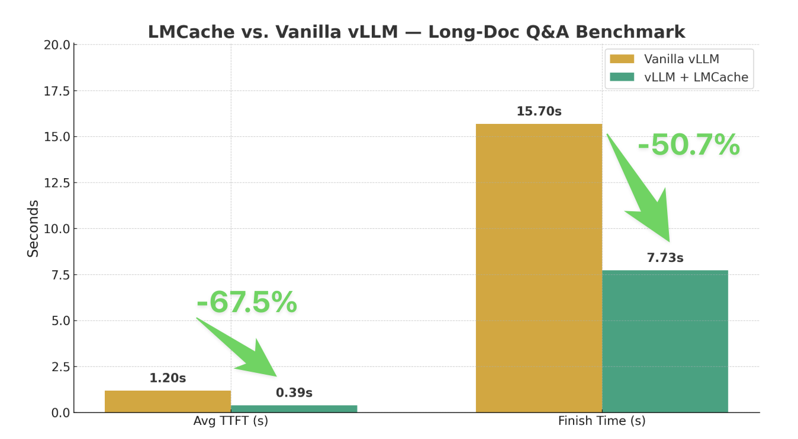

# LMCache supports gpt-oss (20B/120B) on Day 1

> Source: [LMCache blog website](https://blog.lmcache.ai/2025-08-05-gpt-oss-support/)

LMCache is an LLM serving engine extension to reduce TTFT and increase throughput, especially
under long-context scenarios. By storing the KV caches of reusable texts across various locations,
including (GPU, CPU DRAM, Local Disk), LMCache reuses the KV caches of any reused text
(not necessarily prefix) in any serving engine instance. Thus, LMCache saves precious
GPU cycles and reduces user response delay.

By combining LMCache with vLLM, developers achieve 3-10x delay savings and GPU cycle
reduction in many LLM use cases, including multi-round QA and RAG.

LMCache now supports OpenAI’s newly released GPT-OSS models (20B and 120B parameters)
from day one! This post provides a complete guide to setting up vLLM with LMCache for
GPT-OSS models and demonstrates significant performance improvements through our CPU
offloading capabilities.



## Step 1: Installing vLLM GPT OSS Version

### Installation

```shell
uv pip install --pre vllm==0.10.1+gptoss \
    --extra-index-url https://wheels.vllm.ai/gpt-oss/ \
    --extra-index-url https://download.pytorch.org/whl/nightly/cu128 \
    --index-strategy unsafe-best-match
```

### Test the Installation

```shell
vllm serve openai/gpt-oss-120b \
  --max-model-len 32768 \
  --disable-hybrid-kv-cache-manager
```
```shell
curl http://localhost:9000/v1/chat/completions \
  -H "Content-Type: application/json" \
  -d '{
    "model": "openai/gpt-oss-120b",
    "messages": [
      {
        "role": "user",
        "content": "Hello how are you today"
      }
    ],
    "temperature": 0.7
  }'
```

## Step 2: Install LMCache from Source

### Why Install from Source?

vLLM requires nightly built PyTorch to serve GPT models. To ensure compatibility, we highly recommend installing LMCache based on the PyTorch version in your current virtual environment.

### Installation Process

Install LMCache from source (this command may take a few minutes due to CUDA kernel compilations):

```shell
git clone https://github.com/LMCache/LMCache.git
cd LMCache

# In your virtual environment
ENABLE_CXX11_ABI=1 uv pip install -e . --no-build-isolation
```

### Test the Installation

```shell
python3 -c "import torch; import lmcache; import lmcache.c_ops"
```

## Step 3: Run vLLM with LMCache

### LMCache Configuration

Create a configuration file backend_cpu.yaml for CPU offloading:

```yaml
# Create a CPU offloading buffer with 80G
chunk_size: 256
local_cpu: True
max_local_cpu_size: 80
```

### Launch vLLM with LMCache

```shell
LMCACHE_CONFIG_FILE="./backend_cpu.yaml" \
LMCACHE_USE_EXPERIMENTAL=True \
vllm serve \
    openai/gpt-oss-120b \
    --max-model-len 32768 \
    --disable-log-requests \
    --disable-hybrid-kv-cache-manager \
    --kv-transfer-config \
    '{"kv_connector":"LMCacheConnectorV1", "kv_role":"kv_both"}'
```

## Step 4: Benchmark Results

### Use Case: Long Document Q&A

- Input: 20 different documents with an average length of 20K tokens each
- Output: 50 tokens per query

1. Phase 1: Send all documents to the serving engines to warm up the KV cache
1. Phase 2: Shuffle the queries and send them again, measuring TTFT and finish time

### Performance Results

The benchmark results for Phase 2 show impressive improvements:

| Setup             | Average TTFT (secs) | Time to finish all queries (secs) |
| ----------------- | ------------------- | --------------------------------- |
| Vanilla vLLM      | 1.20                 | 15.70                             |
| vLLM + LMCache    | 0.39                 | 7.73                              |

### Why the Performance Gain?

When using a single A100/H100 to serve GPT-120B, the available KV cache GPU buffer is typically less than 10GB. With LMCache’s CPU offloading buffer, vLLM can store and reuse KV cache for many more prefixes, resulting in:

- **67% reduction** in Time to First Token (TTFT)
- **51% reduction** in total query completion time

### Running the Benchmark

You can reproduce these results using our benchmark script:

```shell
python long-doc-qa.py --num-documents 20 \
  --document-length 20000 --output-len 50 \
  --repeat-count 1 --repeat-mode random \
  --shuffle-seed 0
```

## References

- [lmcache.ai website](https://lmcache.ai/)
- [LMCache repo](https://github.com/LMCache/LMCache)
- Check the [complete benchmark script](https://github.com/LMCache/LMCache/blob/dev/benchmarks/long-doc-qa/long-doc-qa.py).
