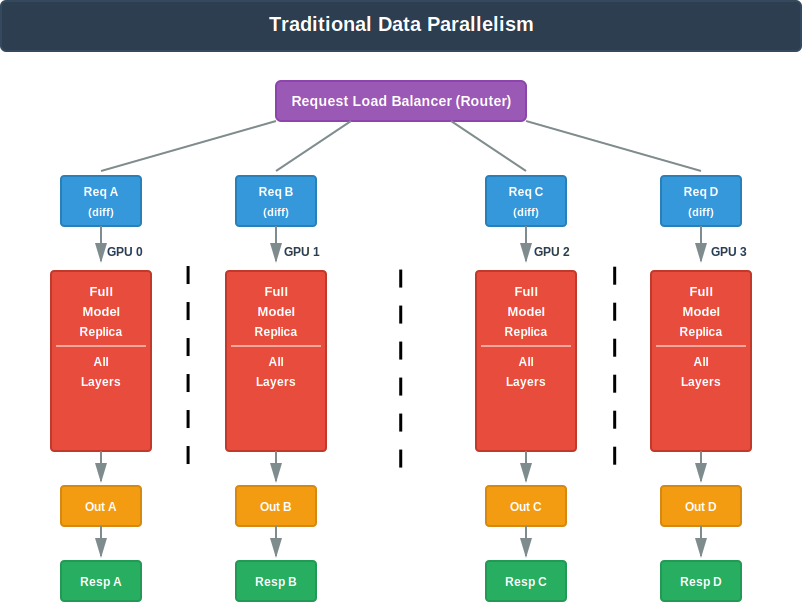
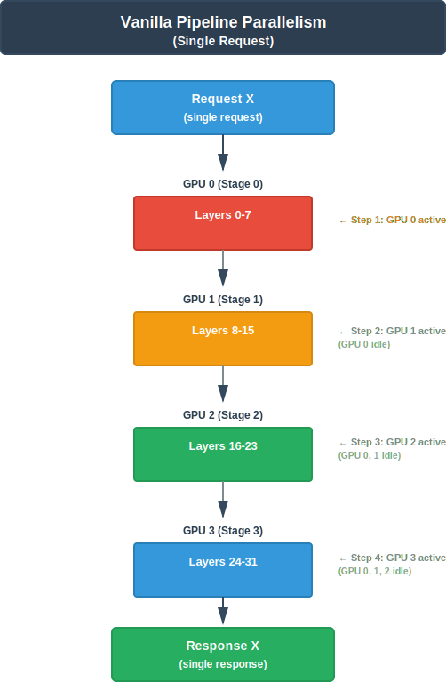
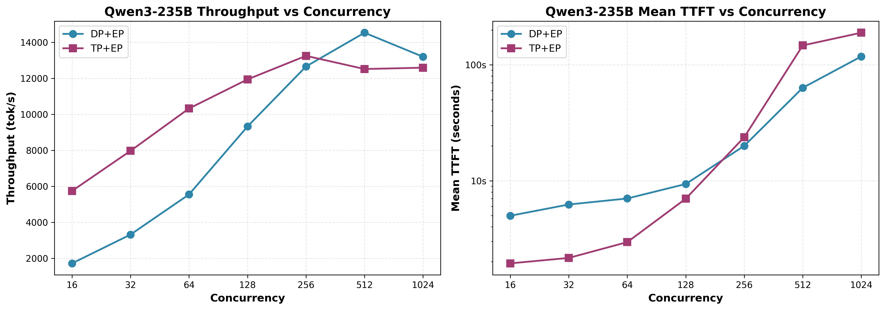
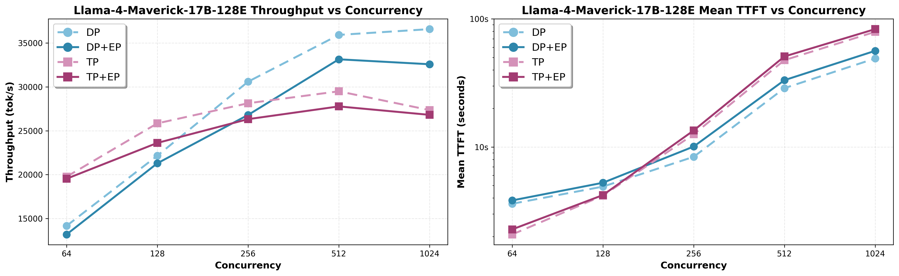

# The vLLM MoE Playbook: A Practical Guide to TP, DP, PP and EP


> Source from [AMD blog](https://rocm.blogs.amd.com/software-tools-optimization/vllm-moe-guide/README.html)

Deploying large Mixture-of-Experts (MoE) models like DeepSeek-R1 efficiently isn’t just about having enough GPUs—it’s about choosing the right parallelism strategy. The wrong choice can lead to duplicated KV caches consuming 8× your memory, or communication overhead that cuts throughput in half. The right choice unlocks significantly better performance for your specific workload.

This guide provides a comprehensive, visual framework for understanding and deploying vLLM’s parallelism strategies: Tensor Parallelism (TP), Data Parallelism (DP), Pipeline Parallelism (PP), and Expert Parallelism (EP). Through detailed diagrams, you’ll see exactly how each strategy distributes computation and memory across GPUs—from how TP shards layers and requires AllReduce synchronization, to how DP+EP enables request-level parallelism with AllToAll communication for MoE models. We’ll clarify critical misconceptions (like why “DP Attention” differs fundamentally from traditional data parallelism) and show you when the `--enable-expert-parallel` flag is essential versus when it adds unnecessary overhead.

Our benchmark results from deploying DeepSeek-R1, Qwen3-235B, and Llama-4-Maverick on AMD Instinct™ MI300X GPUs reveal the performance crossover points: TP+EP delivers superior low-latency performance for interactive workloads with low concurrency, while DP+EP scales better for high-throughput batch processing. You’ll learn how expert activation density determines whether Expert Parallelism helps or hurts, and why MLA/MQA models like DeepSeek require special handling for KV cache management.

By the end, you’ll have a practical decision framework to select the optimal parallelism strategy based on your concurrency levels, model architecture, and hardware constraints.

**Scope:** This blog focuses primarily on **single-node deployment** (typically 8 GPUs connected via AMD Infinity Fabric™ technology or xGMI). While we briefly discuss multi-node considerations for context, the main examples and recommendations are optimized for single-node setups.

## Core Concepts

vLLM has three fundamental parallelism strategies: Tensor Parallelism (TP), Pipeline Parallelism (PP), and Data Parallelism (DP) [[1](https://rocm.blogs.amd.com/software-tools-optimization/vllm-moe-guide/README.html#references), [5](https://rocm.blogs.amd.com/software-tools-optimization/vllm-moe-guide/README.html#references)]. Expert Parallelism (EP) is a special modifier flag for MoE models that works in conjunction with TP or DP.

### Tensor Parallelism (TP)

**What it does:** Shards individual layers across multiple GPUs. Each GPU processes a portion of each layer, with results synchronized through collective communication.

[](./images/tp_vanilla_improved.svg)

<a id="figure1"></a>
<div style="text-align:center;">
Figure 1: Data flow for Tensor Parallelism when Tensor parallel=4
</div>

In [Figure 1](#figure1), single request X’s tensor is split across 4 GPUs. All GPUs collaborate on the SAME computation, and each GPU holds 1/4 of each layer’s weight. ***AllReduce*** after each layer is needed for communication.

**Use case:** When a single model is too large to fit on one GPU. Using TP can reduce latency since the single request is processed in parallel by multiple GPUs. **Constraint:** TP is constrained by the number of attention heads and must be divisible. For example, to use TP=3, you might get “Error message: Total number of attention heads (64) must be divisible by tensor parallel size (3)”.

**Command:** `vllm serve model-name --tensor-parallel-size 4`

### Data Parallelism (DP)

**What it does:** Creates multiple complete replicas of the model, each processing different requests independently. This increases throughput by handling multiple requests simultaneously.

[](./images/data_parallelism.svg)

<a id="figure2"></a>
<div style="text-align:center;">
Figure 2: Data flow for Data Parallelism for DP=4
</div>

In [Figure 2](#figure2), multiple different requests are processed simultaneously. Each GPU is a complete independent replica, processes different requests independently, and 4× throughput for concurrent requests. There is no communication between the GPUs.

**Use case:** When you need higher throughput and have requests that can be processed independently.

**Constraint:** DP typically does not decrease latency.

**Command:** `vllm serve model-name --data-parallel-size 4`

### Pipeline Parallelism (PP)

**What it does:** Splits the model’s layers across multiple GPUs or nodes, with each GPU processing different layers sequentially. Data flows through these stages like an assembly line.

[](./images/vanilla_pipeline_parallelism.svg)

<a id="figure3"></a>
<div style="text-align:center;">
Figure 3: Data flow for Vanilla Pipeline Parallelism for PP=4
</div>

In [Figure 3](#figure3), a request is sequentially being processed in this vanilla pipeline parallelism for demonstration purposes. Only one GPU is active at a time while other GPUs sit idle (pipeline bubbles). The total latency is 4 sequential steps per request, and GPU utilization is 25% (1 out of 4 GPUs active).

**When to use:**

- Model is too large for a single node (combine PP with TP)
- Need to deploy on non power-of-two GPU counts (3,5,6,7,9, etc.).

**Constraint:** PP typically does not decrease latency.

**The Problem:** With vanilla PP processing one request at a time, 75% of your GPUs are idle!

**vLLM’s optimization:** vLLM processes **multiple requests concurrently** through the pipeline. While GPU 0 processes Request B, GPU 1 processes Request A, GPU 2 processes an earlier request, and so on. This keeps all pipeline stages busy simultaneously, dramatically reducing idle time.

**Key Characteristics:**

- Each GPU holds a subset of model layers (a “pipeline stage”)
- Data flows sequentially through pipeline stages
- **Single request latency:** Higher than TP (must traverse all stages)
- **Throughput:** High when pipeline is filled with concurrent requests
- Best suited for multi-node deployments where TP within nodes + PP across nodes

**Commands:**

```
Pure PP: 4 GPUs as 4 pipeline stages
vllm serve model-name --pipeline-parallel-size 4

TP within nodes + PP across nodes (2 pipeline stages with each pipeline has 4 GPUs)
vllm serve model-name --tensor-parallel-size 4 --pipeline-parallel-size 2
```

## Critical Misconceptions About MoE Parallelism

Understanding these concepts is essential before diving into MoE-specific strategies.

### Glossary: Expert Distribution Terminology

Understanding how experts are distributed is critical for interpreting the diagrams and strategies in this guide.

**Sharded Experts (without `--enable-expert-parallel`):**

- **Definition:** All experts are present on every GPU, but their weight tensors are divided/partitioned across GPUs
- **Example:** With 256 routed experts and TP=8, each GPU has all 256 experts, but each expert’s weights are sharded into 8 pieces (one piece per GPU)
- **Communication:** Requires AllReduce to aggregate results from sharded weights

**Split Experts (WITH `--enable-expert-parallel`):**

- **Definition:** Experts are distributed across GPUs, with each GPU holding a different subset of complete experts
- **Example:** With 256 routed experts and TP=8 + EP, each GPU has 32 complete experts (GPU 0: experts 0-31, GPU 1: experts 32-63, etc.)
- **Communication:** May use AllToAll (when combined with DP) or AllReduce (with TP only) depending on parallelism strategy

### Misconception #1: “Expert Parallelism is a standalone strategy”

**Reality:** Expert Parallelism (EP) is **not a standalone parallelism strategy**. It’s a flag (`--enable-expert-parallel`) that modifies MoE communication patterns and must be combined with TP or DP. `--enable-expert-parallel` only takes effect if `TP_SIZE × DP_SIZE > 1`, else it is ignored.

**What the EP flag controls:**

- **WITHOUT EP:** ALL experts present on every GPU, weight tensors sharded, uses **AllReduce** communication
- **WITH EP:** Experts distributed across GPUs, uses **AllToAll** communication (when DP>1) or **AllReduce** (when DP=1)

See the “Mixing Parallelism Strategies” section for detailed EP activation constraints and examples.

### Misconception #2: “DP Attention and traditional Data Parallelism are the same”

**Reality:** For MoE models, vLLM uses a special variant called **“DP Attention”** that’s fundamentally different from traditional DP.

**Terminology Clarification:**

- **Traditional Data Parallelism (DP):**
    - Multiple, independent replicas of the entire model are created, one per GPU (or group of GPUs if combined with Tensor Parallelism)
    - Each replica processes different requests independently, with no inter-replica communication during inference
- **DP Attention:** Request-level parallelism where GPUs coordinate as one logical model replica:
    - Attention layers are replicated (as in usual DP case), while the handling of MoE expert layers depends on with / without expert parallelism
    - Requires inter-GPU communication during inference (e.g., all-gather, all-to-all, slice) to reconcile batch partitions between attention and MoE layers.
    - configured with –data-parallel-size N. It can be used:
        - With EP: “DP + EP” (experts distributed; uses all-to-all or gather/slice around MoE).
        - Without EP: Falls back to traditional DP with FULL KV cache replication on each GPU. **No KV cache partitioning benefits**

**The Problem with TP for MLA/MQA:**

- MLA and MQA use a single KV head in the KV-cache
- With Tensor Parallelism, you can shard QKV along attention heads
- But you **cannot shard KV cache along the head dimension** (there’s only one head)
- Result: **Full KV cache must be duplicated on all TP ranks**

**Example:** With TP=32 for attention layers:

- Linear computation per GPU: 1/32 attention heads ✓
- KV cache per GPU: **Full KV cache** (duplicated 32×) ✗
- This wastes massive amounts of memory

**DP Attention Solution:** Instead of replicating full models independently, DP Attention operates **within a single model replica** and partitions the KV cache by requests/tokens:

- Each GPU holds full non-MoE layers (attention, dense)
- **Single logical batch** is partitioned across GPUs
- KV cache is **partitioned** across GPUs by request/token (each GPU holds 1/DP_SIZE of the batch’s KV cache)
- Communication happens during inference via AllToAll (unlike traditional DP with independent batches)
- **Contrast with traditional DP:** Each GPU processes its own separate batch with its own full KV cache (no partitioning, no inter-GPU communication)

**Example:** With TP=4 and DP=8 for attention layers (32 GPUs total):

- 8 independent DP groups, each containing 4 GPUs in a TP group
- Non-MoE computation per GPU: 1/4 of attention heads (TP-sharded across 4 GPUs)
- KV cache per GPU: (ideal) 1/8 of the total batch requests (partitioned by DP rank)
- AllReduce overhead: Only within 4-GPU TP groups (not across all 32)
- Each DP group processes different requests independently

**Availability:** DP Attention for MoE models is available in vLLM v0.9.0+ with the V1 engine. This feature was specifically designed for MLA/MQA architectures like DeepSeek-V2, DeepSeek-V3, and DeepSeek-R1.

### Misconception #3: “All experts are treated the same in MoE models”

**Reality:** MoE models have two fundamentally different types of experts with different parallelism behavior.

**Routed Experts:**

- Activated **conditionally** based on a routing mechanism
- Only a subset processes each token (e.g., 8 out of 256 experts)
- **If EP is enabled, routed experts are distributed** across GPUs via `determine_expert_map` (different experts per device)
- **If EP is disabled, ALL routed experts present** on every GPU, but weight tensors are sharded via `flatten_tp_across_dp`
- Examples: DeepSeek-R1 has **256 routed experts**, 8 activated per token

**Shared Experts:**

- **Always activated** for every token (no routing)
- Treated as a standard dense MLP layer
- The weight is sharded across GPUs. The weight is only replicated in each GPU if all the following conditions are met:
    - Expert parallelism is enabled
    - Tensor parallel size > 1
    - Data parallel size > 1
    - Using specific all2all backends (allgather_reducescatter, naive, deepep_high_throughput, or deepep_low_latency)
- Examples: DeepSeek-R1 has **1 shared expert** (always active)

**Expert Distribution Formula (for Routed Experts):**

```
EP_SIZE = TP_SIZE × DP_SIZE`
`Routed experts per GPU = Total Routed Experts / EP_SIZE
```

**Example: DeepSeek-R1 (256 routed experts + 1 shared expert):**

| TP_SIZE | DP_SIZE | EP_SIZE | Routed Experts per GPU | Shared Expert Handling |
| ------- | ------- | ------- | ---------------------- | ---------------------- |
| 8       | 1       | 8       | 256 / 8 = 32           | Sharded across 8 GPUs  |
| 1       | 8       | 8       | 256 / 8 = 32           | Sharded across 8 GPUs  |

**Key Insight:** For the same number of GPUs (8 GPUs in this case), `TP=8` and `DP=8` give the same routed expert distribution (32 experts/GPU) when EP is enabled.

### Misconception #4: “TP+EP uses AllToAll communication like DP+EP”

**Reality:** TP+EP uses **AllReduce only**, NOT AllToAll. according to vLLM source code, AllToAll kernels require `dp_size > 1`:

```python
# From vllm/model_executor/layers/fused_moe/config.py:669
@property
def use_all2all_kernels(self):
    return self.dp_size > 1 and self.use_ep  # Both conditions must be true
```

Since TP has `dp_size=1`, AllToAll is **never** triggered regardless of the EP flag.

- **TP+EP:** AllReduce communication (same as TP without EP)
- **DP+EP:** AllToAll communication (enables DP Attention)

This explains why TP=8 with and without `--enable-expert-parallel` are functionally similar for MoE models (both use AllReduce, no AllToAll).

Key implication: For MLA/MQA models where KV cache partitioning is critical:

- TP+EP: Does NOT provide KV cache partitioning (uses AllReduce, dp_size=1)
- DP+EP: DOES provide KV cache partitioning (uses AllToAll, dp_size>1)

## Single-Strategy Deep Dives

### Expert Parallelism for MoE Models

Expert Parallelism modifies how MoE layers are mapped and how they communicate. Understanding this is critical for all MoE deployments.

**How vLLM Internally Handles MoE Expert Distribution:**

Experts are mapped via the `flatten_tp_across_dp` function [[3\]](https://rocm.blogs.amd.com/software-tools-optimization/vllm-moe-guide/README.html#references):

```
# From vllm/model_executor/layers/fused_moe/config.py:687-695` `def flatten_tp_across_dp(tp_size: int, dp_size: int, dp_rank: int):` `flatten_tp_size = dp_size * tp_size` `flatten_tp_rank = dp_rank * tp_size + tp_rank` `return flatten_tp_size, flatten_tp_rank
```

```python
# From vllm/model_executor/layers/fused_moe/config.py:687-695
def flatten_tp_across_dp(tp_size: int, dp_size: int, dp_rank: int):
    flatten_tp_size = dp_size * tp_size
    flatten_tp_rank = dp_rank * tp_size + tp_rank
    return flatten_tp_size, flatten_tp_rank
```

This function is **always called** for MoE layers, regardless of the EP flag.

**Why Expert Parallelism Reduces Latency for MoE Models:**

The key insight: **memory bandwidth, not compute, is the bottleneck** for MoE models.

- MoE models have sparse activation (e.g., DeepSeek uses only 37B of 671B parameters per token)
- GPUs spend most of their time loading expert weights from memory, not computing
- A single GPU’s memory bandwidth limits how fast experts can be accessed
- **Solution:** Distribute experts across multiple GPUs to get aggregate memory bandwidth

With 8 GPUs and EP enabled, you get 8× the memory bandwidth for expert weight loading. This reduces memory transfer wait time, which is the primary latency factor for MoE models.

**Communication Tradeoff:** EP requires AllToAll communication to route tokens to experts on different GPUs. However, this cost is **much smaller** than the memory bandwidth savings for most models (exception: ultra-sparse models with <1% activation density).

## Strategy Combinations

### TP + EP: Tensor Parallelism for MoE Models

**CRITICAL:** For MoE models, `--tensor-parallel-size 8 --enable-expert-parallel` and `--tensor-parallel-size 8` (without EP flag) exhibit different behaviours. The EP flag causes changes in how routed experts are mapped across GPUs

- WITHOUT `--enable-expert-parallel`, routed experts are sharded across 8 GPUs (see **Figure 5**).
- WITH `--enable-expert-parallel`, routed experts are split across 8 GPUs (see **Figure 4**).
- KV cache behavior (duplicated FULL on each GPU in both cases)
- Communication pattern (AllReduce in both cases, NOT AllToAll)

**Why?** AllToAll kernels require `dp_size > 1`. Since TP has `dp_size=1`, AllToAll is **never** triggered regardless of the EP flag.

As illustrated in [Figure 4](#figure4) below, with TP=8 and Expert Parallelism enabled, experts are split across the 8 GPUs (32 experts per GPU), and AllReduce communication is used after each layer.

[](./images/tp_moe_EP_v2.svg)

<a id="figure4"></a>
<div style="text-align:center;">
Figure 4: Data flow for TP=8 on a single node (with Expert Parallelism)
</div>

[](./images/tp_moe_v2.svg)

<a id="figure5"></a>
<div style="text-align:center;">
Figure 5: Data flow for TP=8 on a single node (without Expert Parallelism)
</div>

**Why TP+EP Has Limited Benefits for MLA Models (DeepSeek V2/V3/R1):**
DeepSeek models use Multi-Latent Attention (MLA), which creates a critical limitation:

**The KV Cache Duplication Problem:**

- MLA uses a **single KV head** (unlike standard multi-head attention)
- With TP, you **cannot shard the KV cache along the head dimension** (there’s only 1 head)
- Result: **KV cache must be fully duplicated on every TP rank**

**Memory Impact Example** (DeepSeek-V3 671B with TP=8, batch of 512 tokens):

| Configuration | KV Cache State                                 | Effective Concurrency | Result                                                  |
| ------------- | ---------------------------------------------- | --------------------- | ------------------------------------------------------- |
| TP=8 + EP     | Duplicated ×8 (each GPU holds the same cache)  | 1×                    | Total KV cache is 8× larger; limits batch size          |
| DP=8 + EP     | No duplication (each GPU holds a unique cache) | 8×                    | Total KV cache is optimal; allows for 8× larger batches |

**Memory savings with DP+EP:** By eliminating the 8× duplication of the KV cache, each GPU in the DP=8 configuration reclaims significant memory. This saved memory can be used to increase the effective concurrency by 8×, allowing for much larger batch sizes or longer contexts.

**Why TP+EP Still Helps (But Not Ideal):**

- Expert distribution: Experts distributed across 8 GPUs reduces per-GPU expert memory
- Attention computation: Can shard query projections (limited benefit)
- KV cache: Fully duplicated (major waste for MLA models)

**Benchmark Reality Check:** Despite KV cache duplication, TP+EP delivers **52% higher throughput than DP+EP at low concurrency** (64-128 requests) due to lower per-request latency. The memory overhead is acceptable if you have sufficient HBM and prioritize latency over batch size.

**When to use TP+EP:**

- Large MoE models that don’t fit on a single GPU
- Low-moderate concurrency workloads where latency matters most
- Sufficient HBM to handle KV cache duplication

**Commands:**

```sh
# Without EP flag (same behavior for TP-only)
vllm serve model-name --tensor-parallel-size 8

# With EP flag (minor internal optimizations only)
vllm serve model-name --tensor-parallel-size 8 --enable-expert-parallel
```

### DP + EP: DP Attention with Expert Parallelism

**CRITICAL:** Using `--data-parallel-size` alone (without `--enable-expert-parallel`), the MoE Experts are sharded, NOT DP Attention.

#### DP Without EP

When you use `--data-parallel-size 8` **without** `--enable-expert-parallel`:

```sh
# MoE experts ARE sharded, but uses traditional communication
vllm serve model-name --data-parallel-size 8
```

**What happens** (DeepSeek-R1 as example):

- Attention layers: Full replica on each GPU
- **MoE routed experts: SHARDED** (all 256 experts present on every GPU, weight tensors sharded across 8 GPUs)
    - Requires AllGather before routed experts (gather shared expert outputs)
    - Requires ReduceScatter after routed experts (reduce and distribute results)
- **MoE shared expert: SHARDED**
- KV cache is **partitioned** across GPUs; each GPU holds the cache only for the requests it is assigned.
- Communication: Uses AllGather (before routed experts) + ReduceScatter (after routed experts), **NOT AllToAll**
- **No DP Attention behavior**

[Figure 6](#figure6) illustrates this architecture, showing how routed experts are sharded across all 8 GPUs with AllGather and ReduceScatter communication patterns.

[](./images/dp_without_ep_moe_v3.svg)

<a id="figure6"></a>
<div style="text-align:center;">
Figure 6: Data flow for DP=8 without Expert Parallelism
</div>

#### DP With EP

When you use `--data-parallel-size 8` **with** `--enable-expert-parallel`:

```sh
# This enables DP Attention (request-level parallelism)
vllm serve model-name --data-parallel-size 8 --enable-expert-parallel
```

This uses **DP Attention**, which operates **within a single model replica:**

- Different GPUs process different requests (request-level parallelism)
- KV cache is **partitioned** across GPUs; each GPU holds the cache only for the requests it is assigned.
- Non-MoE layers are replicated but with partitioned KV cache
- MoE experts are **distributed** across all GPUs
- **Communication happens** between layers via AllToAll

This architecture is shown in [Figure 7](#figure7) below, where experts are distributed across GPUs and AllToAll communication enables efficient request-level parallelism with partitioned KV cache.

[](./images/dp_with_ep_moe_v2.svg)

<a id="figure7"></a>
<div style="text-align:center;">
Figure 7: Data flow for DP=8 with Expert Parallelism
</div>

**Why DP+EP for MoE Models?**

DP+EP provides specific benefits for MoE models, but optimal strategy depends on your workload [[5\]](https://rocm.blogs.amd.com/software-tools-optimization/vllm-moe-guide/README.html#references): **For MLA/MQA Models (DeepSeek V2/V3/R1):**

- **Critical benefit:** Avoids KV cache duplication that occurs with TP
- TP duplicates full KV cache on each GPU (8× waste), DP partitions it (1/8 per GPU)
- **Result:** Enables 8× larger batch sizes and higher throughput

**For All MoE Models:**

- **Lower data movement:** Tokens only sent to GPUs holding their routed experts
- **Better expert distribution:** Experts distributed across `TP_SIZE × DP_SIZE` GPUs
- **Higher throughput:** Request-level parallelism for serving workloads
- **Reduced communication:** Sparse AllToAll more efficient than dense AllReduce at scale

**When to use DP+EP:**

- **Essential for MLA/MQA models** where KV cache memory is critical
- **When the TP choices are not compatible (not a power of 2).** (e.g., Qwen3-Coder-480B FP8, MiniMax-M2)
- **Recommended for large MoE models** when non-expert layers fit on single GPUs
- **For throughput-focused deployments** where high-QPS matters more than latency

### Memory Requirements Comparison

Understanding memory requirements helps choose the right strategy. Here’s a comparison for DeepSeek-R1 (671B parameters):

**Assumptions:**

- Model: 671B (37B active per token), 256 routed experts + 1 shared expert
- Quantization: FP8 (1 byte per parameter)
- Batch: 512 tokens, KV cache per token: ~2MB, total KV cache: 1GB
- Non-MoE layers: ~84GB, Routed experts: ~584GB, Shared expert: ~0.04GB

| Configuration    | Non-MoE | Routed Experts    | Shared Expert | KV Cache | Total/GPU | Communication             |
| ---------------- | ------- | ----------------- | ------------- | -------- | --------- | ------------------------- |
| **TP=8 (no EP)** | 10.5GB  | 73GB (32 experts) | 0.04GB        | 1GB      | ~84.5GB   | AllReduce                 |
| **TP=8 + EP**    | 10.5GB  | 73GB (32 experts) | 0.04GB        | 1GB      | ~84.8GB   | AllReduce                 |
| **DP=8 (no EP)** | 84GB    | 73GB (32 experts) | 0.04GB        | 1GB      | ~158GB    | AllGather + ReduceScatter |
| **DP=8 + EP**    | 84GB    | 73GB (32 experts) | 0.04GB        | 0.125GB  | ~157GB    | AllToAll                  |

**Key Insights:**

1. **WITHOUT EP flag:** ALL routed experts present on every GPU, but weight tensors are sharded via `flatten_tp_across_dp`.
2. **WITH EP flag:** Routed experts are distributed (different experts per device) via `determine_expert_map` when `TP_SIZE × DP_SIZE > 1`.
3. **EP flag controls communication:** AllReduce (no EP) vs AllToAll (with EP)
4. **TP=8 (no EP) vs TP=8 + EP:** routed experts are sharded (all present) vs split (distributed); both use AllReduce communication
5. **DP=8 (no EP) vs DP=8 + EP:** both partition KV cache (enables 8× larger batches) compared to TP implementation; routed experts are sharded (all present) vs split (distributed); both use AllToAll communication (Nearly identical memory), but DP+EP partitions KV cache (enables 8× larger batches)
6. **Why DP+EP is recommended:** keeps expert distribution efficient while partitioning the KV cache by requests/tokens, it unlocks larger batches and longer contexts with lower per-GPU memory and better throughput, especially for MLA/MQA models

## Benchmark Results: Strategy Performance

Real-world benchmarking on 8× AMD Instinct™ MI300X GPUs reveals critical insights about parallelism strategy selection.

### Test Configuration

**Hardware:**

- **GPU:** 8× AMD Instinct™ MI300X GPUs (gfx942)
- **CPU:** 2 × AMD EPYC™ 9654 96-Core Processor

**Software Stack:**

- **ROCm Driver:** 6.10.5 (AMDGPU)
- **Container:** rocm/vllm-dev (ROCm 7.0.51831)
- **vLLM:** 0.11.1rc3.dev69+g269c4db0a
- **PyTorch:** 2.9.0a0+git1c57644 (ROCm 7.0.51831)

**Benchmark Configuration:**

- **Input:** 8192 tokens (long context)
- **Output:** 1024 tokens per request
- **Workload:** 640 total requests

### DeepSeek-R1 (671B, 256 routed + 1 shared, 8/token, MLA) DP+EP vs TP+EP Scaling AITER is Disabled

[](./images/deepseek_r1_comparison.png)

<a id="figure8"></a>
<div style="text-align:center;">
Figure 8: DeepSeek-R1 DP+EP vs TP+EP scaling performance
</div>

**Key Findings** (from [Figure 8](#figure8)):

1. **TP=8 + EP superior for low concurrency (64)** - 52% higher throughput, 80% lower TTFT (time to first token, compared to DP=8 + EP with concurrency=64)
2. **DP=8 + EP scales better** - At concurrency=1024, achieves 7,114 tok/s (47% higher than TP8 + EP with concurrency=1024)

### Qwen3-235B-A22B-Instruct-2507 (128 routed, 8/token, 6.25% density)

DP+EP vs TP+EP Scaling AITER is Enabled

[](./images/qwen3_final_comparison.png)

<a id="figure9"></a>
<div style="text-align:center;">
Figure 9: Qwen3-235B-A22B DP+EP vs TP+EP scaling performance
</div>

**Key Finding:** As shown in [Figure 9](#figure9), similar crossover behavior occurs at 256-512 concurrent requests despite higher activation density (6.25% vs DeepSeek 3.13%).

**Llama-4-Maverick-17B-128E-Instruct-FP8 (128 routed + 1 shared, 1/token, 0.78% activation density)** DP and EP (with and without EP) Scaling AITER is Enabled

[](./images/llama4_comparison.png)

<a id="figure10"></a>
<div style="text-align:center;">
Figure 10: Llama-4-Maverick-17B-128E TP vs DP scaling with and without EP
</div>

**Key Finding:** As illustrated in [Figure 10](#figure10), **EP=0 outperforms EP=1 by 7-12%** for ultra-sparse models. With only 0.78% activation density, AllToAll overhead exceeds benefit.

### Expert Activation Density Hypothesis

EP flag benefit correlates with expert activation density:

| Model                                      | Experts/Token | Activation Density | EP Recommendation  | Impact                                  |
| ------------------------------------------ | ------------- | ------------------ | ------------------ | --------------------------------------- |
| **Llama-4-Maverick-17B-128E-Instruct-FP8** | 1 / 128       | 0.78%              | **EP=0**           | EP=1 adds 7-12% overhead                |
| **DeepSeek-R1**                            | 8 / 256       | 3.13%              | **EP=1** (MLA req) |                                         |
| **Qwen3-235B-A22B-Instruct-2507**          | 8 / 128       | 6.25%              | **EP=1**           | Minimal overhead, enables optimizations |

**Pattern:**

- **< 1% activation:** EP=0 preferred (AllReduce more efficient)
- **> 3% activation:** EP=1 strongly recommended (AllToAll efficiency wins)

**MLA Exception:** DeepSeek-R1’s Multi-Latent Attention **requires** EP=1 with DP for proper KV cache handling, regardless of activation density.

## Decision Framework

Selecting the optimal strategy requires balancing model architecture, expert configuration, workload characteristics, and hardware constraints.

### Four Key Questions

#### 1. What is the Expected Concurrency Level?

**Low-Moderate Concurrency (≤128 concurrent requests):**

- ✅ **Use TP=8** (or max TP size within your node)
- **Why:** 40-86% higher throughput across all tested models
- **Best for:** Interactive chat, real-time inference, development/testing

**High Concurrency (≥512 concurrent requests):**

- ✅ **Use DP=8** (or max DP size matching your node count)
- **Why:** 16-47% higher throughput at scale, better TTFT under load
- **Best for:** Batch processing, high-QPS production services

**Crossover Point:** Between 256-512 concurrent requests for all tested models

#### 2. What is the Model’s Expert Activation Density?

Calculate: `Activation Density = (Experts per Token / Total Routed Experts) × 100%`

**Ultra-Sparse (< 1% activation):**

- Example: Llama-4-Maverick-17B-128E-Instruct-FP8 (1/128 = 0.78%)
- **Recommendation:** NO EP flag (EP=0)
- **Reasoning:** AllToAll overhead exceeds benefit

**Sparse (> 3% activation):**

- Example: Qwen3-235B-A22B-Instruct-2507 (8/128 = 6.25%)
- **Recommendation:** YES EP flag (EP=1)
- **Reasoning:** High routing complexity benefits from AllToAll

**MLA Exception:** MLA models (DeepSeek) require EP=1 with DP for proper KV cache handling, regardless of activation density.

#### 3. Does the Model Use MLA/MQA Attention?

**MLA/MQA Models (DeepSeek-R1, DeepSeek-V2, DeepSeek-V3):**

- **CRITICAL:** Always use EP=1 with DP configurations
- **Why:** MLA’s single KV head requires DP Attention for proper KV cache handling
- **Without EP=1:** 38.6% failure rate + full KV cache duplication

**Grouped-Query Attention Models (Qwen3, Llama-4, Mixtral):**

- **Flexible:** EP flag decision based on activation density
- **Less critical:** EP provides optimization, not correctness

#### 4. What are the Hardware Constraints?

**Single Node (≤8 GPUs with fast interconnect):**

- **Preferred:** TP or DP (avoid PP unless necessary)
- **Why:** Leverage high-bandwidth XGMI for AllReduce/AllToAll

**Memory Constrained:**

- **Preferred:** DP + EP for KV cache partitioning

**Benefit:** 8× larger batch size with DP=8 vs TP=8

### Quick Configuration Guide

**DeepSeek-R1 (671B, MLA):**

| Use Case         | Concurrency | Configuration | Command                                             |
| ---------------- | ----------- | ------------- | --------------------------------------------------- |
| Interactive Chat | ≤128        | TP=8 + EP     | `--tensor-parallel-size 8 --enable-expert-parallel` |
| Batch Processing | ≥512        | DP=8 + EP     | `--data-parallel-size 8 --enable-expert-parallel`   |

**Qwen3-235B-A22B-Instruct-2507 (235B, 6.25% density):**

| Use Case         | Concurrency | Configuration | Command                                             |
| ---------------- | ----------- | ------------- | --------------------------------------------------- |
| Interactive Chat | ≤128        | TP=8 + EP     | `--tensor-parallel-size 8 --enable-expert-parallel` |
| Batch Processing | ≥512        | DP=8 + EP     | `--data-parallel-size 8 --enable-expert-parallel`   |

**Llama-4-Maverick-17B-128E-Instruct-FP8 (17B, 0.78% density):**

| Use Case         | Concurrency | Configuration | Command                    |
| ---------------- | ----------- | ------------- | -------------------------- |
| Interactive Chat | ≤128        | TP=8 (no EP)  | `--tensor-parallel-size 8` |
| Batch Processing | ≥512        | DP=8 (no EP)  | `--data-parallel-size 8`   |

## Mixing Parallelism Strategies

vLLM allows combining multiple strategies to efficiently distribute models across GPUs. Understanding which combinations work and their constraints is crucial for successful deployment.

### Expert Parallelism Activation Constraint

**CRITICAL:** Expert Parallelism is **only activated** when `TP_SIZE × DP_SIZE > 1`. This means:
**Examples showing EP activation:**

| TP_SIZE | DP_SIZE | `--enable-expert-parallel` | TP_SIZE × DP_SIZE | EP Active? | Communication             |
| ------- | ------- | -------------------------- | ----------------- | ---------- | ------------------------- |
| 8       | 1       | Yes                        | 8                 | Yes        | AllReduce (dp_size=1)     |
| 1       | 8       | Yes                        | 8                 | Yes        | AllToAll (dp_size>1)      |
| 4       | 2       | Yes                        | 8                 | Yes        | AllToAll (dp_size>1)      |
| 8       | 1       | No                         | 8                 | No         | AllReduce                 |
| 1       | 1       | Yes                        | 1                 | No         | N/A (constraint violated) |

**Key Insight:** AllToAll communication requires `dp_size > 1`. With TP-only configurations (`dp_size=1`), vLLM always uses AllReduce even when the EP flag is enabled.

### Pipeline Parallelism Limitations with Expert Parallelism

**CRITICAL LIMITATION:** PP + EP combinations have significant constraints:

1. **EP only activates if `TP_SIZE × DP_SIZE > 1` within each pipeline stage**
    1. `--pipeline-parallel-size 2 --enable-expert-parallel` → EP **does NOT activate** (TP=1, DP=1 per stage)
    2. `--pipeline-parallel-size 2 --tensor-parallel-size 4 --enable-expert-parallel` → EP activates (TP=4 per stage)
2. **PP + EP requires AITER (Advanced Inter-node Tensor-parallelism Engine Runtime)**
    1. AITER provides stability for complex communication patterns with PP
    2. Enable with: `VLLM_ROCM_USE_AITER=1`
    3. Without AITER: May experience instability or failures with large MoE models

**Example: PP + EP configuration that works:**
`# 8 GPUs: 2 pipeline stages × 4 GPUs per stage`

```sh
VLLM_ROCM_USE_AITER=1 vllm serve model-name \
    --pipeline-parallel-size 2 \
    --tensor-parallel-size 4 \
    --enable-expert-parallel

# EP activates: TP_SIZE × DP_SIZE = 4×1 = 4 > 1 ✓
```

**Example: PP + EP configuration that does NOT activate EP:**

```sh
# 8 GPUs: 8 pipeline stages × 1 GPU per stage
vllm serve model-name \
    --pipeline-parallel-size 8 \
    --enable-expert-parallel

# EP does NOT activate: TP_SIZE × DP_SIZE = 1×1 = 1 ✗
```

### Supported Strategy Combinations

**Single Strategies:**

- ✅ TP only, PP only, DP only
- ❌ EP only (requires TP or DP to be enabled)

**Two Strategies:**

- ✅ TP + PP, TP + DP, TP + EP, PP + DP, DP + EP
- ⚠️ PP + EP: Requires `TP_SIZE × DP_SIZE > 1` + AITER for stability

**Three+ Strategies:**

- ✅ TP + PP + DP, TP + DP + EP
- ⚠️ TP + PP + EP, TP + PP + DP + EP: Require AITER for stability with large MoE models

### Practical Recommendations

**For single-node MoE deployments (≤8 GPUs):**

- ✅ **Use TP + EP** for low concurrency (better latency)
- ✅ **Use DP + EP** for high concurrency (better throughput)
- ❌ **Avoid PP** unless model exceeds node memory (adds latency overhead)

**ROCm Best Practice:** On AMD Instinct™ MI300X GPU with XGMI, prefer staying within a single node (≤8 GPUs) using TP or DP strategies. Only introduce PP when scaling beyond 8 GPUs or across nodes and always enable AITER for PP + EP combinations.

## Summary

In this blog, you learned how to select the optimal parallelism strategy for MoE models by analyzing the critical trade-offs between Tensor Parallelism (TP), Data Parallelism (DP), and Expert Parallelism (EP). We provided a benchmark-backed decision framework that helps you navigate specific constraints, such as expert activation density and MLA architecture requirements, ensuring you avoid common pitfalls like KV cache duplication. By applying these insights, you can maximize the performance of deployments on AMD Instinct™ MI300X GPUs, achieving superior throughput or latency tailored to your specific workload.

Deploying Mixture-of-Experts models efficiently requires understanding how parallelism strategies interact with model architecture and workload patterns. Our comprehensive benchmarking across DeepSeek-R1, Qwen3-235B-A22B-Instruct-2507, and Llama-4-Maverick-17B-128E-Instruct-FP8 reveals that **no single configuration is optimal for all scenarios**.

The key insight: **context matters**. Expert activation density determines whether the EP flag helps or hurts performance. Concurrency levels dictate the TP vs DP tradeoff. Model architecture (MLA/MQA vs standard attention) fundamentally changes requirements. These factors interact in ways that make cookbook recipes inadequate—you must measure your specific workload.

For practitioners deploying on AMD Instinct™ MI300X GPU with ROCm, the 192GB HBM3 per GPU and high-bandwidth XGMI interconnect enable single-node deployments of massive MoE models like DeepSeek-R1 (671B parameters) without pipeline parallelism. This simplifies deployment while maintaining excellent performance for both low-latency interactive workloads (TP+EP) and high-throughput batch processing (DP+EP).

The MoE serving landscape is rapidly evolving. As frameworks like vLLM continue optimizing expert parallelism and memory efficiency, understanding these fundamental tradeoffs will help you unlock performance gains that paper benchmarks miss. Start with the decision framework in this guide, then benchmark with your actual inference patterns to find what works for your deployment.

## References

- [vLLM Documentation](https://docs.vllm.ai/)
- [vLLM DeepSeek Recipe](https://docs.vllm.ai/projects/recipes/en/latest/DeepSeek/DeepSeek-V3.html)
- [vLLM Parallel Configuration Source Code](https://github.com/vllm-project/vllm/blob/main/vllm/model_executor/layers/fused_moe/config.py)
- [vLLM v1 Data Parallelism Attention Design Document](https://docs.google.com/document/d/1I5gmPFdjOvsvgNSvTAuA_h0x7zn3M-5v5AWGLev9M9I/edit?tab=t.0#heading=h.sb8qme4g256f)
- [vLLM RFC: Data Parallel Attention and Expert Parallel MoEs (Issue #16037)](https://github.com/vllm-project/vllm/issues/16037)

## Appendix

This appendix provides complete, reproducible vLLM command-line configurations for all benchmark tests presented in this guide. Each command includes the exact environment variables (AITER settings, AllToAll backends), parallelism flags (TP, DP, EP), and deployment parameters used to generate the performance results for DeepSeek-R1, Qwen3-235B-A22B-Instruct-2507, and Llama-4-Maverick-17B-128E-Instruct-FP8 on AMD Instinct™ MI300X GPUs.

### Benchmark Commands

### DeepSeek-R1

#### DeepSeek-R1: DP=8 (no EP)

```sh
VLLM_ROCM_USE_AITER=0 VLLM_ALL2ALL_BACKEND=allgather_reducescatter vllm serve deepseek-ai/DeepSeek-R1 \
    --tensor-parallel-size 1 \
    --data-parallel-size 8 \
    --max-model-len 32768 \
    --disable-nccl-for-dp-synchronization \
    --trust-remote-code \
    --distributed-executor-backend mp \
    --swap-space 16 \
    --disable-log-requests \
    --port 8000
```

#### DeepSeek-R1: DP=8 + EP

```sh
VLLM_ROCM_USE_AITER=0 VLLM_ALL2ALL_BACKEND=allgather_reducescatter vllm serve deepseek-ai/DeepSeek-R1 \
    --tensor-parallel-size 1 \
    --data-parallel-size 8 \
    --enable-expert-parallel \
    --max-model-len 32768 \
    --disable-nccl-for-dp-synchronization \
    --trust-remote-code \
    --distributed-executor-backend mp \
    --swap-space 16 \
    --disable-log-requests \
    --port 8000
```

#### DeepSeek-R1: TP=8 + EP

```sh
VLLM_ROCM_USE_AITER=0 vllm serve deepseek-ai/DeepSeek-R1 \
    --tensor-parallel-size 8 \
    --enable-expert-parallel \
    --max-model-len 32768 \
    --disable-nccl-for-dp-synchronization \
    --trust-remote-code \
    --distributed-executor-backend mp \
    --swap-space 16 \
    --disable-log-requests \
    --port 8000
```

### Qwen3-235B-A22B-Instruct-2507

#### Qwen3: TP=8

```sh
VLLM_ROCM_USE_AITER=1 vllm serve Qwen/Qwen3-235B-A22B-Instruct-2507 \
    --tensor-parallel-size 8 \
    --max-model-len 32768 \
    --trust-remote-code \
    --distributed-executor-backend mp \
    --swap-space 16 \
    --disable-log-requests \
    --port 8000
```

#### Qwen3: TP=8 + EP

```sh
VLLM_ROCM_USE_AITER=1 vllm serve Qwen/Qwen3-235B-A22B-Instruct-2507 \
    --tensor-parallel-size 8 \
    --enable-expert-parallel \
    --max-model-len 32768 \
    --trust-remote-code \
    --distributed-executor-backend mp \
    --swap-space 16 \
    --disable-log-requests \
    --port 8000
```

#### Qwen3: DP=8

```sh
VLLM_ROCM_USE_AITER=1 VLLM_ALL2ALL_BACKEND=allgather_reducescatter vllm serve Qwen/Qwen3-235B-A22B-Instruct-2507 \
    --tensor-parallel-size 1 \
    --data-parallel-size 8 \
    --max-model-len 32768 \
    --disable-nccl-for-dp-synchronization \
    --trust-remote-code \
    --distributed-executor-backend mp \
    --swap-space 16 \
    --disable-log-requests \
    --port 8000
```

#### Qwen3: DP=8 + EP

```sh
VLLM_ROCM_USE_AITER=1 VLLM_ALL2ALL_BACKEND=allgather_reducescatter vllm serve Qwen/Qwen3-235B-A22B-Instruct-2507 \
    --tensor-parallel-size 1 \
    --data-parallel-size 8 \
    --enable-expert-parallel \
    --max-model-len 32768 \
    --disable-nccl-for-dp-synchronization \
    --trust-remote-code \
    --distributed-executor-backend mp \
    --swap-space 16 \
    --disable-log-requests \
    --port 8000
```

### Llama-4-Maverick-17B-128E-Instruct-FP8

#### Llama-4: TP=8

```sh
VLLM_ROCM_USE_AITER=1 vllm serve meta-llama/Llama-4-Maverick-17B-128E-Instruct-FP8 \
    --tensor-parallel-size 8 \
    --max-model-len 32768 \
    --trust-remote-code \
    --distributed-executor-backend mp \
    --swap-space 16 \
    --disable-log-requests \
    --port 8000
```

#### Llama-4: TP=8 + EP

```sh
VLLM_ROCM_USE_AITER=1 vllm serve meta-llama/Llama-4-Maverick-17B-128E-Instruct-FP8 \
    --tensor-parallel-size 8 \
    --enable-expert-parallel \
    --max-model-len 32768 \
    --trust-remote-code \
    --distributed-executor-backend mp \
    --swap-space 16 \
    --disable-log-requests \
    --port 8000
```

#### Llama-4: DP=8

```sh
VLLM_ROCM_USE_AITER=1 VLLM_ALL2ALL_BACKEND=allgather_reducescatter vllm serve meta-llama/Llama-4-Maverick-17B-128E-Instruct-FP8 \
    --tensor-parallel-size 1 \
    --data-parallel-size 8 \
    --max-model-len 32768 \
    --disable-nccl-for-dp-synchronization \
    --trust-remote-code \
    --distributed-executor-backend mp \
    --swap-space 16 \
    --disable-log-requests \
    --port 8000
```

#### Llama-4: DP=8 + EP

```sh
VLLM_ROCM_USE_AITER=1 VLLM_ALL2ALL_BACKEND=allgather_reducescatter vllm serve meta-llama/Llama-4-Maverick-17B-128E-Instruct-FP8 \
    --tensor-parallel-size 1 \
    --data-parallel-size 8 \
    --enable-expert-parallel \
    --max-model-len 32768 \
    --disable-nccl-for-dp-synchronization \
    --trust-remote-code \
    --distributed-executor-backend mp \
    --swap-space 16 \
    --disable-log-requests \
    --port 8000
```
