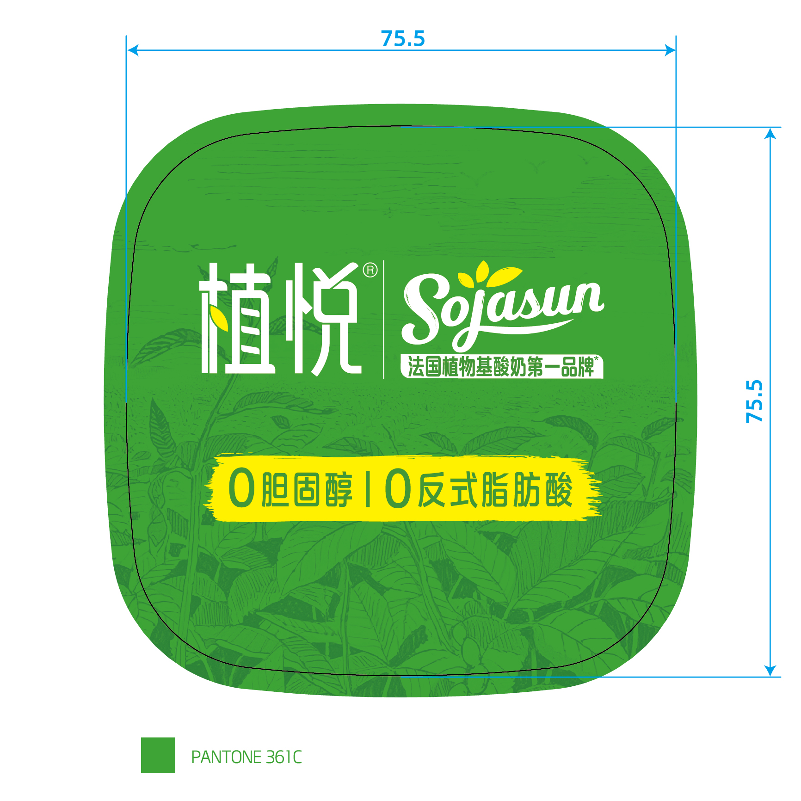
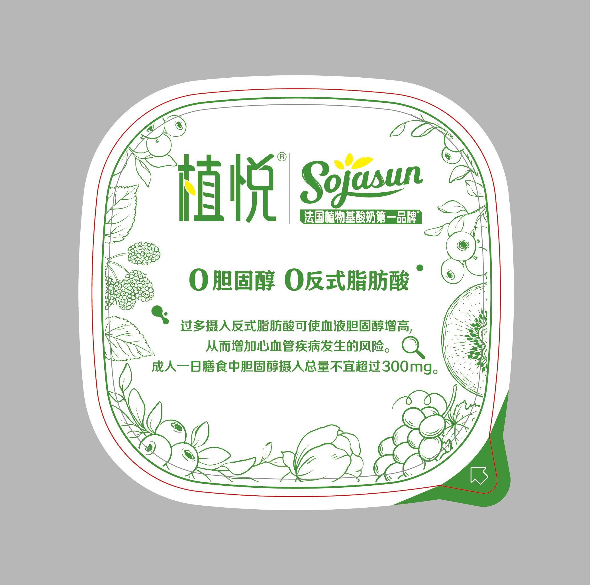

---
hide:
  - navigation
---

# 9 JPGs in English

## 2-Pack–Blueberry.jpg

Magnification: 0.8, bar height at least 1/3 taller than width  
Barcode color: C:0 M:0 Y:0 K:100  
Color scheme: Black and white

### Double Zero Choice · 0 Cholesterol · 0 Trans Fat

Excessive intake of trans fats can increase blood cholesterol levels, thereby raising the risk of cardiovascular diseases. The total daily dietary cholesterol intake for adults should not exceed 300mg.

### Rich in Dietary Fiber

Dietary fiber is a low-calorie substance that helps maintain normal bowel function.

Ingredients: Soy milk (water, soybeans), blueberry–mulberry–water chestnut popping pearl jam, white sugar, polydextrose, hydroxypropyl distarch phosphate, calcium, citrus fiber, Streptococcus thermophilus, Lactobacillus delbrueckii subsp. bulgaricus, Bifidobacterium animalis subsp. lactis, Lactobacillus acidophilus.

Allergens: Contains soy. This production line also processes milk and dairy products.

- Blueberry–mulberry jam content ≥16%  
- Water chestnut popping pearls in blueberry–mulberry–water chestnut jam ≥19%  
- Mulberry content ≥3%  
- Concentrated blueberry juice in jam ≥18%  

Live probiotics: ≥1×10⁸ CFU/100g  

Dietary fiber nutrition claim (per 420kJ)

### Nutrition Facts

| Nutrient                 | Per 100g    | % Daily Value |
| ------------------------ | ----------- | ------------- |
| Energy                   | 335 kJ      | 4%            |
| Protein                  | 3.5 g       | 6%            |
| Fat                      | 2.2 g       | 4%            |
| Saturated Fat            | 0.6 g       | 3%            |
| Trans Fat                | 0 g         | -             |
| Mono & Polyunsaturated Fat | 0.8 g     | -             |
| Cholesterol              | 0 mg        | 0%            |
| Carbohydrates            | 10.0 g      | 3%            |
| Dietary Fiber (as polydextrose) | 3.0 g | 12%           |
| Sodium                   | 20 mg       | 1%            |
| Calcium                  | 100 mg      | 13%           |

Manufacturer: Junlebao Dairy Group Co., Ltd.  
Address: 68 Shitong Road, Luquan District, Shijiazhuang, Hebei Province  
Processor: Zhengyang Junlebao Dairy Co., Ltd.  
Address/Origin: 68 Junlebao Avenue, Zhenyang Town, Zhengyang County, Zhumadian, Henan Province (D)  
Food Production License: SC10541172400044  
Product Type: Fermented and prepared soy milk  
Product Standard Code: Q/JLB0064S  
Storage & Transport Conditions: 36°F–50°F  
Shelf Life: 25 days  
Production Date: See cup  
Inspection Certificate Number: Same as production date and preceding characters (including origin)

### Tips

To maintain product quality, store at 36°F–50°F. Slight separation of soy milk or minor clumping is normal and does not affect consumption. Do not consume if there is an unusual smell or damaged packaging.

For feedback, call our customer service hotline: 4006128138

\*Source: France Circana SCS, census and retail sample data of the French plant-based refrigerated dairy market, market share by brand, sales value, and volume from June 30, 2024, to June 29, 2025.

\*Refers to fermented and prepared soy milk.

Product Qualification Seal

### ZHIYUE | Sojasun

France’s #1 Plant-Based Yogurt Brand

Soy Milk Yogurt  

Blueberry–Mulberry–Water Chestnut Popping Pearls  

Illustrations for reference only.

ZHIYUE | Sojasun  
France’s #1 Plant-Based Yogurt Brand

Soy Milk Yogurt

0 Cholesterol  
0 Trans Fat  
Rich in Dietary Fiber  

Blueberry–Mulberry–Water Chestnut Popping Pearls

Fermented Prepared Soy Milk (with live probiotics)

Net Weight/Specification: 270g (135g × 2)

## 2-Pack–GreenGrape.jpg

Magnification: 0.8, bar height at least 1/3 taller than width  
Barcode color: C:0 M:0 Y:0 K:100  
Color scheme: Black and white  

### Double Zero Choice · 0 Cholesterol · 0 Trans Fat

Excessive intake of trans fats can raise blood cholesterol levels, increasing the risk of cardiovascular diseases. Adults should not consume more than 300mg of dietary cholesterol per day.

### Rich in Dietary Fiber

Dietary fiber is a low-calorie substance that helps maintain normal bowel function.

Ingredients: Soy milk (water, soybeans), green grape–jasmine–water chestnut–kiwi jam, white sugar, polydextrose, hydroxypropyl distarch phosphate, calcium, citrus fiber, Streptococcus thermophilus, Lactobacillus delbrueckii subsp. bulgaricus, Bifidobacterium animalis subsp. lactis, Lactobacillus acidophilus.

Allergens: Contains soy. This production line also processes milk and dairy products.

Green grape–jasmine–water chestnut–kiwi jam content ≥16%  

- Water chestnut in jam ≥400g/kg  
- Green grape ≥1g/kg  
- Jasmine flower infusion ≥0.1g/kg  

Live probiotics: ≥1×10⁸ CFU/100g  

Dietary fiber nutrition claim (per 420kJ)

### Nutrition Facts

| Nutrient                 | Per 100g    | % Daily Value |
| ------------------------ | ----------- | ------------- |
| Energy                   | 369 kJ      | 4%            |
| Protein                  | 3.5 g       | 6%            |
| Fat                      | 2.2 g       | 4%            |
| Saturated Fat            | 0.6 g       | 3%            |
| Trans Fat                | 0 g         | -             |
| Mono & Polyunsaturated Fat | 0.8 g     | -             |
| Cholesterol              | 0 mg        | 0%            |
| Carbohydrates            | 12.0 g      | 4%            |
| Dietary Fiber (as polydextrose) | 3.0 g | 12%           |
| Sodium                   | 20 mg       | 1%            |
| Calcium                  | 100 mg      | 13%           |

Manufacturer: Junlebao Dairy Group Co., Ltd.  
Address: 68 Shitong Road, Luquan District, Shijiazhuang, Hebei Province  
Processor: Zhengyang Junlebao Dairy Co., Ltd.  
Address/Origin: 68 Junlebao Avenue, Zhenyang Town, Zhengyang County, Zhumadian, Henan Province (D)  
Food Production License: SC10541172400044  
Product Type: Fermented and prepared soy milk  
Product Standard Code: Q/JLB0064S  
Storage & Transport Conditions: 36°F–50°F  
Shelf Life: 25 days  
Production Date: See cup  
Inspection Certificate Number: Same as production date and preceding characters (including origin)

### Tips

To maintain product quality, store at 36°F–50°F. Slight separation of soy milk or minor clumping is normal and does not affect consumption. Do not consume if there is an unusual smell or damaged packaging.

For feedback, call our customer service hotline: 4006128138

\*Source: France Circana SCS, census and retail sample data of the French plant-based refrigerated dairy market, market share by brand, sales value, and volume from June 30, 2024, to June 29, 2025.

\*Refers to fermented and prepared soy milk.

Product Qualification Seal

### ZHIYUE | Sojasun

France’s #1 Plant-Based Yogurt Brand

Soy Milk Yogurt  
Green Grape–Jasmine–Water Chestnut–Kiwi  

Illustrations for reference only.

ZHIYUE | Sojasun  
France’s #1 Plant-Based Yogurt Brand

Soy Milk Yogurt

- 0 Cholesterol  
- 0 Trans Fat  
- Rich in Dietary Fiber  

Green Grape–Jasmine–Water Chestnut–Kiwi

Net Weight/Specification: 270g (135g × 2)

Fermented Prepared Soy Milk (with live probiotics)

## 3-Pack–Blueberry.jpg

Magnification: 0.8, bar height at least 1/3 taller than width  
Barcode color: C:0 M:0 Y:0 K:100  
Color scheme: Black and white

### ZHIYUE | Sojasun

France’s #1 Plant-Based Yogurt Brand

Soy Milk Yogurt

- 0 Cholesterol  
- 0 Trans Fat  
- Rich in Dietary Fiber  

Net Weight/Specification: 270g (135g × 2)  

Blueberry–Mulberry–Water Chestnut Popping Pearls

Fermented Prepared Soy Milk (with live probiotics)

### Double Zero Choice · 0 Cholesterol · 0 Trans Fat

Excessive intake of trans fats can increase blood cholesterol levels, raising the risk of cardiovascular diseases. Adults should not consume more than 300mg of dietary cholesterol per day.

### Rich in Dietary Fiber

Dietary fiber is a low-calorie substance that helps maintain normal bowel function.

\*Source: France Circana SCS, census and retail sample data of the French plant-based refrigerated dairy market, market share by brand, sales value, and volume from June 30, 2024, to June 29, 2025.

\*Refers to fermented and prepared soy milk.

### Nutrition Facts

| Nutrient                 | Per 100g    | % Daily Value |
| ------------------------ | ----------- | ------------- |
| Energy                   | 335 kJ      | 4%            |
| Protein                  | 3.5 g       | 6%            |
| Fat                      | 2.2 g       | 4%            |
| Saturated Fat            | 0.6 g       | 3%            |
| Trans Fat                | 0 g         | -             |
| Mono & Polyunsaturated Fat | 0.8 g     | -             |
| Cholesterol              | 0 mg        | 0%            |
| Carbohydrates            | 10.0 g      | 3%            |
| Dietary Fiber (as polydextrose) | 3.0 g | 12%           |
| Sodium                   | 20 mg       | 1%            |
| Calcium                  | 100 mg      | 13%           |

Ingredients: Soy milk (water, soybeans), blueberry–mulberry–water chestnut popping pearl jam, white sugar, polydextrose, hydroxypropyl distarch phosphate, calcium, citrus fiber, Streptococcus thermophilus, Lactobacillus delbrueckii subsp. bulgaricus, Bifidobacterium animalis subsp. lactis, Lactobacillus acidophilus.

Allergens: Contains soy. This production line also processes milk and dairy products.

- Blueberry–mulberry jam content ≥16%  
- Water chestnut popping pearls in jam ≥19%  
- Mulberry content ≥3%  
- Concentrated blueberry juice in jam ≥18%  

Live probiotics: ≥1×10⁸ CFU/100g  

Dietary fiber nutrition claim (per 420kJ)

Manufacturer: Junlebao Dairy Group Co., Ltd.  
Address: 68 Shitong Road, Luquan District, Shijiazhuang, Hebei Province  
Processor: Zhengyang Junlebao Dairy Co., Ltd.  
Address/Origin: 68 Junlebao Avenue, Zhenyang Town, Zhengyang County, Zhumadian, Henan Province (D)  
Food Production License: SC10541172400044  
Product Type: Fermented and prepared soy milk  
Product Standard Code: Q/JLB0064S  
Storage & Transport Conditions: 36°F–50°F  
Shelf Life: 25 days  
Production Date: See cup  
Inspection Certificate Number: Same as production date and preceding characters (including origin)

### Tips

To maintain product quality, store at 36°F–50°F. Slight separation of soy milk or minor clumping is normal and does not affect consumption. Do not consume if there is an unusual smell or damaged packaging.

For feedback, call our customer service hotline: 4006128138

Product Qualification Seal

### ZHIYUE | Sojasun

France’s #1 Plant-Based Yogurt Brand

Soy Milk Yogurt

- 0 Cholesterol  
- 0 Trans Fat  
- Rich in Dietary Fiber  

Net Weight/Specification: 270g (135g × 2)  

Blueberry–Mulberry–Water Chestnut Popping Pearls

Fermented Prepared Soy Milk (with live probiotics)

## 3-Pack–GreenGrape.jpg

Magnification: 0.8, bar height at least 1/3 taller than width  
Barcode color: C:0 M:0 Y:0 K:100  
Color scheme: Black and white  

### ZHIYUE | Sojasun

France’s #1 Plant-Based Yogurt Brand

Soy Milk Yogurt

- 0 Cholesterol  
- 0 Trans Fat  
- Rich in Dietary Fiber  

Net Weight/Specification: 270g (135g × 2)  

Green Grape–Jasmine–Water Chestnut

Fermented Prepared Soy Milk (with live probiotics)

### Double Zero Choice · 0 Cholesterol · 0 Trans Fat

Excessive intake of trans fats can raise blood cholesterol levels, increasing the risk of cardiovascular diseases. Adults should not consume more than 300mg of dietary cholesterol per day.

### Rich in Dietary Fiber

Dietary fiber is a low-calorie substance that helps maintain normal bowel function.

\*Source: France Circana SCS, census and retail sample data of the French plant-based refrigerated dairy market, market share by brand, sales value, and volume from June 30, 2024, to June 29, 2025.

\*Refers to fermented and prepared soy milk.

### Nutrition Facts

| Nutrient                 | Per 100g    | % Daily Value |
| ------------------------ | ----------- | ------------- |
| Energy                   | 369 kJ      | 4%            |
| Protein                  | 3.5 g       | 6%            |
| Fat                      | 2.2 g       | 4%            |
| Saturated Fat            | 0.6 g       | 3%            |
| Trans Fat                | 0 g         | -             |
| Mono & Polyunsaturated Fat | 0.8 g     | -             |
| Cholesterol              | 0 mg        | 0%            |
| Carbohydrates            | 12.0 g      | 4%            |
| Dietary Fiber (as polydextrose) | 3.0 g | 12%           |
| Sodium                   | 20 mg       | 1%            |
| Calcium                  | 100 mg      | 13%           |

Ingredients: Soy milk (water, soybeans), green grape–jasmine–water chestnut–kiwi jam, white sugar, polydextrose, hydroxypropyl distarch phosphate, calcium, citrus fiber, Streptococcus thermophilus, Lactobacillus delbrueckii subsp. bulgaricus, Bifidobacterium animalis subsp. lactis, Lactobacillus acidophilus.

Allergens: Contains soy. This production line also processes milk and dairy products.

Green grape–jasmine–water chestnut–kiwi jam content ≥16%  

- Water chestnut in jam ≥400g/kg  
- Green grape ≥1g/kg  
- Jasmine flower ≥0.1g/kg  

Live probiotics: ≥1×10⁸ CFU/100g  

Dietary fiber nutrition claim (per 420kJ)

Manufacturer: Junlebao Dairy Group Co., Ltd.  
Address: 68 Shitong Road, Luquan District, Shijiazhuang, Hebei Province  
Processor: Zhengyang Junlebao Dairy Co., Ltd.  
Address/Origin: 68 Junlebao Avenue, Zhenyang Town, Zhengyang County, Zhumadian, Henan Province (D)  
Food Production License: SC10541172400044  
Product Type: Fermented and prepared soy milk  
Product Standard Code: Q/JLB0064S  
Storage & Transport Conditions: 36°F–50°F  
Shelf Life: 25 days  
Production Date: See cup  
Inspection Certificate Number: Same as production date and preceding characters (including origin)

### Tips

To maintain product quality, store at 36°F–50°F. Slight separation of soy milk or minor clumping is normal and does not affect consumption. Do not consume if there is an unusual smell or damaged packaging.

For feedback, call our customer service hotline: 4006128138

Product Qualification Seal

### ZHIYUE | Sojasun

France’s #1 Plant-Based Yogurt Brand

Soy Milk Yogurt

- 0 Cholesterol  
- 0 Trans Fat  
- Rich in Dietary Fiber  

Net Weight/Specification: 270g (135g × 2)  

Green Grape–Jasmine–Water Chestnut

Fermented Prepared Soy Milk (with live probiotics)

## BlueberryYogurt.jpg

Magnification: 0.8, bar height at least 1/3 taller than width  
Barcode color: C:0 M:0 Y:0 K:100  
Color scheme: Black and white  

Ingredients: Soy milk (water, soybeans), blueberry–mulberry–water chestnut popping pearl jam, white sugar, polydextrose, hydroxypropyl distarch phosphate, calcium, citrus fiber, Streptococcus thermophilus, Lactobacillus delbrueckii subsp. bulgaricus, Bifidobacterium animalis subsp. lactis, Lactobacillus acidophilus.

### Double Zero Choice · 0 Cholesterol · 0 Trans Fat

Excessive intake of trans fats can raise blood cholesterol levels, increasing the risk of cardiovascular diseases. Adults should not consume more than 300mg of dietary cholesterol per day.

### Rich in Dietary Fiber

Dietary fiber is a low-calorie substance that helps maintain normal bowel function.

### Nutrition Facts

| Nutrient                 | Per 100g    | % Daily Value |
| ------------------------ | ----------- | ------------- |
| Energy                   | 335 kJ      | 4%            |
| Protein                  | 3.5 g       | 6%            |
| Fat                      | 2.2 g       | 4%            |
| Saturated Fat            | 0.6 g       | 3%            |
| Trans Fat                | 0 g         | -             |
| Mono & Polyunsaturated Fat | 0.8 g     | -             |
| Cholesterol              | 0 mg        | 0%            |
| Carbohydrates            | 10.0 g      | 3%            |
| Dietary Fiber (as polydextrose) | 3.0 g | 12%           |
| Sodium                   | 20 mg       | 1%            |
| Calcium                  | 100 mg      | 13%           |

- Blueberry–mulberry jam content ≥16%  
- Water chestnut popping pearls in jam ≥19%  
- Mulberry content ≥3%  
- Concentrated blueberry juice in jam ≥18%  

Live probiotics: ≥1×10⁸ CFU/100g  

Dietary fiber nutrition claim (per 420kJ)

### ZHIYUE

Soy Milk Yogurt

0 Cholesterol  
0 Trans Fat  
Rich in Dietary Fiber  

Fermented Prepared Soy Milk (with live probiotics)

Net Weight: 135g  

Blueberry–Mulberry–Water Chestnut Popping Pearls

Illustrations for reference only.

### ZHIYUE & Sojasun

Best-selling in France for 37 years, soy milk yogurt has been crafted by the Olga Group since 1951, adhering to the mission: “Deliver nutrition from healthy fields to the table.” With three generations of artisanal expertise, Sojasun has become France’s #1 plant-based yogurt brand. Now, the ZHIYUE brand combines 70 years of Olga’s craftsmanship and core formulas to bring this French health wisdom to China, creating ZHIYUE Soy Milk Yogurt and writing a new chapter in healthy plant-based nutrition.

Manufacturer: Junlebao Dairy Group Co., Ltd.  
Address: 68 Shitong Road, Luquan District, Shijiazhuang, Hebei Province  
Processor: Zhengyang Junlebao Dairy Co., Ltd.  
Address/Origin: 68 Junlebao Avenue, Zhenyang Town, Zhengyang County, Zhumadian, Henan Province (D)  
Food Production License: SC10541172400044  
Product Type: Fermented and prepared soy milk  
Product Standard Code: Q/JLB0064S  
Storage & Transport Conditions: 36°F–50°F  
Shelf Life: 25 days  
Production Date: See cup  
Inspection Certificate Number: Same as production date and preceding characters (including origin)

### Tips

To maintain product quality, store at 36°F–50°F. Slight separation of soy milk or minor clumping is normal and does not affect consumption. Do not consume if there is an unusual smell or damaged packaging.

For feedback, call our customer service hotline: 4006128138

\*Source: France Circana SCS, census and retail sample data of the French plant-based refrigerated dairy market, market share by brand, sales value, and volume from June 30, 2024, to June 29, 2025.

\*Refers to fermented and prepared soy milk

## GreenGrapeJasmine.jpg

Magnification: 0.8, bar height at least 1/3 taller than width  
Barcode color: C:0 M:0 Y:0 K:100  
Color scheme: Black and white  

Ingredients: Soy milk (water, soybeans), green grape–jasmine–water chestnut–kiwi jam, white sugar, polydextrose, citrus fiber, Streptococcus thermophilus, Lactobacillus delbrueckii subsp. bulgaricus, Bifidobacterium animalis subsp. lactis, Lactobacillus acidophilus.

### Double Zero Choice · 0 Cholesterol · 0 Trans Fat

Excessive intake of trans fats can raise blood cholesterol levels, increasing the risk of cardiovascular diseases. Adults should not consume more than 300mg of dietary cholesterol per day.

### Rich in Dietary Fiber

Dietary fiber is a low-calorie substance that helps maintain normal bowel function.

### Nutrition Facts

| Nutrient                 | Per 100g    | % Daily Value |
| ------------------------ | ----------- | ------------- |
| Energy                   | 369 kJ      | 4%            |
| Protein                  | 3.5 g       | 6%            |
| Fat                      | 2.2 g       | 4%            |
| Saturated Fat            | 0.6 g       | 3%            |
| Trans Fat                | 0 g         | -             |
| Mono & Polyunsaturated Fat | 0.8 g     | -             |
| Cholesterol              | 0 mg        | 0%            |
| Carbohydrates            | 12.0 g      | 4%            |
| Dietary Fiber (as polydextrose) | 3.0 g | 12%           |
| Sodium                   | 20 mg       | 1%            |
| Calcium                  | 100 mg      | 13%           |

Green grape–jasmine–water chestnut–kiwi jam content ≥16%  

- Water chestnut in jam ≥400 g/kg  
- Green grape ≥1 g/kg  
- Jasmine flower ≥0.1 g/kg  

Live probiotics: ≥1×10⁸ CFU/100g  

Dietary fiber nutrition claim (per 420kJ)

### ZHIYUE

Soy Milk Yogurt

- 0 Cholesterol  
- 0 Trans Fat  
- Rich in Dietary Fiber  

Fermented Prepared Soy Milk (with live probiotics)

Net Weight: 135g  

Green Grape–Jasmine–Water Chestnut  

Illustrations for reference only.

### ZHIYUE & Sojasun

Soy milk yogurt has been best-selling in France for 37 years. Since 1951, the Olga Group has upheld the mission: “Deliver nutrition from healthy fields to the table.” With three generations of artisanal craftsmanship, Sojasun became France’s #1 plant-based yogurt brand. Now, the ZHIYUE brand combines 70 years of Olga’s expertise and core formulas to bring this French health wisdom to China, creating ZHIYUE Soy Milk Yogurt and a new chapter in healthy plant-based nutrition.

Manufacturer: Junlebao Dairy Group Co., Ltd.  
Address: 68 Shitong Road, Luquan District, Shijiazhuang, Hebei Province  
Processor: Zhengyang Junlebao Dairy Co., Ltd.  
Address/Origin: 68 Junlebao Avenue, Zhenyang Town, Zhengyang County, Zhumadian, Henan Province (D)  
Food Production License: SC10541172400044  
Product Type: Fermented and prepared soy milk  
Product Standard Code: Q/JLB0064S  
Storage & Transport Conditions: 36°F–50°F  
Shelf Life: 25 days  
Production Date: See cup  
Inspection Certificate Number: Same as production date and preceding characters (including origin)

### Tips

To maintain product quality, store at 36°F–50°F. Slight separation of soy milk or minor clumping is normal and does not affect consumption. Do not consume if there is an unusual smell or damaged packaging.

For feedback, call our customer service hotline: 4006128138

\*Source: France Circana SCS, census and retail sample data of the French plant-based refrigerated dairy market, market share by brand, sales value, and volume from June 30, 2024, to June 29, 2025.

\*Refers to fermented and prepared soy milk

## ZHIYUE–CupLid.jpg

ZHIYUE | Sojasun
France’s #1 Plant-Based Yogurt Brand  

0 Cholesterol  
0 Trans Fat  

## ZHIYUE–TearFilm1.jpg

ZHIYUE | Sojasun
France’s #1 Plant-Based Yogurt Brand  

0 Cholesterol  
0 Trans Fat  

Excessive intake of trans fats can raise blood cholesterol levels, increasing the risk of cardiovascular diseases. Adults should not consume more than 300mg of dietary cholesterol per day.

## ZHIYUE–TearFilm2.jpg

ZHIYUE | Sojasun
France’s #1 Plant-Based Yogurt Brand  

Rich in Dietary Fiber  

Dietary fiber is a low-calorie substance that helps maintain normal bowel function.
