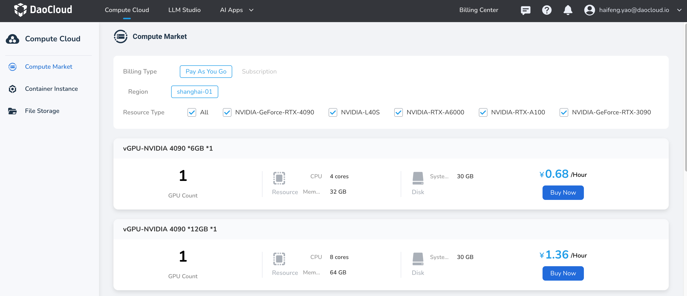

---
hide:
  - toc
---

# Register Account

!!! tip

    d.run = DaoCloud Runs Intelligence
    [Register and Try d.run](https://console.d.run/){ .md-button }
    
    d.run is a comprehensive AIGC computing operation and management platform developed by DaoCloud,
    integrating cloud native capabilities and building an intelligent Q&A system,
    transforming your computing resources into benefits.

d.run supports account registration via mobile phone and email.

1. Click **Register** on the login window.
1. Fill in the username, email, mobile number, receive and fill in the verification code,
   then check the box:
   
    ☑️ **I have read and agree to the d.run Service Agreement.**

    !!! tip
    
        Each email can only register once.
        If you are prompted that the email is already registered, you can return to the login page,
        click **Forgot Password** , and enter your registered email to reset the password.

1. click **Register**. After successful registration, you will return to the login page, enter your username or email, and log in to your account.

You can now start purchasing computing resource.

Next step: [Compute Market](./zestu/index.md)
