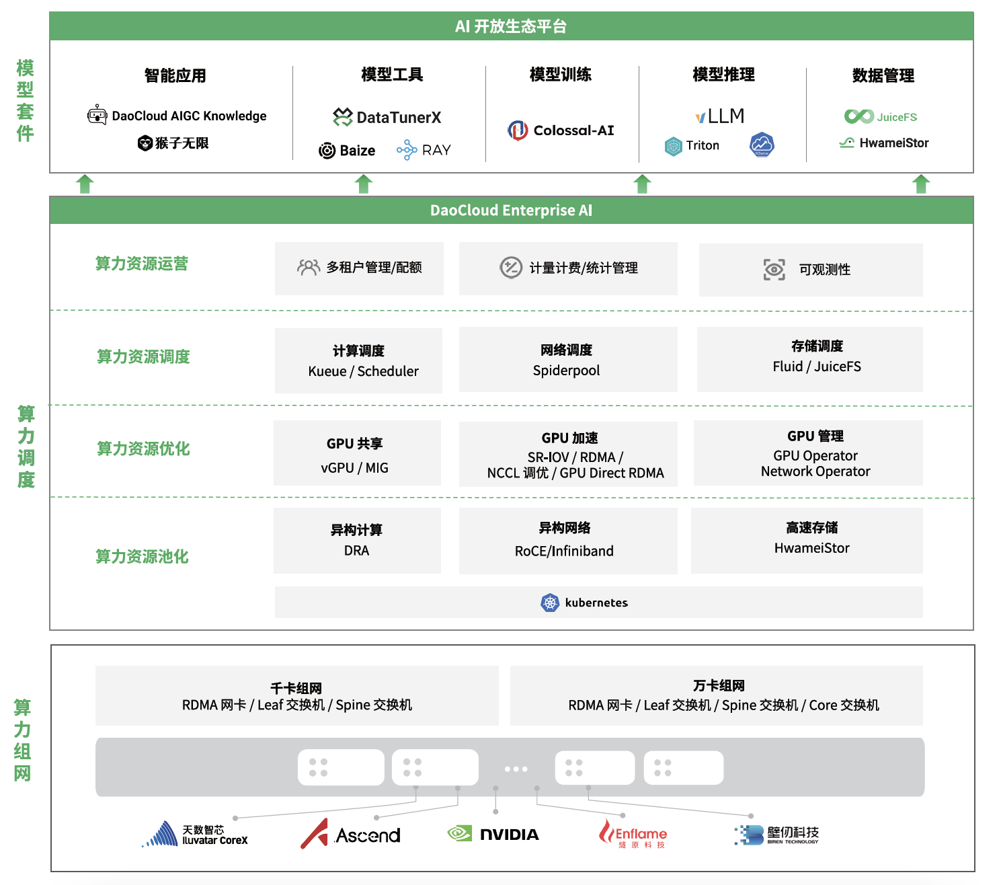
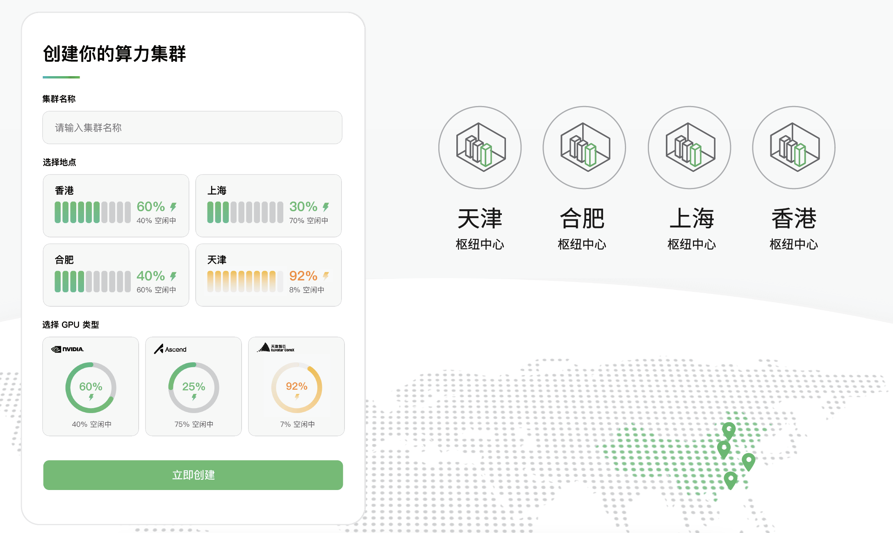
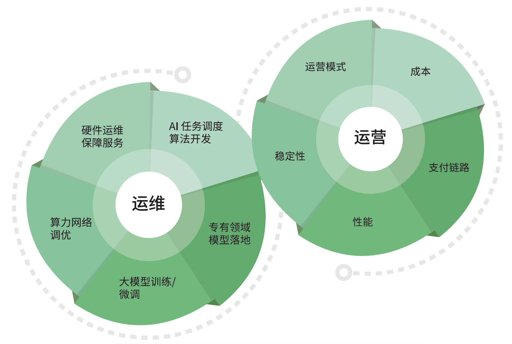

---
hide:
  - toc
---

# d.run Makes Computing Free

!!! tip

    d.run = DaoCloud Runs Intelligence
    [Register and Experience d.run](https://console.d.run/){ .md-button }
    [View and Download PDF](https://harbor-test2.cn-sh2.ufileos.com/drun/d.run-0625.pdf){ .md-button }
    
    d.run is a comprehensive computing platform developed by DaoCloud,
    integrating cloud-native capabilities to build an intelligent Q&A system, turning computing into "computational benefits."

    - AI Lab: After [purchasing computing](buy/buy.md), set up a [computing cluster](./kpanda/intro/index.md) and monitor the cluster status through the [Insight](./insight/intro/index.md) module.
    - Model Services: Build [intelligent Q&A](./dak/index.md) through [workflow orchestration](./monkey/index.md) to solve practical problems.
    - Model Tools: After [AI Lab](./baize/index.md), [fine-tune models](./dtx/index.md) for one-stop management of popular large models in the [model center](./dmc/index.md).
    - Management: Responsible for user access control, permission management, audit logs, and personalized settings for d.run.

  
d.run Product Overview

  
Computing Cloud

  
d.run has established computing hub centers in Shanghai, Hefei, Tianjin, Hong Kong, and other locations, achieving the free flow of computing resources across industries, regions, and levels. By building an AI open ecological platform and integrating rich model suites, it comprehensively promotes the collaborative innovation of intelligent computing and applications.

  
Multi-Region Computing Centers, Select as Needed

-   :fontawesome-brands-battle-net:{ .lg .middle } __Powerful Computing Network__

    ---

    Supports high-speed interconnections at thousands and tens of thousands of cards, creating optimal network utilization for large-scale GPU clusters, ensuring stable, high-speed, and reliable supply of computing resources.

-   :material-arrange-send-to-back:{ .lg .middle } __Flexible Resource Scheduling__

    ---

    Provides flexible computing, network, and storage resource scheduling solutions, effectively improving resource utilization, using computing resources on demand, and significantly reducing computing costs.

-   :simple-themodelsresource:{ .lg .middle } __Feature-Rich Model Suites__

    ---

    Offers various convenient, practical, and high-performance model suites through the AI ecological open platform, supporting model development and training, accelerating the implementation and innovation of AI applications.

  
AI Open Ecological Platform, Accelerating AI Innovative Applications

-   :fontawesome-brands-dev:{ .lg .middle } __For AI Developers__

    ---

    One-stop service for the entire algorithm development process

-   :fontawesome-solid-users:{ .lg .middle } __For AI Users__

    ---

    Lightweight, flexible interaction, easy to use, user-friendly

  
Comprehensive Computing Operation and Management

[Register and Try d.run](https://console.d.run/){ .md-button .md-button--primary }
