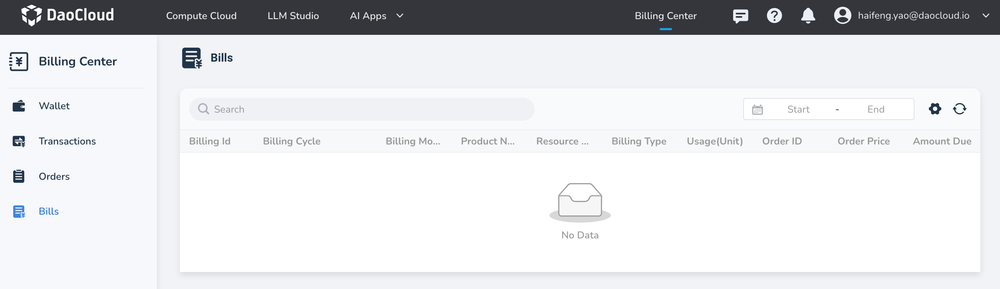

---
hide:
  - toc
---

# Bill Management

The **Detailed Bill** records the user's consumption of purchased products in detail, including the usage of each resource and the specific costs.

## Steps

Enter the **Bills** page to view the **Bill Details** currently on d.run.

- Click the search box to select filtering criteria, supporting search or filtering by bill ID, order ID, resource ID, product name, and billing type.
- Click the date picker to query detailed bills within a specific time range.

{width=900px}

## Explanation of Fields in the Bill List

| Display Field | Description |
| --- | --- |
| Bill ID | A unique identifier for each bill record. |
| Billing Cycle | Indicates the time range for this bill's settlement. |
| Billing Month | Indicates the month range to which the bill belongs. |
| Product Name | The name of the product involved in the bill. |
| Resource Name/ID | The name or unique identifier of the specific resource related to the consumption. |
| Billing Type | The billing model for the resource, such as annual/monthly subscription or pay-as-you-go. |
| Usage | The actual usage of the resource, displayed in the unit of resource usage, such as hours, GB, etc. |
| Order ID | The order ID associated with this bill, facilitating tracing back to the specific source of consumption. |
| Order Price | The cost of the resource before any discounts or promotions are applied. |
| Amount Due | The actual cash portion paid by the user, the amount payable after discounts. |
