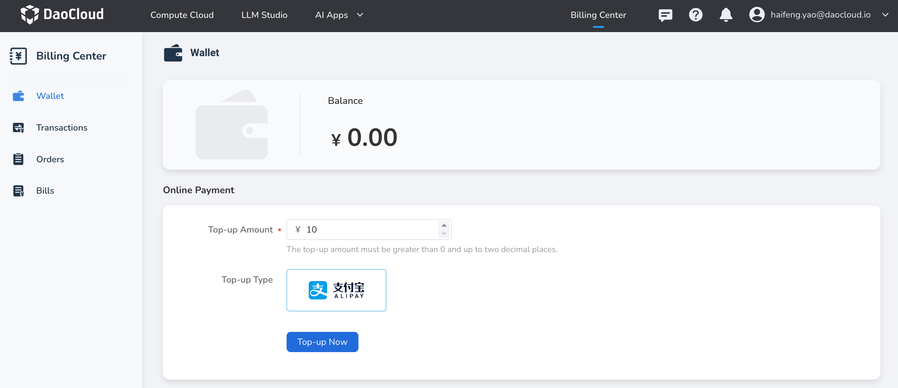

---
hide:
  - toc
---

# Wallet

The expense center serves as a one-stop financial platform, providing functions such as top-up, expense viewing, bill and voucher details. Users can monitor the consumption of various resources in real-time, clearly understand bill details, usage, and payment status, helping enterprises optimize resource allocation, control costs, and improve financial transparency.

You can top-up your account online in the **Wallet** , and the top-up amount can be used to purchase various products on the platform.

!!! note

    1. The top-up amount can only be invoiced after consumption.
    2. If you need an invoice, please contact customer service on the official website.

## Steps

1. Go to **Wallet**, enter the top-up amount. The amount must be greater than 0 and can have a maximum of two decimal places. Then select the payment method.

2. Click the **Top-up Now** button to be redirected to a third-party payment channel to complete the payment.

    {width=900px}

3. After the top-up is completed, check the total balance of your account in **Balance** ,
   and you can view the top-up records in **Transactions**.

[Register and Try d.run](https://console.d.run/){ .md-button .md-button--primary }
