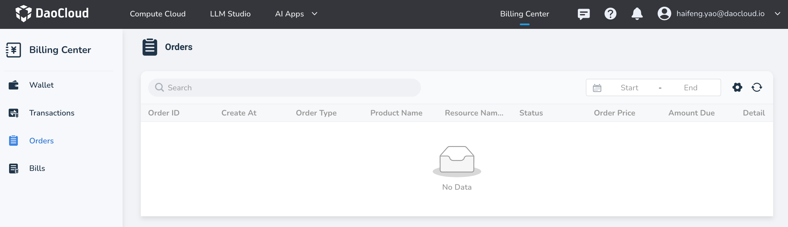
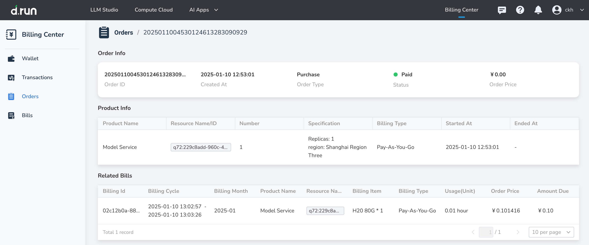

---
hide:
  - toc
---

# Orders

**Orders** allows users to view records generated when purchasing or using resources on the platform, including detailed information about the products purchased, resource information, resource specifications, amounts, and more.

## Steps

1. In the **Orders**, you can view detailed records of the user's purchases or resource operations.

    Filtering: Click on the search box to select filtering criteria, supporting search or filtering by order ID, resource ID, type, product name, and status.

    {width=900px}

    !!! note

        Pay-as-you-go resources are billed in real-time based on actual usage, rather than having a specific amount determined at the time the order is generated.
        Therefore, the **Order Price** and **Amount Due** for orders generated from pay-as-you-go resources will both be 0.

2. Click the icon in the action column to view detailed specification information and billing type for the resources purchased or operated in the order, as well as the billing information generated from the resource consumption.

    <!-- {width=900px} -->

## Explanation of Fields

| **Display Field Name** | **Description** |
| --- | --- |
| Order ID | A unique identifier for each order, used to query or manage order records. |
| Create Time | The time point when the order was generated, indicating the specific time of purchase or operation. |
| Order Type | The category of the order, such as new purchase, renewal, upgrade, or downgrade. |
| Product Name | The name of the product involved in the order, such as container instances, model services, etc. |
| Resource Name/ID | The specific resource identifier associated with the order, such as container instance name or unique resource ID. |
| Status | The current processing progress or result status of the order, such as paid, refunded, or canceled. |
| Order Price | The total amount of the order, indicating the cost before any discounts or promotions are applied. |
| Amount Due | The actual amount the user needs to pay. |
