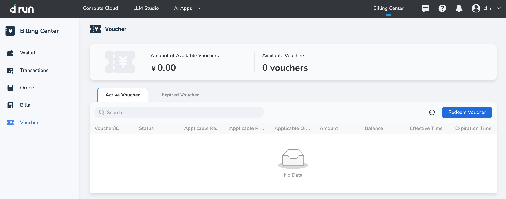
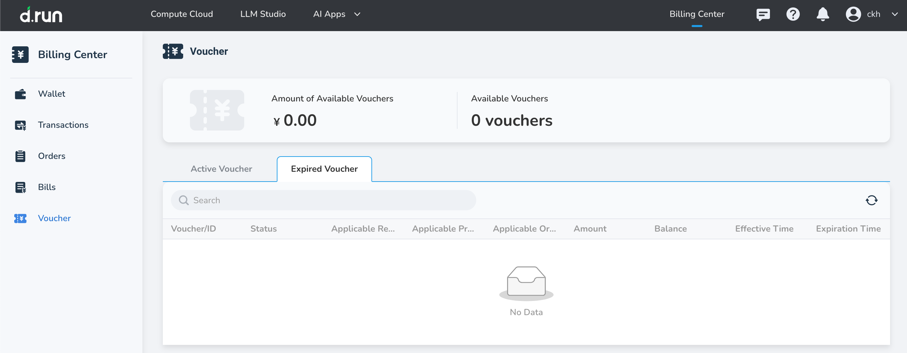
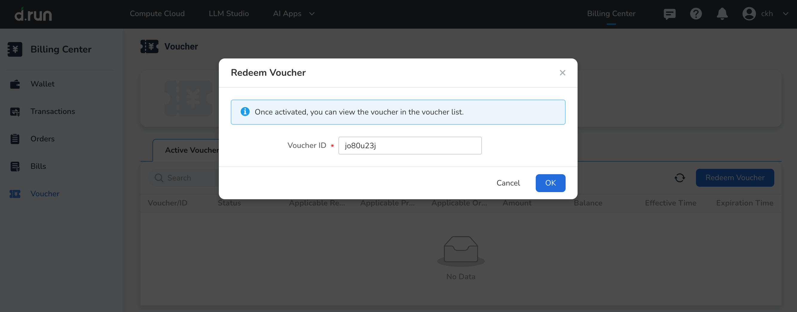

---
hide:
  - toc
---

# Vouchers

Vouchers can be used as a substitute for cash. They can be activated using a redemption code and applied to offset eligible spending under specified conditions.

## Steps

1. In the **Active Voucher** , you can view all voucher details associated with your logged-in account, including usage restrictions, denomination, and validity period.

    

2. Click **Expired Voucher** to view records of vouchers that have either passed their validity period or have been fully used.

    

### Redeem a Voucher Using a Redemption Code

After logging in, go to the **Vouchers** page and click the **Redeem Voucher** button. In the popup window, enter your redemption code and submit it. The system will verify the code and, if valid, automatically issue the voucher to your account.

## Usage Rules

1. Voucher statuses include: Active, Expired, and Used Up.

   - **Active** : The voucher is within its validity period and has a remaining balance.
   - **Expired** : The voucher has passed its validity period but still has a remaining balance.
   - **Used Up** : The voucher was fully used during its validity period.

2. For pay-as-you-go products, the deduction order after order confirmation is: vouchers first, then cash.
3. For pay-as-you-go products, eligible vouchers will be automatically applied to offset charges at each billing cycle until the voucher expires or its balance is depleted.
