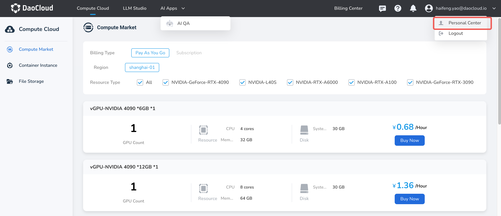
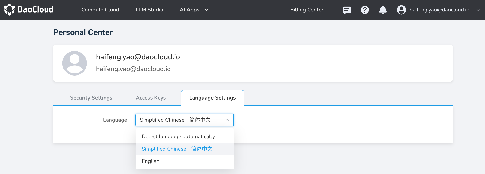

---
hide:
  - toc
---

# Language Settings

This section explains how to set the interface language. Currently, it supports Chinese and English.

Language settings serve as the entry point for the platform's multilingual services, with Chinese displayed by default. Users can choose English or switch the platform language based on automatic detection of their browser language preferences as needed. Each user's multilingual service is independent, and switching will not affect other users.

The platform provides three options for switching languages: Chinese, English, and automatic detection of your browser's language preferences.

The steps to operate are as follows:

1. Log in to d.run using your username/password, got to __Personal Center__ from the top right corner.

    

1. Click the __Language Settings__ tab.

    

1. Switch the language options.
