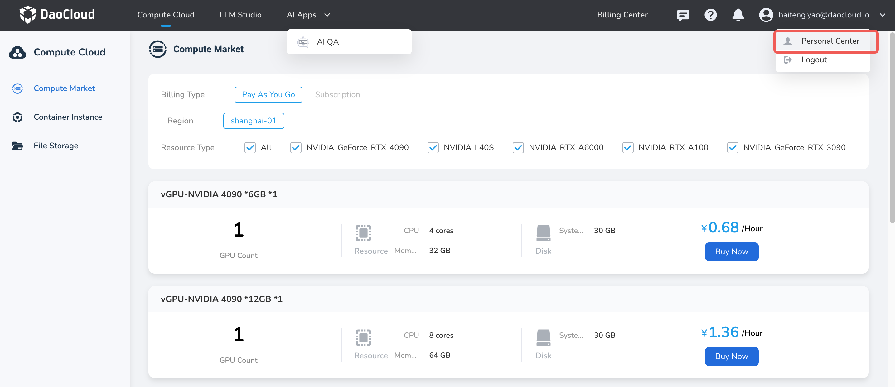
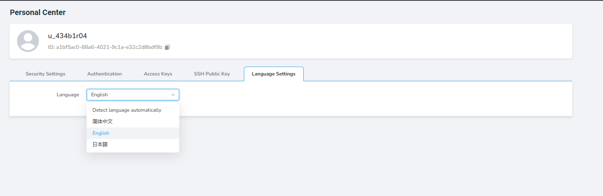

---
hide:
  - toc
---

# Language Settings

This section explains how to set the interface language. Currently, it supports Simplified Chinese, English, and Japanese.

Language settings serve as the entry point for the platform's multilingual services, with Simplified Chinese displayed by default. Users can choose another language or switch the platform language based on automatic detection of their browser language preferences as needed. Each user's multilingual service is independent, and switching will not affect other users.

The platform provides four language options: automatic detection of your browser's language preferences, Simplified Chinese, English, and Japanese.

The steps to operate are as follows:

1. Log in to d.run using your username/password, go to __Personal Center__ from the top right corner.

    

1. Click the __Language Settings__ tab.

    

1. Switch the language options.
