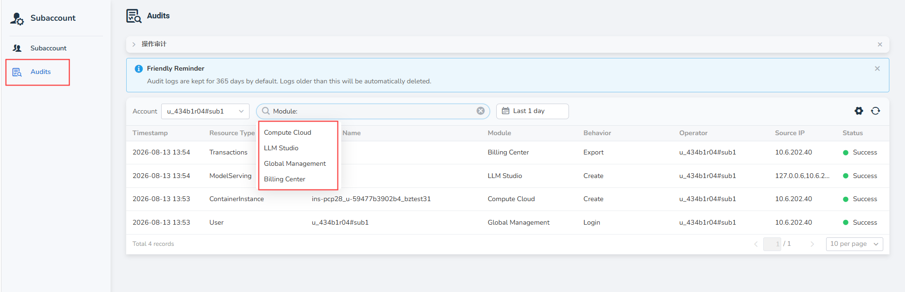

# Sub-Account Management

The sub-account management feature allows a primary account to create and manage multiple sub-accounts, enabling hierarchical account management and unified billing within an organization.

## Terminology

- **Primary Account**: An account that has completed identity verification and holds wallet and global management permissions. The primary account can create and manage sub-accounts and bears all sub-account expenses.  
- **Sub-Account**: Created by the primary account, it can log in independently and use platform resources, with billing consolidated under the primary account. Data between sub-accounts is fully isolated, with no need for separate identity verification or recharging.

## Access

### Prerequisites

Before using the sub-account management feature, the primary account must complete identity verification. Only after verification can sub-account functionality be enabled.

### Steps to Access

1. Log in to the d.run platform  
2. Click the profile icon in the upper-right corner, and select **Sub-Account** from the dropdown menu  
3. Click to enter the sub-account management interface  

## Management Features

### Account Operations

The primary account can perform the following operations on sub-accounts:

- **Create Sub-Account**: Create a new sub-account and set basic information  
- **Disable Sub-Account**: Temporarily disable sub-account login and resource usage  
- **Delete Sub-Account**: Permanently delete a sub-account and its related data  
- **Edit Information**: Modify basic details and configurations of a sub-account  

### Data Isolation

- Sub-accounts can log in independently and use platform features and services  
- Data is completely isolated between sub-accounts, ensuring no interference  
- Each sub-account has its own workspace and resource view  

### Billing Management

- Sub-accounts do not need separate recharges; all consumption is charged from the primary account wallet  
- Supports expense statistics and analysis by sub-account  
- Bills and transaction details show specific consumption per sub-account  

## Expense Center Permissions

After the primary account enables sub-accounts, the visibility and data scope in the Expense Center are as follows:

| Feature | Primary account | Sub-account |
| --- | --- | --- |
| Wallet | Visible; manages the primary account wallet | Visible when the primary account has not set a quota for the sub-account; can view the balance shared with the primary account |
| Transactions | Can view and filter primary-account and sub-account records by account | Can view records for the currently signed-in account only |
| Orders | Can view and filter primary-account and sub-account orders by account | Can view orders for the currently signed-in account only |
| Bill Details | Can view and filter primary-account and sub-account bills by account | Can view bills for the currently signed-in account only |
| Monthly Bills | Can view monthly bills and account-level statistics | Not visible |
| Vouchers | Visible; manages primary-account vouchers | Not visible |

Transactions, order lists, and bill lists display the username and User ID. Primary accounts can use the **Account** dropdown to select the primary account or any managed sub-account for filtering.

## Naming Rules

### Username Format

Sub-account usernames follow a fixed format: `<PrimaryAccountID>#<SubAccountName>`

**Example**: `daocloud-test#samzong`

### Character Restrictions

- **Allowed characters**: Lowercase letters (a–z), numbers (0–9), and hyphen (-)  
- **Length**: 1–49 characters  
- **Start/End**: Must begin and end with a letter or number  
- **Prohibited characters**: Spaces, Chinese characters, and special symbols are not allowed  

### Important Note

!!! warning "Attention"

    Once created, usernames cannot be changed. Please choose carefully.

## Security Settings

Sub-accounts support full security management features:

### Login Security

- **Password Reset**: The primary account can reset a sub-account’s login password  
- **Login Status Management**: View and manage the login status of sub-accounts  

### Access Control

- **Access Keys (AK/SK)**: Generate and manage API access keys for sub-accounts  
- **SSH Public Key**: Configure SSH public keys to enable password-free access to server resources  

## Operation Audits

Key operations performed by primary and sub-accounts are recorded in Operation Audits. This helps track account operations, resource changes, and abnormal activities.

### Accessing Operation Audits

1. Log in to the d.run platform.
2. Click the profile icon in the upper-right corner and open **Subaccount**.
3. Click **Audits** in the left navigation panel.

### Query and Filter

The Operation Audits page supports the following filters:

- **Account**: Select the primary account or a sub-account to view.
- **Module**: Filter records by product module, including Compute Cloud, LLM Studio, Global Management, and Billing Center.
- **Time range**: Filter audit records by a specified time range.

Audit records include the following fields:

| Field | Description |
| --- | --- |
| Timestamp | The time when the operation occurred. |
| Resource Type | The type of the affected resource, such as `Transaction`, `ModelServing`, `ContainerInstance`, or `User`. |
| Name | The name or identifier of the affected resource. |
| Module | The product module where the operation occurred. |
| Behavior | The operation performed, such as `Create`, `Login`, or `Export`. |
| Operator | The account that performed the operation. |
| Source IP | The source IP address of the request. |
| Status | The result of the operation, such as Success or Failure. |

Audit logs are retained for 365 days by default. Logs older than the retention period are automatically deleted.
