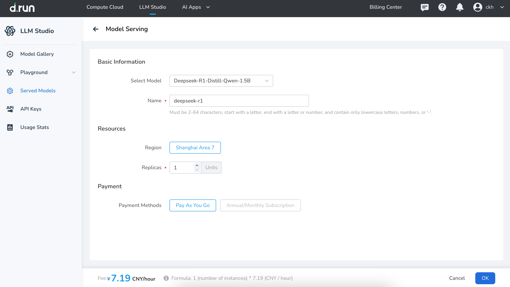

---
hide:
  - toc
---

# Serve a Model

You can serve models from the **Model Gallery** or **Served Models**. Below are the details for serving a model:

- **Select the Model**  

    Choose the model to serve (e.g., Qwen2-0.5B-Instruct), ensuring it aligns with your business needs and task requirements.
  
- **Model Service Name Requirements**  
    The name of the model service must meet the following criteria:

    - Length: 2–64 characters
    - Allowed characters: Lowercase letters, numbers, and hyphens (-). The name must start and end with a lowercase letter or number.
    - Example: `text-gen-service` or `model-01`
  
- **Region**

    Select the region for serving (e.g., "Shanghai Area 2"). Choose a region based on your business coverage and latency needs.

- **Number of Instances**

    - Configure the number of instances to serve. Default value: 1.  
    - More instances enhance service concurrency, but they will also increase costs.

- **Billing Method**
  
    d.run offers two billing options:

    1. **Pay-as-you-go:**
        
        - Real-time billing based on usage, ideal for short-term or variable-demand users.
        - Cost formula: Number of instances × hourly rate.
        - Example: 1 instance × 3 Yuan/hour = 3 Yuan/hour.

    2. **Annual or Monthly Subscription** (currently not supported):
        
        - Prepay for service instances at a discounted rate, suitable for long-term users.
        - Upon selecting this option, the system will display the corresponding annual or monthly fee.

- **View Configuration Costs**

    At the bottom of the page, the cost calculation formula and estimated costs will be displayed automatically.

    - Configuration cost: 3 Yuan/hour
    - Calculation formula: 1 instance × 3 Yuan/hour = 3 Yuan/hour
