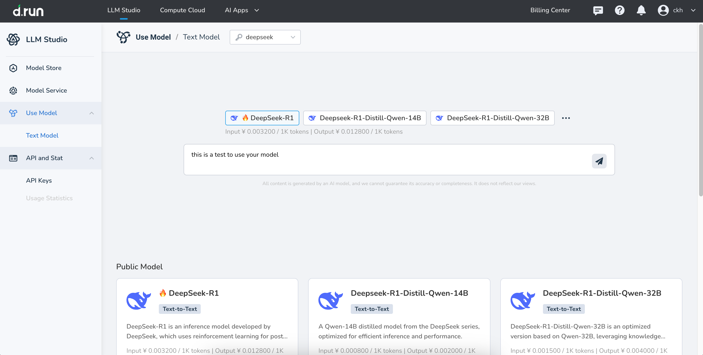

# Try a Model

d.run offers most models not only with the ability to view documentation but also with an interactive inference experience. For example, you can engage in daily chats with large language models to intuitively explore their capabilities.

## Entry Points

The platform provides two entry points, allowing you to choose based on your needs.

- **Entry 1** : On the [Model Store](./index.md) page, select your preferred model and click **Use Model** to enter the chat page.
- **Entry 2** : From the left-side menu, click **Use Model** to directly start the model experience process.

## Instructions

Upon your first visit to the **Use Model** , the system will recommend some popular and high-quality models for you to try. You can:

- Click on a recommended model to directly use the chat functionality of the large language model.
- Or choose from the list of other models you’re interested in.

## Model Types

### Chat Models

You can use pre-configured chat models to have a try and can also select services you’ve created. You can choose 1 to 3 models for an online experience.

### Image Models

d.run supports using the pre-configured image description model Llama-3.2-11b, and also allows you to select services you’ve created. Currently, only one model can be selected for the online experience.

### Completing a Full Chat

To complete a chat, simply follow these three steps:

1. On your first visit, select an API key. If you don't have one, you can authorize the platform to automatically create one for you.

2. Select a model: Choose the model you'd like to experience from the list and click it to begin. If you've already added a model, you can skip this step and directly start the experience with the model you're interested in.

3. If you're not satisfied with the model’s response, click refresh to regenerate the answer. You can also click copy to copy the content generated by the model.

Additionally, the token usage for this round of responses is displayed at the bottom of the chat, so you can compare the model's performance.

## More Chat Features

You can click **Clear Context** to end the current chat and reset the context, ensuring that the following chat is not influenced by previous interactions.

## Model Comparison

Text generation models support comparing up to 3 models simultaneously.

## Model Parameter Settings

The platform displays several adjustable parameters for the model. Different settings will affect the model’s responses, and you can configure them to suit your needs. Click **Model Configuration** above the model to adjust its parameters.

Each parameter name is followed by a `?`—hovering over it will show a detailed description, helping you understand each one.

| Parameters | Description |
| ---------- | ----------- |
| System | System Role: Defines the model's behavior and context, specifying the responsibilities and roles the model should assume. For example, "You are an AI assistant." |
| Temperature | The higher the value, the more varied and random the output; the lower the value, the more focused and deterministic the output. It’s recommended to adjust either this parameter or top_p, but not both. |
| TopP | Controls the diversity of the generated text. The higher the value, the more varied and rich the output. It’s recommended to adjust either this parameter or temperature, but not both. |
