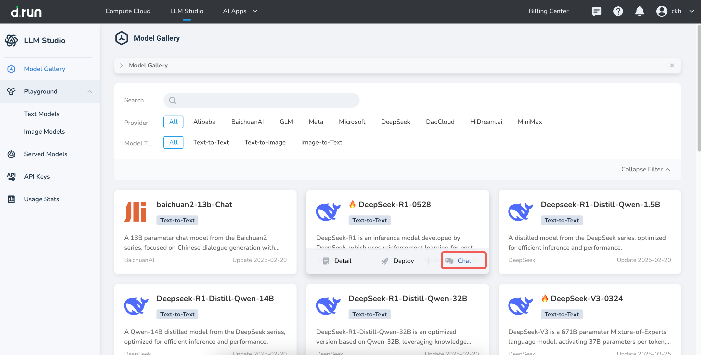
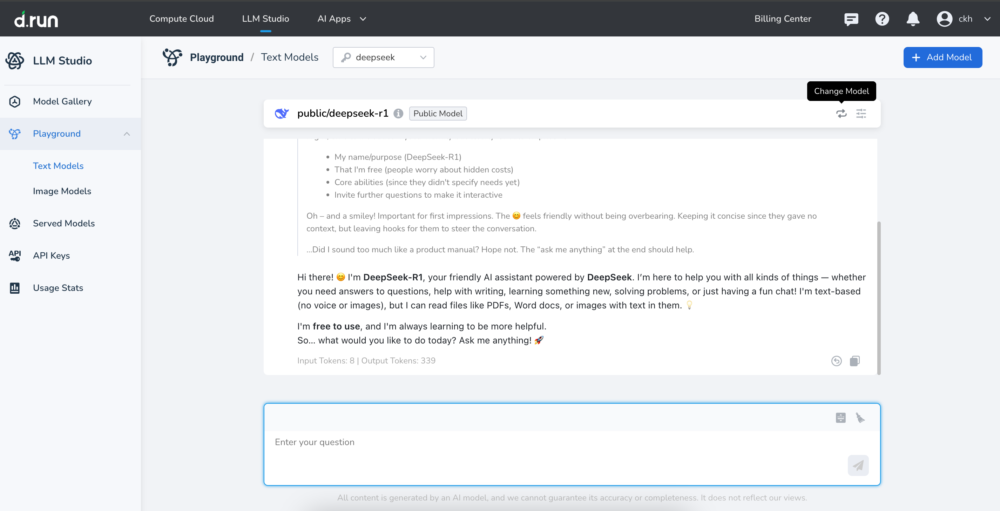

---
hide:
  - toc
---

# Model Store

The Model Store offers a diverse selection of models covering areas such as text generation, image understanding, and speech synthesis. It integrates hundreds of models from providers like Tongyi Qianwen, Mistral, Meta, Cohere, and more. Users can flexibly deploy models according to their business needs to achieve efficient real-time inference.

## Find a model

Using the tags in the Model Store, you can quickly search the model list, supporting multiple tag selections, and you can clear the filter conditions at any time.

- Supported filter tags include:
    - Providers: such as Baichuan Intelligence, GLM, Meta, etc.
    - Model types: such as text generation, visual understanding, video generation, etc.
- You can also enter keywords to quickly locate a specific model.

## Try a Model

Hover your cursor over a model card and click the Chat icon to use the default corpus and try AI conversations with a model.

In the upper right corner of the chat window, click **Change Model** to choose different models for conversation.

## Deploy a Model

You can easily deploy models from the **Model Store** or **Model Service** pages.
Refer to [Deployment Parameters](./deploy.md).

[Register and Try d.run](https://console.d.run/){ .md-button .md-button--primary }
