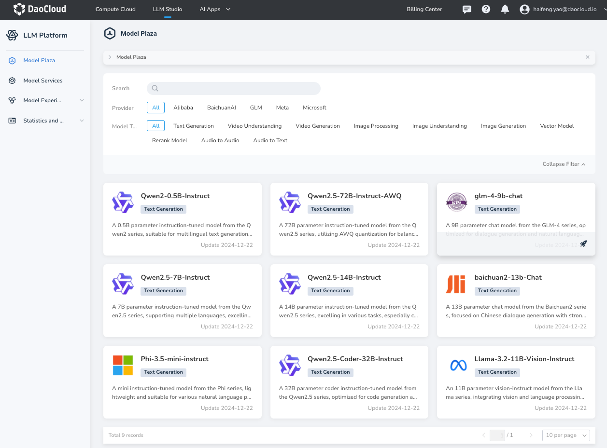

---
hide:
  - toc
---

# Model Store

The Model Store offers a diverse selection of models covering areas such as text generation, image understanding, and speech synthesis. It integrates hundreds of models from providers like Tongyi Qianwen, Mistral, Meta, Cohere, and more. Users can flexibly deploy models according to their business needs to achieve efficient real-time inference.

After logging into d.run, you can select **Model Store** from the left navigation bar to view a list of preset model cards.

Using the tags in the Model Store, you can quickly search the model list, supporting multiple tag selections, and you can clear the filter conditions at any time.

- Supported filter tags include:
    - Providers: such as Baichuan Intelligence, GLM, Meta, etc.
    - Model types: such as text generation, visual understanding, video generation, etc.
- You can also enter keywords to quickly locate a specific model.

