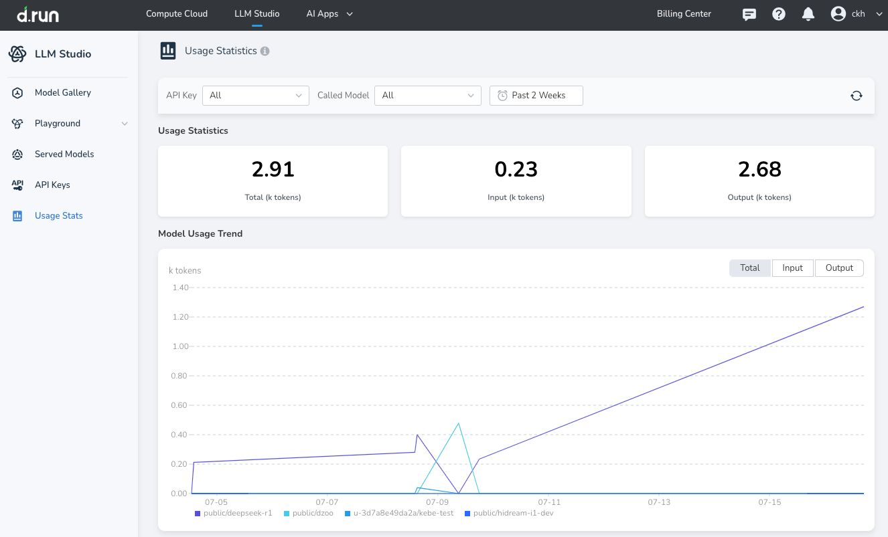

---
hide:
  - toc
---

# Usage Statistics

The Usage Statistics module is one of the fundamental features of the Large Model Service Platform. It helps users gain a comprehensive understanding of resource consumption during model invocation.

This module consolidates multi-dimensional data—such as total calls and input/output token counts—and supports cost analysis, resource optimization, and business decision-making.

Its core value includes:

* **Cost Management**: Accurately tracks usage (in thousands of tokens). Combined with the platform’s billing rules, it helps users estimate and control costs to avoid resource waste.
* **Business Analysis**: Leverages trend charts and model distribution to gain insights into usage patterns across different scenarios, optimizing model selection and business workflows.
* **Resource Optimization**: Identifies high-frequency, high-consumption models to allocate resources appropriately and improve overall platform efficiency.

## How to Use

After logging into the platform, click **Usage Statistics** in the left navigation bar to access the main dashboard for data queries and analysis.

### Set Filter Conditions

* **API Key Filter**: Click the “API Key” dropdown to select a specific key or “All” to view the corresponding usage data.
* **Model Filter**: Use the “Model” dropdown to select a specific model (e.g., `public/deepseek-r1`) or “All” to focus analysis on your target model.
* **Time Range Filter**: Click the time selector (default is “Last 2 weeks”) to customize the time range (single or multiple days) according to your needs.

### View and Interpret Data

* **Usage Overview**: The top of the page displays three key indicators:
  
    * Total Usage (K tokens)  
    * Input Tokens (K tokens)  
    * Output Tokens (K tokens)  
      Quickly understand the overall resource consumption.

* **Trend Chart Analysis**: The line chart below shows the usage trends of different models over the selected time period. Each model is color-coded, e.g., `public/deepseek-r1` appears in purple.

  You can switch between "Total", "Input", and "Output" views to analyze usage trends and business fluctuations.

### Refresh Data

Click the refresh icon in the upper-right corner of the page to retrieve the latest usage data and ensure real-time accuracy.

## Use Case Examples

- **Cost Accounting**

    Finance personnel can select “All API Keys” and set the current month as the time range at month-end. By checking total usage and combining it with per-token pricing, they can calculate usage costs and generate expense reports.

- **Business Diagnostics and Optimization**

    When a business line experiences slow responses, analysts can filter by relevant API Keys and models to review usage trends. If a usage spike is found along with degraded model performance, they can adjust the model or invocation strategy promptly.

- **Operations and Resource Planning**

    Operations staff can regularly (e.g., weekly) monitor each model's usage and trend changes to identify potential bottlenecks:

    - Scale up high-frequency models in advance to ensure service availability.
    - Reduce resources for low-frequency models to improve overall efficiency.
