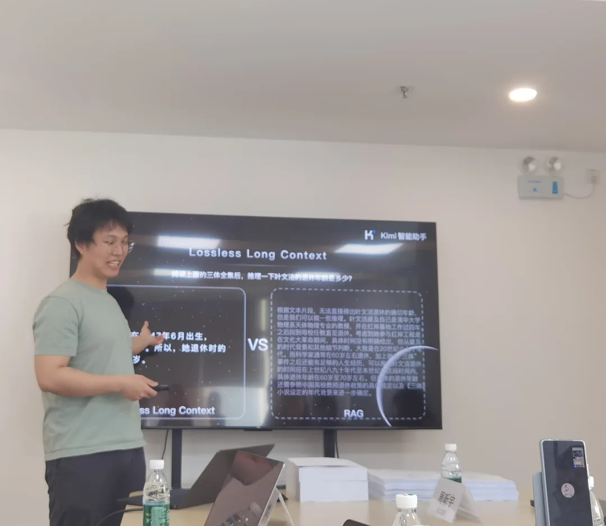

# The Rise of Moonshot from the Perspective of China's LLMs

> Image 1: The initial expectation from investors regarding the dark side of the moon is to "create Global AGI," followed by commercialization.

Recently, after the dark side of the moon announced that Kimi can support a lossless contextual input capability of 2 million Chinese characters, Kimi-related topics have trended twice on Weibo.

The first was "Kimi concept stocks." Following the official announcement of the 2 million Chinese character contextual input capability, several stocks related to Kimi in the A-share market, including Zhangyue Technology, Huace Film and TV, Chaoxun Communication, Zhongguang Tianze, Century Tianhong, Haitan Ruisheng, and Jiuan Medical, all hit their daily limit.

The second was about "Kimi's customer acquisition cost." Reports indicated that based on the advertising costs for Kimi, the computational costs arising from user Q&A interactions after attracting new users, and estimated download volumes on third-party platforms, Kimi's customer acquisition cost has reached at least 200,000 yuan per day over the past month.

This has made Moonshot AI the first LLM unicorn company to break into the public eye since the GPT craze swept through in 2023, gaining significant visibility with its product. Due to a surge in users and high traffic, Kimi's servers even experienced downtime.

Kimi is indeed on fire.

However, if we closely examine the rise of Moonshot, aside from the capital frenzy and high market attention, its path among the many Chinese LLM companies valued over 2 billion dollars is quite unique. The two major factors supporting Moonshot's high visibility—technological advancements and commercial pace—are not particularly prominent among its competitors.

Firstly, compared to other LLM companies, including Zhipu AI, MiniMax, Shenyin Technology, Mianbi Intelligence, Baichuan Intelligence, and even Lightyear (later acquired by Meituan), Moonshot was established much later, and its team collaboration and technological progress are naturally relatively lagging. Although Yang Zhilin's technical prowess is widely recognized, according to SuperCLUE's evaluation, Moonshot's overall capabilities currently only surpass GPT-3.5 and are still catching up to GPT-4.

Secondly, Moonshot's LLM product and commercialization pace are not particularly fast. For instance, Zhipu began forming a commercialization team last year to explore commercial services for its foundational LLM, while Moonshot primarily focuses on B2C with the launch of the Kimi intelligent assistant, but its commercial aspect is not very pronounced.

Yet, Moonshot has managed to attract multiple rounds of investment in a short period, rising to the first tier of Chinese LLM startups. Some reports even suggest that Moonshot's valuation has surpassed that of Zhipu AI. As 2023 comes to a close, while most LLM companies are grappling with the existential question of "if they don't commercialize soon, the funding of 2023 may only last until the end of 2024," Moonshot, also focusing on foundational LLMs, stands out even more.

Regarding this difference, AI Technology Review inquired about Moonshot's investors and received starkly different perceptions. One representative viewpoint is: "We are not currently asking Moonshot to pursue commercialization; rather, we hope they focus on perfecting the LLM technology first. We want the LLM we invest in to not only be the strongest in China but also one of the strongest globally in the future AGI era."

Yang Zhilin and Moonshot have given them this confidence.

## Well-Received, Short-Term Capital Accumulation

Upon careful consideration, the frequently active Moonshot in the rankings has been established for less than a year.

Moonshot was officially founded in April 2023, and in October of the same year, it launched its first LLM product, the Kimi intelligent assistant, which can support input of up to 200,000 Chinese characters, the longest contextual input length among AI LLM products globally at that time.

According to reports, based on OpenAI's calculation standards, typically, one Chinese character is approximately equal to two tokens, meaning Moonshot's 200,000 Chinese characters equate to about 400,000 tokens, while the maximum long text supported by Anthropic's Claude LLM at the same time was 100,000 tokens.

In February 2024, Kimi underwent iterative upgrades for website and multi-question search capabilities, with usability performance continuously improving.

On March 18 of this year, Moonshot again set a record by announcing a new breakthrough in long contextual window technology, stating that Kimi can support 2 million characters of ultra-long lossless context, and began internal testing of the product immediately.

> Image 2: Moonshot announces that Kimi can support 2 million characters of ultra-long lossless context

Although it has been less than a year since its establishment, AI Technology Review has learned that Moonshot has already completed four rounds of financing.

The first round of financing for Moonshot occurred in April 2023, just after it was spun off from Recurrent AI.

Recurrent AI is a company focused on sales technology, co-founded by Yang Zhilin in 2016. Its main business involves using AI technologies like NLP, voice, multimodal, and LLMs to create "sales technology" solutions. Records show that Recurrent AI has received multiple rounds of investment from Sequoia Capital China, ZhenFund, and other investors.

After completing its first round of financing, Moonshot reached a valuation of 300 million dollars, with investors including Sequoia Capital China, ZhenFund, and Lisi Capital.

In June 2023, Moonshot conducted its second round of financing, achieving a pre-investment valuation of 600 million dollars and a post-investment valuation of 770 million dollars. This round of investment included Ant Group, Alibaba, Meituan, FunPlus, and some members of Alibaba's strategic investment department. Reports indicate that this round was led by Ant, Alibaba, and Meituan.

The third round of financing for Moonshot included investors such as Yunjing Capital and Wuyuan Capital, with an estimated valuation of about 1 billion dollars after this round.

It is understood that the third round of financing was discussed simultaneously with the fourth round, which is the recent round of financing where Moonshot secured over 1 billion dollars.

In this round, Alibaba invested 800 million dollars (more accurately, 790 million dollars), with over 40% of the amount being a co-managed account for Alibaba and Moonshot, intended for Moonshot's cloud purchases and usage.

Additionally, Lisi Capital invested 10 million dollars, while other existing shareholders contributed over 200 million dollars, bringing the total amount for this round to over 1 billion dollars.

Following this round of investment, Moonshot's valuation reached 2.5 billion dollars.

As an AI LLM startup, what enables Moonshot to attract so many investors' attention?

Many investors have told AI Technology Review that Moonshot has two distinct characteristics—long context and B2C—which differentiate it from other AI LLM startups from the outset.

Long context is a fundamental capability of large language models (LLMs). However, if the context is too long, the model tends to focus too much attention on the beginning and end of the text, neglecting the information in the middle, making it difficult for the model to find and utilize relevant information located in the middle of a long text.

Thus, how to ensure the text is sufficiently long while maintaining "losslessness" becomes crucial.

"Lossless long context is everything."

Yang Zhilin has publicly stated multiple times, "The path to General Artificial Intelligence (AGI) will fundamentally rely on lossless long context as a key foundational technology. Historically, all model architecture evolutions have essentially aimed at enhancing effective, lossless context length. While context length may follow Moore's Law, it is meaningful scaling only when both length and lossless compression levels are optimized."

This has been the original focus of Moonshot since its inception.

Regarding the B2C route, this is the direction in which AI LLMs are most likely to yield super applications during their landing process, and it is also something Yang Zhilin has been firmly committed to from the beginning.

Of course, beyond technology and route, even more crucial is Yang Zhilin's personal capabilities.

An investor who participated in Moonshot's investment told AI Technology Review that in the early stages, he considered various AI LLM startups, including Zhipu AI, Baichuan Intelligence, MiniMax, and others, and ultimately chose Moonshot.

"This wave of AI is technology-driven; if investing, the primary consideration is to find the strongest and most relevant person technically." The current mainstream architecture of AI LLMs, Transformer, was previously Yang Zhilin's research area. He has published two significant papers as the first author, Transformer-XL and XLNet, which have been cited over 20,000 times since 2019, demonstrating his undeniable technical strength.

Moreover, as an entrepreneur, Yang Zhilin has a strong talent attraction ability, able to draw many young, outstanding industry talents, such as co-founders of Moonshot and employees who chose to join after gaining experience in various AI companies.

Additionally, Yang Zhilin's goal is pure: to create China's AGI. An investor noted that he has spoken to many young and experienced AI entrepreneurs, and Yang Zhilin is the most articulate and visionary in terms of technology he has encountered.

"We have talked several times; now just a few words are enough to clarify that he is committed to creating China's AGI."

Investors believe that in this wave of AI entrepreneurship, the experiences of those who thrived in the internet era may not necessarily be advantageous, and could even be a burden. In the new AI era, everything is new, and new organizations and people have a better chance of bringing new imagination to the table.

All of the above are reasons why Moonshot, despite lacking first-mover advantages, can rise to the top—an inevitable outcome amid chance.

## Ambition to Seize Global AGI

"In fact, capital is not as urgent as everyone imagines." One investor told AI Technology Review.

Recently, news emerged of a Microsoft engineer building a training cluster of 100,000 H100s for GPT-6, which led to a power grid collapse, reiterating the confusion that the path to AGI still needs to address power challenges, while also sending a signal: although the GPT-4.5 leak has stirred controversy and GPT-5 has yet to be released, GPT-6 is already on the way.

The development of deep learning has spanned a decade, and compared to the last AI wave, this wave of LLM investors understands technology much better. They clearly recognize that LLMs are a fluid technology that continues to grow, and GPT-4 is not the endpoint. "Even OpenAI's path is not necessarily the final route to AGI."

Especially for well-known investment institutions, they are not just looking to invest in the "strongest LLM" within China but in LLM teams qualified and capable of competing for the "strongest AGI globally." In one interview, Yang Zhilin also openly stated, "AI is not about finding PMF in the next one or two years, but about how to change the world in the next ten to twenty years."

If we step outside the domestic LLM battle and view it from a global perspective, as a representative of typical tech believers, Moonshot's advantages in seizing global AGI may include the following points:

Firstly, Moonshot is a product of globalized education, with a broader vision. Founder Yang Zhilin graduated from Tsinghua University with a degree in Computer Science and Technology, then pursued a PhD at Carnegie Mellon University's Language Technologies Institute (LTI), studying under Ruslan Salakhutdinov, head of AI research at Apple, and William Cohen, chief scientist at Google, giving him keen awareness and high attention to developments in foreign technology.

In terms of practical experience, Yang Zhilin has worked at Google Brain and FAIR, participating in the development of several LLMs, including Google Gemini, Google Bard, "Pangu," and "Wudao," gaining a deeper understanding of the technological gaps and rhythms between domestic and international LLM developments, as well as how to grow an AI LLM company with an international perspective in China.

Not only Yang Zhilin, but the other two co-founders, Zhou Xinyu and Wu Yuxin, also graduated from Tsinghua University and have work experience at renowned AI companies like Meta and Megvii.

Additionally, according to an employee of Moonshot, Yang Zhilin has a strong admiration for companies with a "Silicon Valley style," and Moonshot aims to develop in that direction.

Secondly, Moonshot is firmly committed to the B2C route. On one hand, in the application process of AI LLMs, B2C seems more likely to yield super applications compared to B2B. There is a deeper consideration that, in the journey towards AGI, the data flywheel is crucial, which makes the B2C route an inevitable choice.

Yang Zhilin has mentioned that for Moonshot, both AGI and products are pursued objectives, and throughout history, nearly all internet products that "emerged" ultimately relied on the scale of user data.

Perhaps due to the stage of development, the early stages will rely on scaling laws of foundational models, but over a longer time frame, the focus will eventually shift to scaling laws of user data.

From a comprehensive perspective, the B2C path is currently recognized as the most suitable one, with greater potential ceilings.

Moreover, even though GPT-4's performance has amazed humanity, the imaginative space for LLMs remains vast.

Based on this consensus, it becomes particularly critical to firmly hold on to a unique understanding of AGI, maintain a long-term directional plan, and have clear logic.

On this point, Yang Zhilin has his own rhythm.

An investor told AI Technology Review that Yang Zhilin does not care when GPT-5 and GPT-6 are released, but he has his own definitions regarding when GPT-5 or GPT-6 will occur, how to achieve it, what problems need to be solved in the process, how to solve them, and the ultimate direction of the model, etc.

Thus, looking beyond the domestic landscape and focusing globally, the possibility of Moonshot competing for global AGI gains additional weight, and the selection of Moonshot by globally renowned capitals like Sequoia Capital China may also reflect such considerations—there is plenty of time left for Moonshot.

Focusing back on the domestic scene, among the current AI LLM startups, Moonshot's advantages are also very clear.

In terms of technology, Moonshot's technical team has participated in the research and development of multiple LLMs, both domestically and internationally, and compared to companies like MiniMax and Baichuan Intelligence with similar valuations, their experience is more robust.

As for another LLM company with a comparable valuation to Moonshot, Zhipu AI, its first-mover advantage and maturity may not be something that a company less than a year old can compete with, but the differences in their routes also determine that they are unlikely to meet on the same competitive track. Investors view Zhipu AI's positioning as "replicating OpenAI," firmly pursuing B2B and B2G routes along a trusted innovation path.

In terms of capital, early entrants like the ZhiYuan team, which entered the LLM sphere around the same time as Yang Zhilin, include two companies spun off from Tsinghua THUNLP—Shenyin Technology and Mianbi Intelligence. Although they also have technical strength, their financing pace is far behind that of Moonshot. Currently, Shenyin Technology is in the A+ financing round, while Mianbi Intelligence is at the Pre-A stage.

Regarding talent reserves, Moonshot has a high talent density. Yang Zhilin's personal technical appeal is strong, and the company is still in a rapid development and expansion phase. Although the total number of employees is still under one hundred, the talent density in LLM startups may only be second to Zhipu AI.

In summary, Moonshot's focus is on technology rather than commercialization. Therefore, whether it is Moonshot spending heavily to recruit talent, incurring nearly 200,000 yuan a day in customer acquisition costs, firmly pursuing B2C and long text routes, or building a super-strong foundational LLM... all of these make sense, as investors "are not in a hurry" and do not require Moonshot to start thinking about commercialization at this moment.

Perhaps, in 2024, commercialization will be the main theme and task for most domestic AI LLM companies, but it is not for Moonshot.

## Conclusion

Indeed, with the accumulation of ideas, technology, talent, and capital, Moonshot possesses clear advantages, with a strong foundation. However, there are also concerns about some shortcomings.

One investor told AI Technology Review that currently, Moonshot has a heavy presence of genes from Megvii, with many members from that team; on the other hand, after the latest round of financing, the heavy investment from Alibaba has led to a high shareholding ratio.

Regarding the first point, Yang Zhilin's personal capability and appeal may be able to change the situation, but the future remains uncertain; concerning the second point, Moonshot is still actively seeking financing to reduce Alibaba's internal influence, which is also favorable for other capital forces.

An investor who had contact with Moonshot but ultimately did not invest told AI Technology Review that after Sequoia's initial investment, they also wanted to invite him to invest in another round. However, after careful consideration, he felt that while Yang Zhilin's technical capabilities are indeed strong, his investment perspective considers comprehensive capabilities. Technology is important, but he also looks at infrastructure, computing power, data, and other aspects, and in these areas, Yang Zhilin's appeal is still lacking.

"He can attract top smart young people, but whether he can draw more senior talent remains uncertain, especially since he is young, and those in the AI infrastructure field are seasoned veterans; whether they are willing to follow him remains to be seen."

However, what can be confirmed is that Moonshot's strengths are sufficient to cover short-term shortcomings, allowing investors to be willing to pay and wait for Moonshot to bring a different narrative about AGI.

## References

- [Kimi Web Version, available after registration](https://kimi.moonshot.cn/)
- Kimi Intelligent Assistant, no need for VPN, currently the top-ranked intelligent app in China, with over 8 million monthly active users.

> This article is reproduced from [AI Technology Review](https://mp.weixin.qq.com/s/JHBPMHxYj3LvcAtL-I2nrw)
