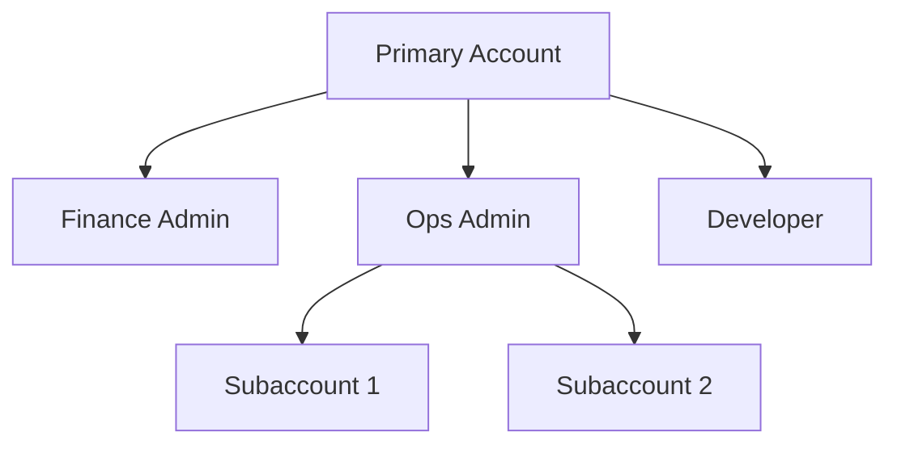

# Enterprise/Academic Institution Verification Service (Trial)

> Updated: April 30, 2025  
> Effective: May 1, 2025

In accordance with the Cybersecurity Law of the People's Republic of China, the Provisional Regulations on Enterprise Information Disclosure, and other relevant laws and regulations, Shanghai DaoCloud Network Technology Co., Ltd. ("we") hereby provides the following instructions for the real-name authentication service for enterprise/academic institution users. This document serves as a supplementary clause to the [Real-Name Authentication Service Description](./name.md). Matters not covered herein shall be subject to the Real-Name Authentication Service Description.

## 1. Service Scope

### 1.1 Eligible Users

- **Enterprise Users**: Legally registered organizations in mainland China, including limited liability companies, joint-stock companies, sole proprietorships, etc.  
- **Academic Users**: Institutions approved by education authorities, including universities and research institutes  
- **Government Agencies**: Party and government organizations and public institutions at all levels  

### 1.2 Verification Levels

- **Basic Verification**: Verifies basic organization info (name, Unified Social Credit Code, etc.)  
- **Advanced Verification**: Includes legal representative identity verification and corporate bank account verification  
- **Privileged Verification**: For enterprise users requiring API integration or bulk management (requires a supplementary agreement)  

## 2. Required Verification Documents

### 2.1 Mandatory Documents

```markdown
- [ ] Scanned copy of business license/public institution certificate (stamped)
- [ ] Scanned copy of legal representative's ID (front and back)
- [ ] Enterprise Real-Name Authorization Letter [Download Template](./attach/enterprise-auth-template.docx)
```

### 2.2 Special Cases

- **Branch Verification**: Additional authorization from parent company required  
- **Foreign-Invested Enterprises**: Scanned copy of Ministry of Commerce filing certificate required  
- **Academic Users**: Provide educational qualification certificate and agent’s staff ID  

## 3. Verification Process

### 3.1 Online Submission

1. Log in to the D.run Console and navigate to the [Enterprise Authentication] section  
2. Upload scanned documents (PDF/JPG format, ≤5MB each)  
3. Fill in organization information:

    ```yaml
    Organization Name: Must exactly match the business license
    Unified Social Credit Code: 18 characters
    Verification Type: Enterprise/Academic Institution/Government Agency
    ```

### 3.2 Manual Review

- Applications submitted during working hours (Mon–Fri, 9:00–18:00) will be reviewed within 2 working days  
- Requests for additional documents will be sent via site messages and email  

### 3.3 Verification Badge

- Verified enterprise accounts will display a <span style="color:blue;">✓ Verified Enterprise</span> badge  
- Academic users will display a <span style="color:green;">🏫 Academic Institution Verified</span> badge  

## 4. Information Change Management

### 4.1 Types of Changes

- **Major Changes**:
  
    - Change of legal representative  
    - Change of organization name  
    - Change of Unified Social Credit Code  

- **General Changes**:
  
    - Change of registered address  
    - Change of registered capital  
    - Change of contact person information  

### 4.2 Change Procedure

1. Download and fill in the [Enterprise Verification Information Change Request Form](./attach/enterprise-change-form.docx)  
2. Prepare supporting documents:

    ```markdown
    - [ ] Scanned copy of updated business license
    - [ ] Notification of Business Change Approval (required for major changes)
    - [ ] Scanned copy of new legal representative's ID (if applicable)
    ```

3. Submission Methods (choose one):
   
    - **Online Submission**: Upload in the [Enterprise Authentication > Information Change] section of the Console  
    - **Manual Service**: Email to enterprise-support@d.run and cc service@daocloud.io  

### 4.3 Review Timeline

- If documents are complete, review will be completed within 3 working days  
- Notification of results will be sent via SMS and site messages  

## 5. Account Management System

### 5.1 Permission Structure



### 5.2 Access Control

- **Role Assignment**: Custom roles with fine-grained permissions supported (see [Permission Management Guide](../security.md#_4))  
- **Operation Auditing**: All enterprise account operations are recorded in the [Audit Logs](../security.md#_7)  

## 6. Data Security Management

### 6.1 Information Storage

- Sensitive files such as business licenses are stored with AES-256 encryption  
- Legal representative ID information is retained for no more than 30 days after verification  

### 6.2 Information Usage

- Used solely to verify organizational authenticity and prevent fraud  
- Organization documents will not be disclosed to third parties (unless required by law)  

## 7. Violation Handling

### 7.1 False Materials

- Immediate termination of all services  
- Account funds frozen for no less than 180 days  
- Legal action may be pursued  

### 7.2 Account Lending

- First offense: Service suspended and password reset required  
- Repeat offense: Enterprise account permanently closed  

## 8. Supplementary Provisions

### 8.1 Contact Us

For issues related to verification, contact customer support via:

- **Hotline**: 400-002-6898 (Mon–Fri, 9:00–18:00)  
- **Online Support**: Click **Online Chat** at the bottom right of the Console  
- **Emergency Contact**: security@daocloud.io (24/7 security incident response)  

### 8.2 Document Updates

We reserve the right to update this document in accordance with changes in laws or service upgrades. Updates will be announced via:

- Console notification bar  
- Registered email  
- Official website service agreement page  

- For matters not covered herein, refer to the [Real-Name Authentication Service Description](./name.md)  
- Face recognition data processing during verification follows the [Face Information Processing Rules](./face-id.md)  
- For technical implementation details, see the [Platform Security Whitepaper](../security.md)  

[Register and Try Enterprise Authentication Service](https://console.d.run/enterprise-auth){ .md-button .md-button--primary }
