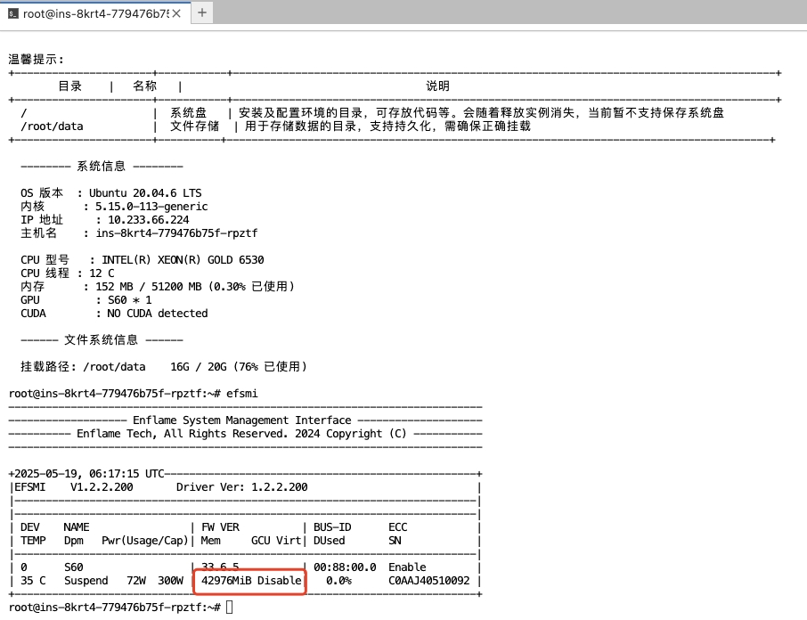

# Compute Cloud Frequently Asked Questions

This page lists some common issues you may encounter in Compute Cloud (Zestu) and provides convenient troubleshooting solutions.

- [Inconsistent GPU Memory Issue](#GPUMemory)

## Inconsistent GPU Memory Issue <a id="GPUMemory" />

Why is the GPU memory capacity reported in the container instance command line different from the memory capacity shown on the web page?

This is because the GPU card has ECC (Error Correcting Code) enabled. ECC improves data integrity but results in reduced available memory and performance loss. Therefore, ECC consumes part of the actual GPU memory. ECC is enabled by default on enterprise-grade GPUs and disabled on consumer-grade GPUs.
