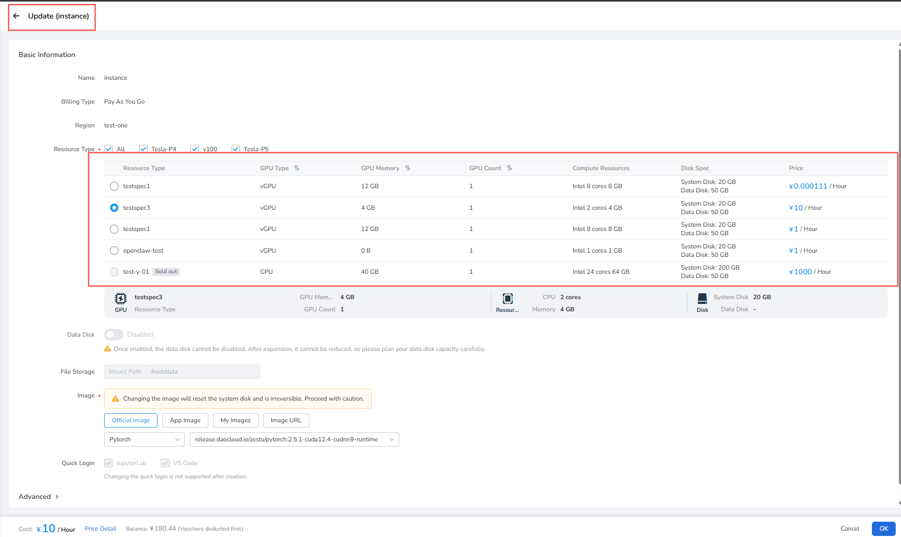

# Container Instance Power On/Off

After the container instance is created, it supports power off and power on operations. Powering on starts billing, while powering off stops billing.

## Power Off

Prerequisites: A container instance has been created and is currently running.

The steps are as follows:

1. Log in to d.run, go to **Compute Cloud** -> **Container Instances** ,
   select a running instance, click the **┇** on the right side of the list,
   and choose **Power Off** from the dropdown list.

    <!--  -->

2. In the pop-up prompt, carefully read the power off notice, then click **OK**

    <!--  -->

!!! note

    - Currently, powering off an instance does not support saving the system disk, please ensure data backup is done. Support is expected in February 2025.
    - Instances that have not been powered on for 15 days will be automatically released.
    - GPU resources will not be reserved after power off. If there are insufficient
      available GPU resources of the required model when powering back on, you will need to wait.

## Update Configuration (Scale Up or Down)

After a container instance is powered off, you can select a new SKU through **Update** to scale the instance up or down.

Prerequisite: The container instance has been created and is in the **Stopped** state.

The steps are as follows:

1. Go to **Compute Cloud** -> **Container Instances**, find an instance in the **Stopped** state, click the **┇** on the right side of the list, and choose **Update** from the dropdown list.

    

2. On the **Update** page, select a new SKU, confirm the GPU type, GPU memory, GPU count, compute resources, disk configuration, and price, then click **OK** to complete the update.

    

!!! note

    - Configuration updates are supported only when the container instance is powered off.
    - After the scale-up or scale-down is complete, the container instance remains powered off. Manually choose **Start Instance** to power it on.

## Power On

Prerequisites: A container instance has been created and is currently powered off.

The steps are as follows:

1. Log in to d.run, go to **Compute Cloud** -> **Container Instances** ,
   select a powered-off instance, click the **┇** on the right side of the list,
   and choose **Start Instance** from the dropdown list.

    <!--  -->

2. If the required GPU resources are sufficient, click **OK** to start.
   If resources are insufficient, you may need to wait.

    <!--  -->

!!! note

    - Instances that are queued or starting do not incur charges; billing begins when in running status.
    - Container instances do not actively refresh their status;
      you need to manually refresh to check the real status of the container instance.
